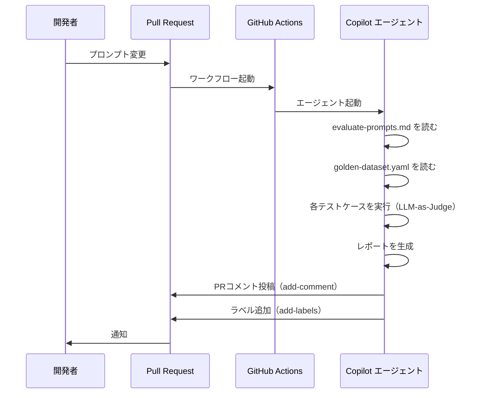

LLMをプロダクトに組み込む開発が増えるにつれて、プロンプトをソフトウェアエンジニアリングのプロセスに取り入れていく場面が増えてきた。「プロンプトの品質を継続的に管理したい」「プロンプト自体の管理や評価を最適化するアプローチを模索したい」という課題感から、コードと同等のプロセスでプロンプトを扱う仕組みを検討してみた。

この記事では、**GitHub Agentic Workflows (gh-aw)** を使ったプロンプト管理・評価基盤のアーキテクチャと実装を紹介する。

## GitHub Agentic Workflows とは

[GitHub Agentic Workflows](https://github.github.com/gh-aw/) は、`.github/workflows/*.md` に書いた**自然言語の指示書**をGitHub Copilot、Claude by Anthropic、OpenAI Codexなどが解釈・実行する仕組みだ。

従来のGitHub Actions（YAMLで手続きを定義）と対比すると分かりやすい。

**従来のGitHub Actions:**

```yaml
- name: Run tests
  run: pytest tests/
```

**GitHub Agentic Workflows:**

```markdown
---
on:
  pull_request:
permissions:
  contents: read
engine: copilot
---

## ステップ1: テストの実行
1. tests/ ディレクトリのすべてのPythonテストを実行
2. 結果をレポート形式でまとめる
3. 失敗したテストがあればPRにコメント
```

YAMLフロントマターでトリガー・権限・許可する操作（Safe Outputs）を宣言し、その下にMarkdownで自然言語の指示を書く。Copilotエージェントがこの指示書を読んで実行する。

`.md`ファイルは `gh aw compile` コマンドで `.lock.yml`（実際に動くGitHub Actions YAMLファイル）にコンパイルして使う。

## アーキテクチャ概要

ディレクトリ構造は以下のようになっている。

```
.
├── .github/
│   └── workflows/
│       ├── evaluate-prompts.md        # Copilotエージェントへの指示書（人間が書く）
│       └── evaluate-prompts.lock.yml  # コンパイル済みワークフロー（自動生成）
├── prompts/                            # 評価対象プロンプト
│   └── code-review.md
│
└── tests/
    └── golden-dataset.yaml            # 評価基準データセット
```

## 各コンポーネントの実装

### 1. プロンプトファイル（`prompts/`）

プロンプトはMarkdownファイルで管理する。

```markdown
# Code Review Prompt

あなたは経験豊富なソフトウェアエンジニアです。
提出されたコードを以下の観点でレビューしてください。

### レビュー観点
1. **正確性**: ロジックにバグがないか
2. **可読性**: 命名・構造が明確か
3. **セキュリティ**: 脆弱性の懸念がないか
...
```

### 2. Golden Dataset（`tests/golden-dataset.yaml`）

評価の核となるのが **Golden Dataset** だ。「この入力に対して、こういう品質の出力が期待される」という評価基準を定義する。

```yaml
test_cases:
  - id: "code-review-001"
    category: "code_review"
    description: "バグを含むコードを正しくレビューできるか"
    input:
      user_message: "以下のコードをレビューしてください。"
      context: |
        def divide(a, b):
            return a / b
    expected_output:
      criteria:
        - name: "問題の特定"
          description: "ゼロ除算の問題を指摘できるか"
          weight: 0.4
        - name: "改善提案"
          description: "適切な修正案を提示できるか"
          weight: 0.4
        - name: "説明の明確さ"
          description: "問題点をわかりやすく説明できるか"
          weight: 0.2
```

各テストケースには **評価基準（criteria）と重み（weight）** を定義する。これにより、LLMが出力を評価する際の判断軸を明確にする（LLM-as-Judge）。

### 3. 指示書ワークフロー（`evaluate-prompts.md`）

評価のオーケストレーションは自然言語の指示書で定義する。構造は5つのステップからなる。

```markdown
---
on:
  pull_request:
    paths:
      - 'prompts/**'

safe-outputs:
  add-comment:
    target: triggering
  add-labels:
    allowed: [needs-improvement, prompt-evaluation]

engine: copilot
---

### ステップ1: 変更されたプロンプトファイルの特定
1. Pull Requestで変更されたファイルを特定:
   gh pr view ${{ github.event.pull_request.number }} --json files \
     --jq '.files[].path' | grep '^prompts/.*\.md$'

### ステップ2: 黄金データセットの読み込み
1. tests/golden-dataset.yaml を読み込む
2. 各テストケースの構造を確認

### ステップ3: プロンプトの評価
各テストケースに対して:
- プロンプトの内容をシステムプロンプトとして使用
- 出力を生成し、criteria の各基準について 1-5 のスコアを付与

### ステップ4: 評価レポートの生成
Markdown形式でレポートを生成

### ステップ5: 結果の出力
- PRにコメントとして投稿（add-comment）
- スコアが3.0未満の場合: needs-improvement ラベルを追加
```

`safe-outputs`の設定により、エージェントが実行できる操作を「PRへのコメント投稿」と「特定ラベルの追加」のみに制限している。コードの直接変更やmainブランチへのプッシュは許可されていない。

## 評価フロー

PRを作成してからフィードバックを受け取るまでの流れを示す。



評価レポートはPRにMarkdownコメントとして投稿される。スコアが3.0/5.0未満の場合は `needs-improvement` ラベルが自動で付く。

## セキュリティ設計

権限設定はミニマルに設計されている。

```yaml
permissions:
  contents: read  # リポジトリの読み取りのみ
```

PRへのコメント投稿やラベル追加は `safe-outputs` 経由で行うため、`pull-requests: write` も不要だ。エージェントが誤動作してもコードを書き換えたりブランチをプッシュしたりできない設計になっている。

## 応用：他のAI資産への横展開

この設計は「プロンプトをコードと同じ品質管理プロセスで扱う」という思想が核にある。同じ仕組みをさまざまなAI資産に適用できる。

| 対象                               | `prompts/` に置くもの                 | 評価基準の例                  |
| ---------------------------------- | ------------------------------------- | ----------------------------- |
| 汎用AIプロンプト                   | system prompt, few-shot examples      | 出力品質・制約の遵守度        |
| Claude skills/tools                | tool の `description`, `input_schema` | ツールが正しく選択されるか    |
| MCPサーバーの説明文                | tool/resource の description          | LLMが正しく解釈・呼び出せるか |
| RAGのクエリテンプレート            | クエリ生成プロンプト                  | 検索精度・再現率              |
| チャットボットのシステムプロンプト | system prompt                         | ペルソナ・制約の遵守度        |

評価対象のファイルフォーマットや評価ロジックは `evaluate-prompts.md` の自然言語指示を変更するだけで柔軟に調整できる。

## まとめ

GitHub Agentic Workflows を使うことで、「プロンプトをPRでレビューして自動テストが通ればマージできる」というContinuous AIとも言えるワークフローを、YAMLを一行も書かずに自然言語の指示書だけで実現できる。

プロンプトエンジニアリングが組織的な活動になるにつれて、こうした品質管理基盤の重要性は増していく。今回紹介したアーキテクチャはあくまで一例だが、GitHub Agentic Workflowsの柔軟性を活かして、さまざまなAI資産の品質管理に応用できる可能性がある。
