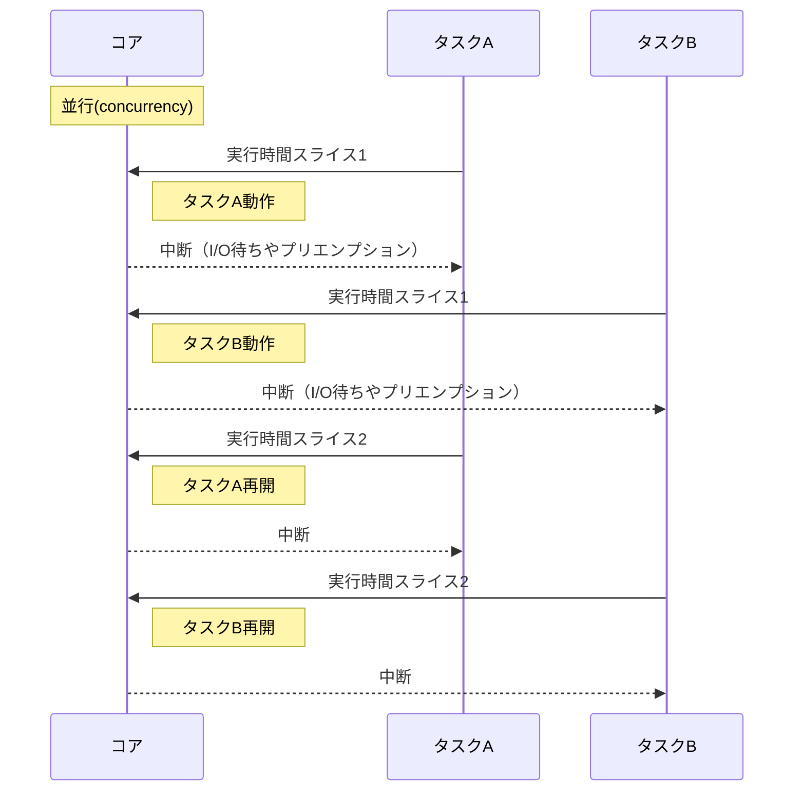
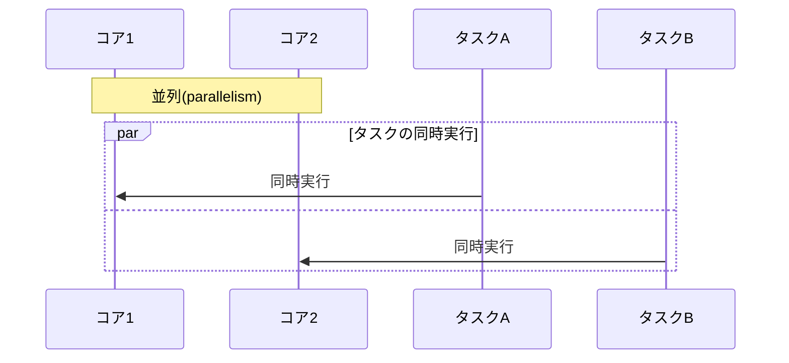

# 概要
Go言語は、軽量なgoroutineとランタイム機構により並行処理（concurrency）を強力にサポートし、Go 1.5以降はデフォルトでGOMAXPROCSが利用可能CPUコア数に設定されるため、適切に設定することでマルチコアを活かした並列実行（parallelism）も可能とする。本記事では、goroutineのスケジューリングやCPUバウンド処理でのマルチコア活用の仕組み、OSプロセス・スレッド・goroutineの関係を整理する。

# 並行（concurrency）と並列（parallelism）の違い
Goで直接指示して実装できるのは主に並行処理（concurrency）であり、goroutineにより複数タスクを重ね合わせて扱う。真の並列実行（parallelism）を行うには、実行環境が複数のCPUコアを持ち、かつ`GOMAXPROCS`を2以上に設定する必要がある。

## 並行(concurrency)の時間軸視点
単一コア上でタスクが時間を分割して重ね合わせて実行される様子を表す。実際のスケジューラはプリエンプションポイントやI/O完了通知のタイミングで切り替えを行うため、切り替えタイミングは厳密に決定的ではないが、goroutineはI/O待ちやランタイムプリエンプションで動的に切り替わりながら動作する。



- 複数処理を同時に開始するが、実際には時間を分割して単一コア上で切り替えながら実行する。
- I/O待ちやプリエンプションによりgoroutineを別のgoroutineへ切り替え、効率的に複数タスクを扱う。

## 並列(parallelism)の時間軸視点
複数コア上でタスクが物理的に同時実行される様子。実行環境が複数コアかつ`GOMAXPROCS`が2以上の場合に可能となる。



- 複数のgoroutineが異なるコアで同時に実行されるため、CPUバウンド処理を高速化できる。
- コード中は並行処理を記述し、環境要件を満たすと並列実行が行われる。

# goroutineとは
- **軽量な実行単位**: 通常のOSスレッドより小さい初期スタック（数KB）から始まり、必要に応じて伸長・縮小。大量生成してもオーバーヘッドが小さい。
- **生成方法**:

  ```go
  go func() {
      // 並行で実行したい処理
  }()
  ```

  返り値は直接取得できず、通信にはチャネルや同期プリミティブを使用。
- **ランタイム制御**: 実行タイミングやOSスレッドへの割り当てはGoランタイムスケジューラが担当。

# M-P-Gモデル（Machine, Processor, Goroutine）
Goランタイムのコア概念:

- **G（goroutine）**: ユーザーが生成する軽量スレッド。関数呼び出し履歴、スタック、スケジューリング状態を保持。
- **M（Machine / OSスレッド）**: 実際にOS上で動作するスレッド。goroutineをCPU上で実行する。
- **P（Processor / 仮想プロセッサ）**: Goランタイム内部の実行コンテキスト。goroutineを実行可能状態として管理するランナブルキューなどを持ち、MがPを介してGを取り出し実行。
  - P数は同時並列実行可能なgoroutine数の上限を決定し、`runtime.GOMAXPROCS`で設定可能（通常はCPUコア数と同じ）。

## G → P → M の流れ
1. goroutine生成時、Pのローカルキューまたはグローバルキューに登録。
2. 空きのMがPを取得し、キューからgoroutineを取り出して実行。
3. 終了またはI/O待ち・プリエンプションで中断後、別の実行可能goroutineが同様に実行される。

goroutineは軽量に生成・中断・再開され、高い並行性と並列性を実現するが、大量に生成するとスケジューリングオーバーヘッドやスタック成長コストが発生する可能性があるため、適切な粒度設計とプロファイリングによる検証が重要である。

# M-P-Gモデルの深掘りと参考記事
- [Ardan Labs: Scheduling in Go (Part 1)](https://www.ardanlabs.com/blog/2018/08/scheduling-in-go-part1.html)
- [Ardan Labs: Scheduling in Go (Part 2)](https://www.ardanlabs.com/blog/2018/08/scheduling-in-go-part2.html)
- [Illustrated Tales of Go Runtime Scheduler - Medium](https://medium.com/@ankur_anand/illustrated-tales-of-go-runtime-scheduler-74809ef6d19b)

これらを参照し、図解や具体的コード例を交えて説明すると理解が深まる。

## GOMAXPROCSと並列実行
- `runtime.GOMAXPROCS(n)`でP数を設定する。Go 1.5以降はデフォルトで利用可能CPUコア数が設定されるが、以前のバージョンではデフォルトが1であった。環境変数`GOMAXPROCS`でも明示的に設定でき、OSスレッド利用の挙動にも影響を与える。
- P数が1の場合、goroutineは並行処理できても同時実行は1つ。P数を2以上にすると、複数のOSスレッド上でgoroutineが同時実行され、CPUバウンド処理をマルチコアで並列化できる。
- 多くの場合デフォルト設定で十分だが、GCやI/O特性を考慮し必要に応じて調整する。

## スケジューリングの詳細
### ランナブルキューとワークステーリング
- 各Pがローカルランナブルキューを持ち、新規goroutineや他Pから盗まれたgoroutineを登録。
- ローカルキューが空になると、他Pのキューからgoroutineを盗み負荷分散。
- 必要に応じてグローバルキューも使用し、急増するgoroutineを管理。

### プリエンプティブスケジューリング
- Go 1.14以降、CPU占有が長時間続くgoroutineにもプリエンプションを適用。関数呼び出し後やループ内チェックポイントで割り込み、他のgoroutineへ切り替える。
- 特定のgoroutineによる飢餓を防止し、全体の応答性・スループットを向上する。

### ブロッキング操作時の挙動
- goroutineがチャネル操作やmutex待ちでブロックすると、そのgoroutineはP上で待機する。ネットワークI/Oの場合はGoランタイムのnetpollerで非同期ポーリングにより扱われ、OSスレッドが長時間ブロックされるのを避ける。システムコールでのブロック挙動やプラットフォーム依存の実装差を理解するには、実際のコード例や図解を参照するとよい。
- システムコールでMがブロックすると、ランタイムはそのMを専用化し、新たなMを生成またはアイドル中のMを利用して他のPのgoroutine実行を継続する。
- ネットワークI/Oはnetpollerで非同期処理し、完了時にgoroutineを再度ランナブルキューに戻す。

### システムコールとスレッド管理
- goroutineがシステムコールでブロックすると、Mを専用化し、残りのP→M経路で他のgoroutineを進行させる。Mは最小限の数を生成・再利用する。

## スタック管理とメモリ効率
- goroutineは小さい初期スタックで開始し、必要に応じて自動で伸長・縮小する。大量生成してもメモリ消費を抑えつつ高い並行性を維持可能。ただし、深い再帰や大きな配列をローカル変数として使うとスタックが大きく伸長し、再配置（リロケーション）コストが発生する場合がある。
  - 例: 再帰呼び出しが深い関数では、スタックサイズが増大しリロケーション頻度が高まるため、再帰をループに置き換えるか、配列をヒープ領域に移す設計（スライスを使う、関数外で大きなバッファを確保するなど）を検討する。
  - プロファイリングやトレースでスタック成長の挙動を確認し、適切な設計・実装を行うことが望ましい。
- 深い再帰や大きなローカル変数を持つ関数は、スタック再配置コストに注意する。

## CPUバウンド処理と並列活用
- CPUバウンド処理を複数のgoroutineに分割し、`GOMAXPROCS`を適切に設定することで、Goランタイムが複数OSスレッド上で並列実行しマルチコアを活かす。
- 分割や結果結合のオーバーヘッド、同期コストに留意し、適切な粒度で設計する。
- 例:

  ```go
  runtime.GOMAXPROCS(4)
  var wg sync.WaitGroup
  for i := 0; i < 4; i++ {
      wg.Add(1)
      go func(id int) {
          defer wg.Done()
          heavyComputation(id)
      }(i)
  }
  wg.Wait()
  ```

## I/Oバウンド処理との親和性
- Goランタイムは非同期ネットワークI/Oポーリング（netpoller）を内蔵し、I/O待ち中でも他のgoroutineを実行可能にする。プラットフォームごとの実装差やsystem callの挙動によって動作が異なるため、netpollerの仕組みやOS依存の処理を理解し、実際の環境での動作確認やプロファイリングを行うことが重要である。多数同時接続を扱うサーバーで高スループットを得やすいが、実装詳細を把握することでより最適な設計が可能となる。

## スケジューラチューニング
- **GOMAXPROCS**: デフォルト設定（コア数）が基本。特殊要件時のみ調整。
- **goroutineの粒度**: 細かすぎる生成はオーバーヘッド増大。適切な単位で並行タスクを設計。
- **ブロッキング理解**: CPU長時間使用や大きなシステムコールの影響を把握し、性能を検証する。
- **プロファイリング**: `go tool pprof`などでCPUプロファイルやスケジュール待ち時間を分析し、ボトルネックを特定する。
- **同期手法**: チャネルやmutexを適切に使い、不要な競合やデッドロックを避ける。
- **ランタイムログ**: `GODEBUG=schedtrace=1000,scheddetail=1`でスケジューラ挙動をログ化し、負荷テスト時の振る舞いを観察する。

## プリエンプションの仕組み（Go 1.14以降）
- Go 1.14以降、CPU占有が長いgoroutineにもプリエンプティブスケジューリングが働く。関数呼び出し後やループ内チェックポイントで割り込み、他のgoroutineへ切り替える。ただし、プリエンプションポイントはGoランタイムの実装や状況に応じたタイミングで挿入されるため、厳密なリアルタイム性を保証するものではない。例えば長いループ内で定期的にチェックポイントを挟む擬似コードのイメージを示すと、以下のような概念となる。

```go
func busyLoop() {
    for i := 0; i < 1e9; i++ {
        // ループ内の計算処理
        _ = i * i
        // Goランタイムはこのあたりでプリエンプションポイントを挿入し、他のgoroutine実行を許可することがある
    }
}
```

実際のプリエンプションはランタイム内部で自動的に行われ、明示的に記述する必要はないが、上記のようにループや関数呼び出しが安全点となり得ることを理解しておくと、長時間CPUを占有する処理でも並行性を維持しやすいことがわかる。

## OSプロセス・スレッド・goroutineの関係
- **OSプロセス**: プログラムの実行単位。Goプログラムは通常1つのOSプロセスとして起動する。
- **OSスレッド（M）**: CPU上で動作する実体。Goランタイムが複数生成・管理し、goroutine実行を担う。
- **goroutine（G）**: 軽量ユーザースレッド。直接OSスレッドを占有せず、GoランタイムスケジューラがM-P-Gを介して実行する。
- **P（仮想プロセッサ）**: Goランタイムの実行コンテキスト。goroutineを実行可能状態として管理し、MがPを取得してGを実行する。P数（`GOMAXPROCS`）が同時並列実行可能goroutine数を決定する。

```
[OSプロセス]
    ├─ Goランタイム起動 → 複数のOSスレッド(M)生成・管理
    ├─ Goランタイム内にPを複数（GOMAXPROCS分）用意
    └─ goroutine(G)はユーザーレベルで生成され、Pのランナブルキューに置かれる
       └─ 空きのMがPを取得すると、キューからGを取り出して実行
```

高い並行性・並列性を同時に実現する仕組みを理解し、ベンチマークやプロファイリングを通じて性能最適化に役立てる。

## まとめ
GoランタイムはM-P-Gモデルを基盤に、軽量なgoroutine生成と高度なスケジューリング機構を提供し、並行処理と並列処理を明確に区別しつつ自然にサポートする。開発者は`GOMAXPROCS`設定、goroutine粒度、プロファイリング、同期手法などを理解することで、性能最適化やスループット向上を図ることができる。

## 参考
- [Go メモリモデルリファレンス](https://go.dev/ref/mem)
- ~~Go Blog: Go Scheduler (公式ランタイムスケジューラ解説)~~
- [Goソースコード: runtime/proc.go (Scheduler実装部分)](https://go.googlesource.com/go/+/refs/heads/master/src/runtime/proc.go)
- [Ardan Labs: Scheduling in Go (Part 1)](https://www.ardanlabs.com/blog/2018/08/scheduling-in-go-part1.html)
- [Ardan Labs: Scheduling in Go (Part 2)](https://www.ardanlabs.com/blog/2018/08/scheduling-in-go-part2.html)
- [Illustrated Tales of Go Runtime Scheduler - Medium](https://medium.com/@ankur_anand/illustrated-tales-of-go-runtime-scheduler-74809ef6d19b)
- [Go 1.14 リリースノート（プリエンプティブスケジューリング導入の詳細）](https://go.dev/doc/go1.14)
- [Go GitHub リポジトリ: runtime パッケージ](https://github.com/golang/go/tree/master/src/runtime)

