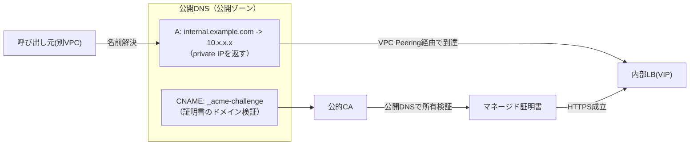

VPC内部の通信（あるアプリから別アプリの内部APIへの呼び出し）をHTTPS化する構成を考えていて、ふと「証明書のドメインはCloud DNSで払い出されるprivateなドメインでもよかったのでは？」と思ったので、整理しておく。

結論を先に書くと、**マネージド証明書（公的に信頼される証明書）を使いたいなら、ドメインは公開DNSに置く必要がある**。private zoneのドメインではマネージド証明書は発行できない。

# 前提となる構成

- リージョン内部LB（INTERNAL_MANAGED）をHTTPS（443）で公開する
- 呼び出し元は別VPCにいて、VPC Peering経由で内部LBのVIPにアクセスする
- 内部LBにはGoogle Cloud Certificate Managerのマネージド証明書を付与する

# DNSには2つの役割がある

この構成でDNSが担う役割は、実は2つに分かれている。

| 役割 | 内容 |
| --- | --- |
| (A) 証明書のドメイン検証 | Certificate ManagerのDNS Authorization（`_acme-challenge`のCNAME）とCAA |
| (B) 名前解決 | LBのVIPを引くためのAレコード |

「Cloud DNSのprivate zoneでよかったのでは」という疑問は、主に(B)の話。(B)だけならprivate zoneでも成立する。

# (A) マネージド証明書の検証は公開DNS必須

ここが肝。マネージド証明書（＝公的CAが署名する証明書）を発行するとき、GoogleのCAは**インターネットの公開DNSから** `_acme-challenge` のレコードを引いてドメイン所有を検証する。

private zoneはVPC内部からしか引けないので、外部のCAからは見えない。つまり**private zoneのドメインに対してはマネージド証明書を発行できない**。

| ゾーン種別 | 外部のCAから引けるか | マネージド証明書 |
| --- | --- | --- |
| 公開ゾーン（public） | 引ける | 使える |
| private zone（VPC内のみ） | 引けない | 使えない |

# private zoneでHTTPSをやるなら？

どうしてもprivate zone（VPC内専用ドメイン）でHTTPSをやるなら、選択肢は変わる。

- **セルフマネージド証明書**を使う。社内CA（GCPなら[Certificate Authority Service](https://cloud.google.com/certificate-authority-service)、AWSなら[ACM Private CA](https://docs.aws.amazon.com/privateca/)）でprivateなCAを立て、そこから発行した証明書をLBにアップロードする。
- ただし呼び出し元は、そのprivate CAのルート証明書を信頼ストアに入れる必要がある。
- マネージド証明書のように「公的CAだから何もしなくても信頼される」という手軽さはなくなる。

# 採用した落とし所：公開ドメイン＋private IP

今回は、private zoneを使わずに次の形にした。

- ドメイン自体は公開DNS（公開ゾーン）に置く
- ただしAレコードが返す値は**private IP（内部LBのVIP）**
- 証明書は公的マネージド証明書

「公開DNSにprivate IPのAレコードを置く」のは一見奇妙だが、ドメインが公開なので検証(A)も名前解決(B)も同じ公開ゾーンに集約でき、証明書はマネージドのまま使える。実際の到達はVPC Peering経由なので、IPが公開DNSに見えても外部から到達できるわけではない。

# 一般的にはどうしているか

内部通信のTLSは定番の悩みで、規模に応じてだいたい次のどれかに落ち着く。

- **公開ドメイン＋private IP＋公的マネージド証明書**（今回）。CA運用ゼロで一番ラク。VPC内部からだけ叩く内部APIでよく使われる。
- **マネージドなprivate CA**（ACM Private CA / GCP CAS）。内部ドメインを厳格に閉じたい場合。古典的な自前CAよりは運用が楽。
- **サービスメッシュ**（Istio / Linkerd など）にmTLSを任せる。サービス数が多く、証明書運用を隠蔽したい場合。

# まとめ

- マネージド証明書の検証は公開DNS必須。**private zoneのドメインではマネージド証明書は使えない**。
- private zoneでHTTPSをやるなら、private CA＋ルート証明書配布のセルフマネージド運用が必要になる。
- それを避けたいなら「公開ドメイン＋private IP＋マネージド証明書」が手軽な落とし所。

「privateなドメインならマネージド証明書が使えないのでは？」という直感は正しくて、証明書を公的なものにする以上、検証は必ず公開DNSを通る、というのが要点だった。
