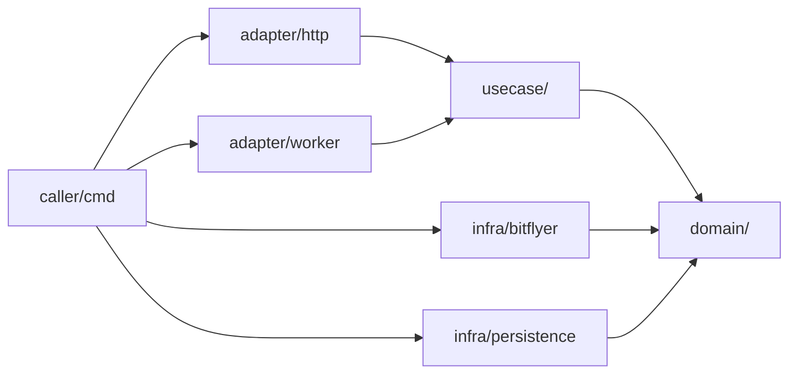
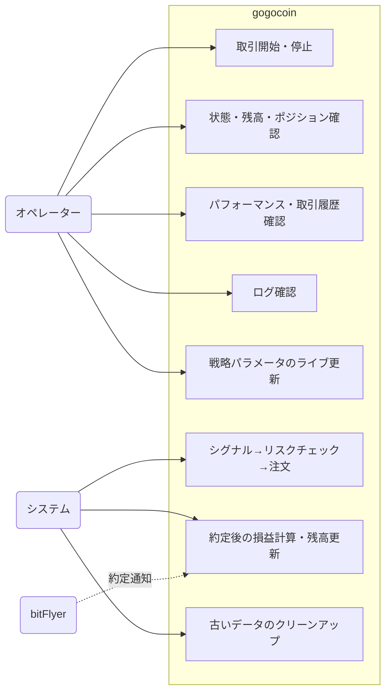
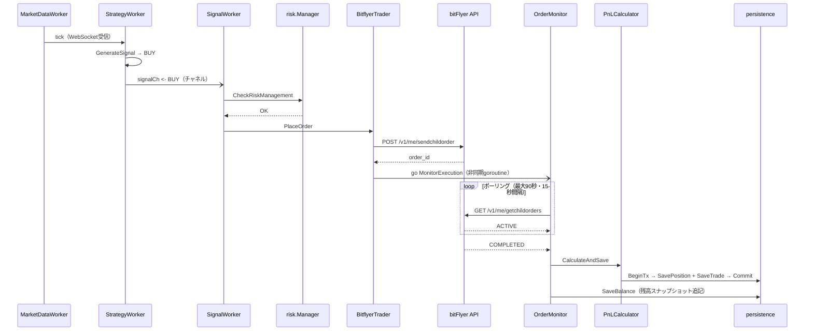
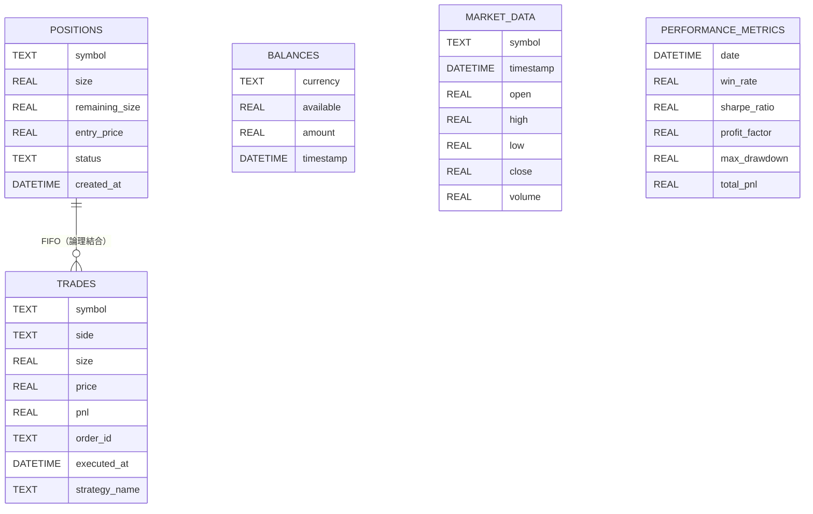

# gogocoin — セルフホスティング暗号資産の自動取引ボットの紹介

## 作った理由

OSSの仮想通貨ボットや自動取引サービスは多く存在する。それでもこれを作ったのは、自分で思い通りに動くものを実装し、自分の資金で実際に利益を上げる体験をしてみたかったからである。以前一度作ったことがあるが、今回はAIを活用しながら改めて作り直した。実際に運用してみると学びが多く、趣味として続けられるソフトウェアになっている。

[gogocoin](https://github.com/bmf-san/gogocoin)

## 使い始め方

**対応取引所はbitFlyer一択。** APIアクセスには自作の[`go-bitflyer-api-client`](https://github.com/bmf-san/go-bitflyer-api-client)ライブラリを使用しており、他取引所には対応していない。注文発注にはbitFlyerの現物専用エンドポイント（`/v1/me/sendchildorder`）を使うため、**信用取引（FX\_BTC\_JPY等）は非対応**となっている。

gogocoinには2つの使い方がある。

**A. ライブラリとして使う（推奨）**

`example/` ディレクトリに完全な動作サンプルが入っている。自分のリポジトリに発展させる際の出発点として使える。

```bash
git clone https://github.com/bmf-san/gogocoin.git && cd gogocoin/example

# 設定ファイルを作成（APIキーを環境変数で指定）
cp configs/config.example.yaml configs/config.yaml
export BITFLYER_API_KEY=your_key
export BITFLYER_API_SECRET=your_secret

make run
# または: go run ./cmd/

# → http://localhost:8080 でダッシュボードが開く
```

`example/configs/config.example.yaml`をそのまま使うと、XRP/JPY・1000円/回のスキャルピングが動く。通貨ペアは`trading.symbols`、注文サイズは`strategy_params.scalping.order_notional`で変更できる。

`go get github.com/bmf-san/gogocoin@latest`で自分のリポジトリに組み込んで使うこともできる。

**B. Dockerで素早く試す**

`example/`に`Dockerfile`と`docker-compose.yml`が入っている。Aと同じEMA+RSIスキャルピング戦略が登録済みのバイナリをビルドして起動する。

```bash
git clone https://github.com/bmf-san/gogocoin.git && cd gogocoin/example
cp configs/config.example.yaml configs/config.yaml
# configs/config.yaml にAPIキーを記入
make up

# → http://localhost:8080 でダッシュボードが開く
```

Dockerfileのビルドコンテキストはリポジトリルートなので、`example/`ディレクトリから実行すること。

## アーキテクチャ

コードベースは4層のレイヤードアーキテクチャを採用している。`internal/`にドメインロジック・ユースケース・外部アダプター（bitFlyerクライアント・SQLiteリポジトリ・HTTPハンドラ等）、`pkg/strategy`がStrategyインターフェース定義とスキャルピングリファレンス実装を提供する公開パッケージになっている。Composition Root（全サービスの指定・組み立て）は呼び出し側のリポジトリに存在する（`example/cmd/main.go`がそのサンプル）。



依存ルールはCIで強制している。

| ルール | 詳細 |
|---|---|
| `domain/` は内部importゼロ | stdlibのみ。インフラも usecase も知らない |
| `usecase/` は `infra/` をimportしない | `domain/` インターフェースにのみ依存する |
| `adapter/` は `infra/` の具体型を持たない | `domain/` インターフェースのみ使用 |
| `infra/` は `domain/` を実装する | `usecase/` や `adapter/` は知らない |
| Composition Root は呼び出し側リポジトリに存在する | `internal/` はwiring不要 |

公開API（セマンティックバージョニング対象）は `pkg/` 以下に分離している。`pkg/engine` がエンジン起動のエントリーポイント、`pkg/strategy` がStrategyインターフェースとレジストリを提供する。

## ユースケース



オペレーターはHTTP API（WebダッシュボードのUIを含む）を通じて取引の制御と状態確認を行う。シグナル生成・注文・損益計算・データクリーンアップはシステムが自律的に実行する。

## 取引フロー

WebSocketでティックを受信してから注文が約定・損益記録されるまでの主なフローを示す。



`StrategyWorker` と `SignalWorker` はGoチャネル経由で非同期に連結している。`PlaceOrder()` は発注後すぐにreturnし、約定監視は `OrderMonitor` がgoroutineで行う。`PnLCalculator` はポジションと取引を同一トランザクション内で保存し、完了後に `OrderMonitor` が残高スナップショットを追記する。

## Strategyインターフェース

すべての取引戦略は`pkg/strategy/strategy.go`で定義された`Strategy`インターフェースを実装する必要がある。これによりエンジンは特定のアルゴリズムから分離される。

```go
// AutoScaleConfig は Strategy.GetAutoScaleConfig が返す注文サイズ自動スケール設定。
// エンジンがこれを使うことで、戦略固有の設定キーを直接読まずに注文金額を計算できる。
type AutoScaleConfig struct {
    Enabled     bool
    BalancePct  float64 // 利用可能なJPY残高に対する割合（0-100）
    MaxNotional float64 // JPYの上限。0 = 無制限
    FeeRate     float64
}

type Strategy interface {
    // 最新の市場データポイントからシグナルを生成
    GenerateSignal(ctx context.Context, data *MarketData, history []MarketData) (*Signal, error)

    // 履歴データのバッチからシグナルを生成
    Analyze(data []MarketData) (*Signal, error)

    // ライフサイクル
    Start(ctx context.Context) error
    Stop(ctx context.Context) error
    IsRunning() bool
    GetStatus() StrategyStatus
    Reset() error

    // メトリクス等
    GetMetrics() StrategyMetrics
    RecordTrade()
    InitializeDailyTradeCount(count int)

    // 設定
    Name() string
    Description() string
    Version() string
    Initialize(config map[string]interface{}) error
    UpdateConfig(config map[string]interface{}) error
    GetConfig() map[string]interface{}

    // 注文サイジング — エンジンが戦略固有の設定キーを直接参照しないよう各戦略が実装する
    GetStopLossPrice(entry float64) float64   // 0 = 損切なし
    GetTakeProfitPrice(entry float64) float64 // 0 = 利確なし
    GetBaseNotional(symbol string) float64
    GetAutoScaleConfig() AutoScaleConfig
}
```

`Initialize()`は`config.yaml`の`strategy_params.<name>`ブロックを`map[string]interface{}`として受け取る。`UpdateConfig()`はHTTP API経由でボットを再起動せずにライブでパラメータを更新できる。

戦略はグローバルレジストリへの自己登録で動作する。`database/sql`パッケージのドライバ登録と同じ仕組みで、各戦略パッケージの`register.go`が`init()`内で`strategy.Register("name", constructor)`を呼び出し、`main.go`はブランクインポート（`_ "github.com/bmf-san/gogocoin/pkg/strategy/scalping"`）で戦略を取り込む。新しい戦略の追加は`main.go`への`import`行の追加だけで済み、エンジンコードの変更は不要となっている。

## エンジンのリスク管理

エンジン（`StrategyWorker`）は戦略から独立して、毎ティックで損切り・利確を強制適用する。ティックのたびに`GetStopLossPrice` / `GetTakeProfitPrice`を呼び出し、価格が閾値を超えた瞬間にポジションをクローズする。シグナル発生を待つ必要はない。

`config.yaml`の`max_open_positions_per_symbol: 1`ガードはポジションの積み上がりを防ぐ。このガードがないと、下降トレンド中に複数のBUYシグナルが同一シンボルに積み上がり、損切り発動時にすべてが一度にクローズされて損失が倍増する。`1`に設定することで、同シンボルにオープンポジションが存在する場合はBUYを拒否する。

エンジンは`GetAutoScaleConfig()`を通じた残高比例注文サイジングもフレームワーク機能として持つ。有効化するには、自分の戦略実装で`GetAutoScaleConfig()`をオーバーライドして`Enabled: true`と割合・上限を返すよう実装する。

## 残高キャッシュ — ダブルチェックロック

取引ループは残高情報を頻繁に問い合わせる。ティックごとにレート制限付きのREST API呼び出しは適切でない。`BalanceService`は60秒TTLのキャッシュを保持し、ダブルチェックロックパターンでthundering herd問題を防ぐ。

```go
func (s *BalanceService) GetBalance(ctx context.Context) ([]domain.Balance, error) {
    // 第1チェック: 書き込みロックなしで読み取る
    s.cache.mu.RLock()
    cacheTimestamp := s.cache.timestamp
    cacheData := s.cache.data
    s.cache.mu.RUnlock()

    if time.Since(cacheTimestamp) < CacheDuration && len(cacheData) > 0 {
        result := make([]domain.Balance, len(cacheData))
        copy(result, cacheData)
        return result, nil
    }

    // APIフェッチをシリアライズ
    s.fetchMu.Lock()
    defer s.fetchMu.Unlock()

    // 第2チェック: ロック取得後に再確認
    s.cache.mu.RLock()
    cacheTimestamp = s.cache.timestamp
    cacheData = s.cache.data
    s.cache.mu.RUnlock()
    if time.Since(cacheTimestamp) < CacheDuration && len(cacheData) > 0 {
        result := make([]domain.Balance, len(cacheData))
        copy(result, cacheData)
        return result, nil
    }

    // ... API呼び出しとキャッシュ更新
}
```

外側の`cache.mu`（`sync.RWMutex`）がフレッシュなキャッシュデータの同時読み取りを許可する。内側の`fetchMu`（`sync.Mutex`）がAPI呼び出しをシリアライズし、キャッシュ失効時に正確に1つのゴルーチンのみが取得する。

## データモデル

取引データはSQLiteに保存する。テーブルとドメインモデルの対応は次の通りとなっている。

| テーブル | 内容 | 備考 |
|---|---|---|
| `trades` | 約定レコード | `order_id UNIQUE`で冪等性保証。不変（UPDATEなし） |
| `positions` | FIFOポジション | OPEN / PARTIAL / CLOSED の3状態。BUYで生成・SELLで更新 |
| `balances` | 残高スナップショット | 追記のみ（上書きなし）。通貨ごとに最新行を取得 |
| `market_data` | WebSocketティックデータ | UNIQUE(symbol, timestamp) |
| `performance_metrics` | 日次パフォーマンス指標 | 取引完了ごとにスナップショットを追記 |
| `logs` | 構造化ログ | `fields` カラムはJSON |
| `app_state` | 実行時フラグのKVストア | `trading_enabled`等 |



外部キー制約は持たない。`PnLCalculator` が `positions` と `trades` を同一トランザクション内で書き込むため整合性はアプリケーション層でアトミックに保証する設計となっている。

## Webダッシュボード

内蔵Web UIは`http://localhost:8080`で動作し、サイドバーナビゲーションで4ページに分かれている。

- **ダッシュボード** — 総損益・本日損益・勝率・取引回数の4枚のサマリーカードと、接続状態・戦略・稼働時間・監視中の通貨ペア価格をまとめたシステム状態パネル。
- **パフォーマンス** — 残高、リスク指標（シャープレシオ・プロフィットファクター・最大ドローダウン）、日別損益。
- **取引履歴** — 日時・通貨ペア・売買・価格・数量・手数料・損益の一覧テーブル。
- **システムログ** — ログレベル（DEBUG / INFO / WARN / ERROR）とカテゴリ（システム・取引・API・戦略・UI・データ）でフィルタリングできるログビューア。

トップバーの「開始」「停止」ボタンでボットをその場で制御できる。設定（API資格情報、取引パラメータ）は`config.yaml`で行う—外部データベース不要（データはSQLiteに記録）。

## VPSデプロイ

gogocoinは単一の静的リンクバイナリ一本で配布する。[gogocoin-vps-template](https://github.com/bmf-san/gogocoin-vps-template)はConoHa VPSでの運用を想定したセットアップサンプルで、systemd設定やデプロイ手順の参考に使える。systemdユニットファイルは次の通りとなっている。

```ini
[Unit]
Description=gogocoin - bitFlyer 自動取引ボット
After=network.target

[Service]
Type=simple
User=gogocoin
WorkingDirectory=/opt/gogocoin
EnvironmentFile=/opt/gogocoin/.env
ExecStart=/opt/gogocoin/gogocoin
Restart=always
RestartSec=5
StandardOutput=journal
StandardError=journal
SyslogIdentifier=gogocoin
NoNewPrivileges=true
PrivateTmp=true

[Install]
WantedBy=multi-user.target
```

`make setup`でVPSの初期セットアップ（systemdサービスのインストール等）を行い、デプロイは付属のGitHub Actionsワークフロー（`workflow_dispatch`）で自動化されており、linux/amd64向けにビルドして`rsync`でVPSへ転送する。

## まとめ

gogocoinは自分の取引戦略を自由に実装して実際の資金で動かせる、ミニマルなセルフホスティング型自動取引ボットである。自作のコードが直接損益に影響するというのはなかなかエキサイティングで、戦略のチューニングや機能の作り込みに際限なくハマれる面白さがある。興味があればぜひ触ってみてほしい。

- **GitHub**: [bmf-san/gogocoin](https://github.com/bmf-san/gogocoin)
- **VPSテンプレート**: [bmf-san/gogocoin-vps-template](https://github.com/bmf-san/gogocoin-vps-template)
