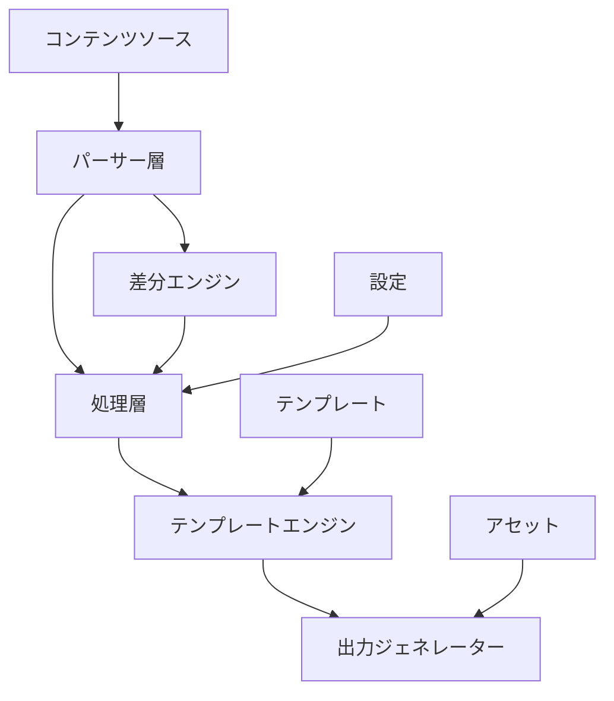
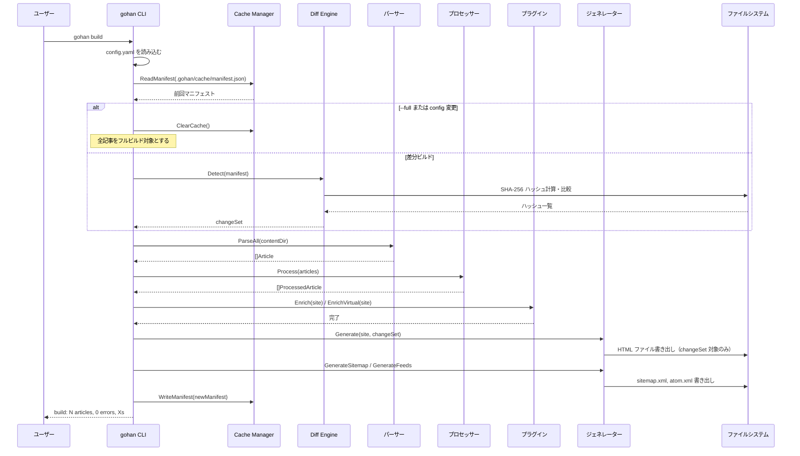
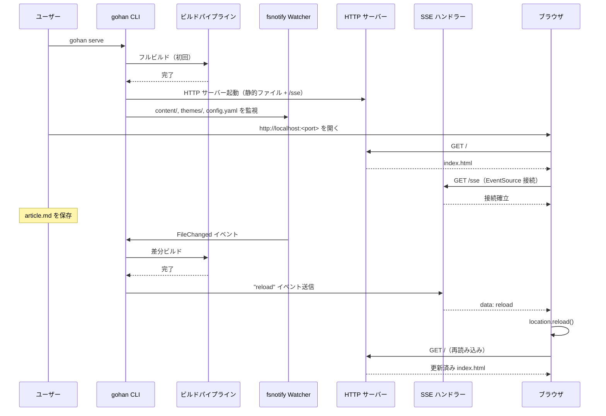

# gohan — インクリメンタルビルド対応のGo製静的サイトジェネレータの紹介

## 作った理由

このサイト（bmf-tech.com）はgohanで動いている。自分で完全に理解でき、変更したページだけを再生成する静的サイトジェネレータが欲しかった。ほとんどのジェネレータは無条件全再生成か Git diff 依存のどちらかだが、Git diff はブランチ切り替えやフレッシュ clone 後に信頼性が落ちる。gohan は SHA-256 コンテンツハッシングでビルドマニフェストを永続化し、Git 履歴に依存せず常に正確な差分ビルドを実現する。

## クイックスタート

```bash
# 1. プロジェクトディレクトリを作成
mkdir myblog && cd myblog

# 2. config.yaml を追加
cat > config.yaml << 'EOF'
site:
  title: My Blog
  base_url: https://example.com
  language: ja
build:
  content_dir: content
  output_dir: public
theme:
  name: default
EOF

# 3. 最初の記事を作成
gohan new --title="Hello, World!" hello-world

# 4. サイトをビルド
gohan build

# 5. ライブリロード付きでプレビュー
gohan serve   # http://127.0.0.1:1313 を開く
```

## アーキテクチャ

### システム構成



### ディレクトリ構造

入力:

```text
.
├── config.yaml
├── content/
│   ├── posts/        # ブログ記事（一覧・タグ・アーカイブ対象）
│   └── pages/        # 静的ページ（About, Contact など）
├── themes/
│   └── default/
│       └── layouts/  # テンプレートファイル
├── assets/           # CSS・画像などの静的ファイル
└── taxonomies/
    ├── tags.yaml
    └── categories.yaml
```

出力（`public/`）:

```text
public/
├── index.html
├── posts/
├── pages/
├── tags/
├── categories/
├── archives/
├── feed.xml
├── atom.xml
├── sitemap.xml
└── assets/
```

## インクリメンタルビルドエンジン

インクリメンタルビルドのコアは`internal/diff/git.go`にある。`Detect()`メソッドが現在のワーキングツリーを永続化した`BuildManifest`と比較する。

```go
func (g *GitDiffEngine) Detect(manifest *model.BuildManifest) (*model.ChangeSet, error) {
    current, err := hashAllFiles(g.rootDir)
    if err != nil {
        return nil, err
    }

    if manifest == nil {
        cs := &model.ChangeSet{}
        for path := range current {
            cs.AddedFiles = append(cs.AddedFiles, path)
        }
        return cs, nil
    }

    cs := &model.ChangeSet{}
    for path, hash := range current {
        if prev, ok := manifest.FileHashes[path]; !ok {
            cs.AddedFiles = append(cs.AddedFiles, path)
        } else if prev != hash {
            cs.ModifiedFiles = append(cs.ModifiedFiles, path)
        }
    }
    for path := range manifest.FileHashes {
        if _, ok := current[path]; !ok {
            cs.DeletedFiles = append(cs.DeletedFiles, path)
        }
    }
    return cs, nil
}
```

`hashAllFiles()`がコンテンツディレクトリをウォークして全ファイルのSHA-256 hexダイジェストを計算する。初回ビルド（またはマニフェストが存在しない場合）は全ファイルが`Added`とみなされる。以降のビルドでは`Added`、`Modified`、`Deleted`の3種類の変更を検出する。影響を受けたHTMLページだけを再生成する。

`config.yaml`自体もビルドごとにハッシュされており、変更を検知すると自動的にキャッシュをクリアしてフルビルドに切り替わる。`--full`フラグで明示的に強制することもできる。

キャッシュは `.gohan/cache/manifest.json` に保存される。

```text
.gohan/
└── cache/
    └── manifest.json   # ファイルハッシュ一覧
```

### ビルドシーケンス（`gohan build`）



### 開発サーバー・ライブリロード（`gohan serve`）



## 機能一覧

インクリメンタルビルドに加え、gohanは標準で多くの機能を提供する。

- **Markdown + Front Matter** — GFM (GitHub Flavored Markdown) + YAMLメタデータ対応。
- **タクソノミー** — タグ・カテゴリーページを自動生成。
- **Atomフィード / サイトマップ** — `atom.xml`・`sitemap.xml` を自動生成。
- **カスタマイズ可能なテーマ** — Go `html/template` による完全制御。
- **i18n** — `content/en/`と`content/ja/`のようなロケールミラーディレクトリ構造。ロケール切り替えリンクを自動生成。
- **シンタックスハイライト** — Chromaによるサーバーサイドレンダリング。クライアントサイドJavaScript不要。
- **Mermaid図** — ビルド時にSVG変換またはクライアントサイドレンダリング用の`<pre class="mermaid">`として出力。
- **OGP画像生成** — 記事ごとにOpen Graph画像をビルド時に生成。
- **ページネーション** — 1ページあたりの記事数を設定可能。
- **関連記事** — タグによる類似記事リンク。
- **GitHubSourceリンク** — Markdownソースへの編集リンクを自動追加。
- **ライブリロード開発サーバー** — `gohan serve`がコンテンツを監視し保存時に自動再ビルド。

## プラグインシステム

gohanはGoの標準`plugin`パッケージや外部ライブラリとしての設計ではなく、**バイナリ内蔵型**を選んだ。理由はシンプルで、「手軽にシンプルに最短でSSGを使える体験」を優先したかったからだ。動的ロードやライブラリ依存を持ち込むと、インストール・ビルド・配布の手間が増える。問題になるまでは内蔵型で構わないという判断のもと、現在の設計に落ち着いている。

プラグインはgohanバイナリにコンパイルされ、`config.yaml`でプロジェクトごとに有効化する。利用者側の再コンパイルは不要だ。プラグインインターフェースは`internal/plugin/plugin.go`に定義される。

```go
type Plugin interface {
    Name() string
    Enabled(cfg map[string]interface{}) bool
    TemplateData(article *model.ProcessedArticle, cfg map[string]interface{}) (map[string]interface{}, error)
}

type SitePlugin interface {
    Name() string
    Enabled(cfg map[string]interface{}) bool
    VirtualPages(site *model.Site, cfg map[string]interface{}) ([]*model.VirtualPage, error)
}
```

`Plugin`（記事単位）は1つの記事に追加データを記事のテンプレートを通じて`.PluginData.<name>`として公開する。`SitePlugin`（サイト全体）は全記事処理後に実行され、Markdownソースを持たない**仮想ページ**を生成できる。

内蔵レジストリには2つのプラグインが内蔵されている。

```go
func DefaultRegistry() *Registry {
    return &Registry{
        plugins: []Plugin{
            amazonbooks.New(),
        },
        sitePlugins: []SitePlugin{
            bookshelf.New(),
        },
    }
}
```

`amazon_books`は記事フロントマターのASIN値からAmazonアフィリエイト本カードデータ（画像・URL・タイトル）を生成する。`bookshelf`はサイト全体の本フロントマターを集約し履歴できる仮想`/bookshelf`ページを生成する。

`config.yaml`での設定例。

```yaml
plugins:
  amazon_books:
    enabled: true
    tag: "your-associate-tag-22"
  bookshelf:
    enabled: true
```

## CLI リファレンス

### `gohan build`

```bash
gohan build [--full] [--config=path] [--output=dir] [--parallel=N] [--dry-run]
```

| フラグ | 説明 |
|---|---|
| `--full` | 前回マニフェストを無視してフルビルドを強制 |
| `--config` | 設定ファイルのパス（デフォルト: `./config.yaml`） |
| `--output` | 出力ディレクトリの上書き |
| `--parallel` | 並列ワーカー数（デフォルト: CPU数） |
| `--dry-run` | ファイルを書き出さずに変更対象を表示 |
| `--draft` | ドラフト記事（`draft: true`）もビルド対象に含める |

### `gohan new`

```bash
gohan new [--title="タイトル"] [--type=post|page] <slug>
```

### `gohan serve`

```bash
gohan serve [--port=N] [--host=addr]
```

| フラグ | 説明 |
|---|---|
| `--port` | ポート番号（デフォルト: `1313`） |
| `--host` | ホストアドレス（デフォルト: `127.0.0.1`） |

## インストールと基本操作

```bash
# Homebrew (macOS/Linux)
brew install bmf-san/tap/gohan

# Go install
go install github.com/bmf-san/gohan/cmd/gohan@latest

# ビルド
gohan build

# ライブリロード付き開発サーバー
gohan serve
```

## まとめ

gohanはこのサイトを動かすエンジンだ。SHA-256マニフェストによるインクリメンタルビルドがイテレーションを速く保ち、コンパイル済みプラグインシステムがバイナリを自由に保つ。i18nからOGP、Mermaidまで、ビルド時はクライアントサイドJavaScript不要で動作する。

- **GitHub**: [bmf-san/gohan](https://github.com/bmf-san/gohan)
