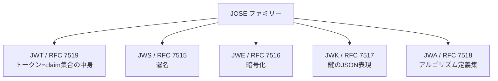

# 概要

JWTについて調べていると、JWS・JWE・JWK・JWAといった似た用語が次々と出てきて混乱することがある。「JWTとJWSって何が違うのか」「あの3つのドットで区切られた文字列は何なのか」といった疑問は、これらの仕様がまとめて**JOSE**というファミリーを構成していることを理解すると一気に解消する。

この記事では、JOSE（JSON Object Signing and Encryption）の全体像を整理し、それぞれの仕様の役割・関係・使い分け、そして安全に使うためのベストプラクティス（RFC 8725）までをまとめる。

関連するRFCは以下の通り。

- [RFC 7515 JSON Web Signature (JWS)](https://www.rfc-editor.org/rfc/rfc7515)
- [RFC 7516 JSON Web Encryption (JWE)](https://www.rfc-editor.org/rfc/rfc7516)
- [RFC 7517 JSON Web Key (JWK)](https://www.rfc-editor.org/rfc/rfc7517)
- [RFC 7518 JSON Web Algorithms (JWA)](https://www.rfc-editor.org/rfc/rfc7518)
- [RFC 7519 JSON Web Token (JWT)](https://www.rfc-editor.org/rfc/rfc7519)
- [RFC 8725 JSON Web Token Best Current Practices](https://www.rfc-editor.org/rfc/rfc8725)

# JOSEとは

JOSE（JSON Object Signing and Encryption）は、「JSONで表現したデータを署名・暗号化して安全に受け渡す」ための一連の標準仕様群である。IETFのjoseワーキンググループが策定した。まとめて**JWx**と呼ばれることもある。



# JWT と JWS/JWE の関係

多くの人が「JWT」と「JWS」を混同する。まずこの関係を整理しておくと、あとの理解がスムーズになる。

- **JWT**は「中身」、つまりclaim（クレーム）の集合そのものを指す抽象的な概念である。
- その中身を「どう保護して運ぶか」で、2つの表現がある。
  - 署名して運ぶ → **JWS**表現（3パート）
  - 暗号化して運ぶ → **JWE**表現（5パート）

```
JWT = 中身（{ "sub": "alice", "exp": 1700000000, "aud": "api" }）
       │
       ├─ 署名して運ぶ  → JWS → header.payload.signature（3パート）
       └─ 暗号化して運ぶ → JWE → header.encrypted_key.iv.ciphertext.tag（5パート）
```

普段[jwt.io](https://jwt.io/)に貼り付けるような`xxx.yyy.zzz`の3パート構造は、正確には「JWSで署名されたJWT」である。payloadをbase64urlデコードすれば中身が読めるのは、JWSが署名しかしていない（暗号化していない）からである。

一言でまとめると次のようになる。

- **JWT**: 何を主張するか（中身）
- **JWS**: 署名して運ぶ器（中身は見える、改ざんは防ぐ）← 普段の「JWT」
- **JWE**: 暗号化して運ぶ器（中身が隠れる）

# JWS（署名）

JWSは3つのパートをドットで連結した構造を持つ。

```
eyJhbGci...  .  eyJzdWIi...  .  SflKxwRJ...
└─ header ─┘    └─ payload ┘    └ signature ┘
  {alg, typ}     {claim集合}      署名
```

- 保証するもの: 完全性（改ざん検知）と発行者の真正性。**機密性はない**（payloadは誰でも読める）。
- 署名の方式には2種類ある。
  - **HMAC（HS256など）**: 対称鍵。共有した秘密で署名・検証する。
  - **デジタル署名（RS256 / ES256など）**: 非対称鍵。秘密鍵で署名し、公開鍵で検証する。

検証側は、ヘッダの`alg`を見て、発行者の鍵で署名を検証する。ただし後述するように、この`alg`を鵜呑みにすると攻撃の入り口になる。

# JWE（暗号化）

JWEは5つのパートを持ち、中身を暗号化して隠す。

```
header . encrypted_key . iv . ciphertext . tag
 └┬──┘   └─────┬─────┘  └┬┘  └────┬────┘  └┬┘
JOSEヘッダ  暗号化されたCEK  IV   暗号文     認証タグ
(alg,enc)
```

- 保証するもの: 機密性（中身を隠す）と完全性。
- 使いどころ: PII（個人情報）などの機密claimをトークンに載せる必要があるとき。JWSは署名だけで中身が見えてしまうため、隠したいならJWEを使う。

## ハイブリッド暗号（2段階）

JWEは鍵を2段階で扱う。

1. コンテンツ暗号鍵（CEK）をランダムに生成し、本体をCEKで暗号化する（対称暗号なので高速）。これが`enc`パラメータ。
2. そのCEK自体を受信者の公開鍵で暗号化する。これが`encrypted_key`。使う暗号方式が`alg`パラメータ。

復号時は、受信者が秘密鍵でCEKを取り出し、そのCEKで本体を復号する。公開鍵暗号は遅くサイズ制限もあるため本体には使えず、速い対称暗号で本体を暗号化し、その鍵だけ公開鍵で包む。TLSと同じ発想である。

## JWSとJWEの見分け方

- ドットで区切ったパート数が**3ならJWS、5ならJWE**。
- ヘッダに`enc`があればJWE。

# JWK（鍵のJSON表現）

JWKは鍵をJSONで表す仕様である。公開鍵の配布（`jwks_uri`）で多用される。

```json
{
  "kty": "RSA",
  "kid": "2026-key-1",
  "use": "sig",
  "alg": "RS256",
  "n": "0vx7...",
  "e": "AQAB"
}
```

複数のJWKを`keys`配列で束ねたものを**JWK Set（JWKS）**と呼ぶ。実務では、認可サーバーが`jwks_uri`でJWKSを公開し、リソースサーバーがそこから公開鍵を取得してJWSを検証する、という形で使われる。これは認証基盤の要となる部分である。

# JWA（アルゴリズム定義集）

JWAは、JWS/JWE/JWKで使う`alg` / `enc`の値を定義する集合である。「RS256とは正確には何か」の答えがここにある。

```
署名/MAC (JWS alg):
  HS256/384/512 … HMAC + SHA（対称）
  RS256/384/512 … RSASSA-PKCS1-v1_5 + SHA（非対称）
  ES256/384/512 … ECDSA + SHA（非対称・楕円曲線）
  PS256/...     … RSASSA-PSS
  none          … 署名なし（危険）

鍵管理 (JWE alg):     RSA-OAEP, ECDH-ES, A128KW ...
コンテンツ暗号 (JWE enc): A128GCM, A256GCM, A128CBC-HS256 ...

鍵タイプ (kty): RSA(n,e,d..) / EC(crv,x,y,d) / oct(k)
```

アルゴリズムは識別子（`alg`の値）で選べるように設計されている。これにより、弱いアルゴリズムが見つかったときに別のものへ移行できる（cryptographic agility）。ただしこの柔軟性は、後述の通り攻撃の余地にもなる。

# セキュリティ：JWT BCP（RFC 8725）

JOSEにまつわる有名な事故は、ほぼ次の2つに集約される。RFC 8725（JSON Web Token Best Current Practices）は、これらを防ぐためのベストプラクティスをまとめている。

## alg=none 攻撃

攻撃者がヘッダを`{"alg":"none"}`に書き換え、署名を空にする。検証側のライブラリが`none`を受け入れてしまうと、署名のないトークンを正当なものとして通してしまう。

対策は、**`none`を許可しないこと**。

## alg混同（RS256 ↔ HS256）

サーバーはRS256（公開鍵で検証）を想定しているとする。攻撃者はヘッダをHS256に書き換え、**公開鍵の文字列を共有鍵として** HMAC署名する。検証側が`alg`をヘッダ任せにしていると、公開鍵をHMAC鍵として検証してしまい、署名が通ってしまう。

対策は、**検証側で許可する`alg`を固定し、ヘッダの`alg`を信用しないこと**。

## RFC 8725 の中心メッセージ

- 許可する`alg`を検証側で固定する（アルゴリズム検証を必ず行う）。
- `none`や弱いアルゴリズムを排除する。
- `typ`ヘッダで用途を区別する（例: `at+jwt`、`secevent+jwt`）。クロスJWT混同を防ぐ。
- `iss`（発行者）に紐づく鍵かを検証する。`aud`（audience）を検証し、意図しない相手へのすり替えを防ぐ。
- `kid`の値によるSQL/LDAPインジェクション、`jku`/`x5u`によるSSRFに注意する（許可リストで防御）。

# Nested JWT（署名と暗号の両立）

「署名と暗号化を両方かけたい」ときは、JWSを作り、それをJWEで包む（`cty: "JWT"`）。受信者は復号してから署名を検証する。これにより、真正性（署名）と機密性（暗号）を両立できる。

```
中身(claim) ──署名──▶ JWS ──暗号化──▶ JWE
```

# まとめ

JOSEの各仕様の役割を表に整理する。

| 仕様 | RFC | 役割 | 構造 |
| --- | --- | --- | --- |
| JWT | 7519 | トークン=claim集合の中身 | 抽象（JWS/JWEで表現） |
| JWS | 7515 | 署名（改ざん検知、中身は見える） | 3パート |
| JWE | 7516 | 暗号化（中身を隠す） | 5パート |
| JWK | 7517 | 鍵をJSONで表す | JSON object / JWKS |
| JWA | 7518 | alg/enc の定義集 | 識別子 |
| JWT BCP | 8725 | JWTの安全な使い方 | ガイド |

要点は次の3つである。

- JOSEはJSONを署名・暗号で守るファミリー（JWx）。JWT（中身）をJWS（署名・3パート）またはJWE（暗号・5パート）で運ぶ。
- 鍵はJWK、アルゴリズムはJWA、安全な使い方はRFC 8725で定義される。
- 普段「JWT」と呼んでいるものは、実際には「JWSで署名されたJWT」である。

# 参考リンク

- [RFC 7515 JSON Web Signature (JWS)](https://www.rfc-editor.org/rfc/rfc7515)
- [RFC 7516 JSON Web Encryption (JWE)](https://www.rfc-editor.org/rfc/rfc7516)
- [RFC 7517 JSON Web Key (JWK)](https://www.rfc-editor.org/rfc/rfc7517)
- [RFC 7518 JSON Web Algorithms (JWA)](https://www.rfc-editor.org/rfc/rfc7518)
- [RFC 7519 JSON Web Token (JWT)](https://www.rfc-editor.org/rfc/rfc7519)
- [RFC 8725 JSON Web Token Best Current Practices](https://www.rfc-editor.org/rfc/rfc8725)
