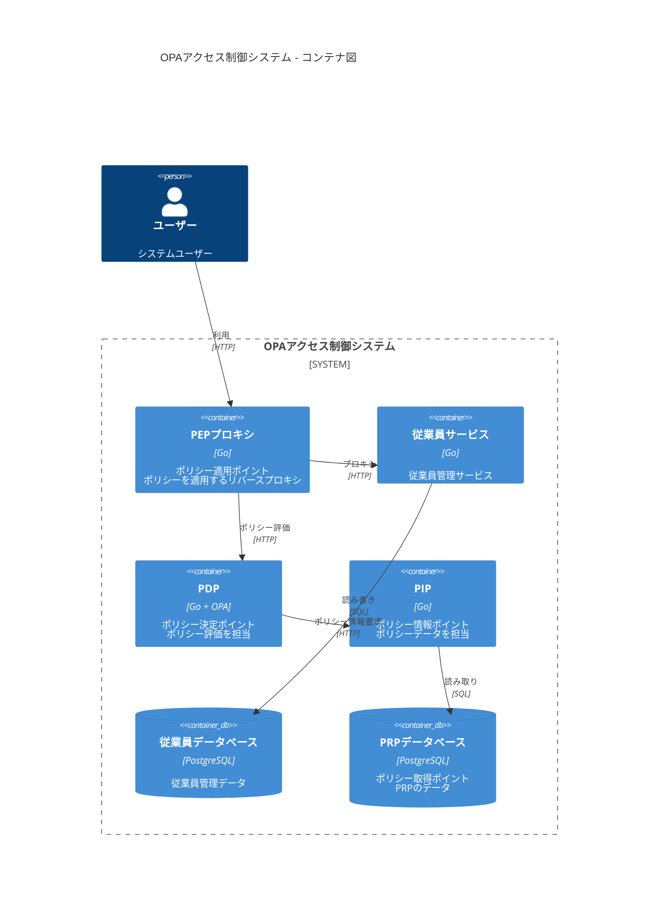
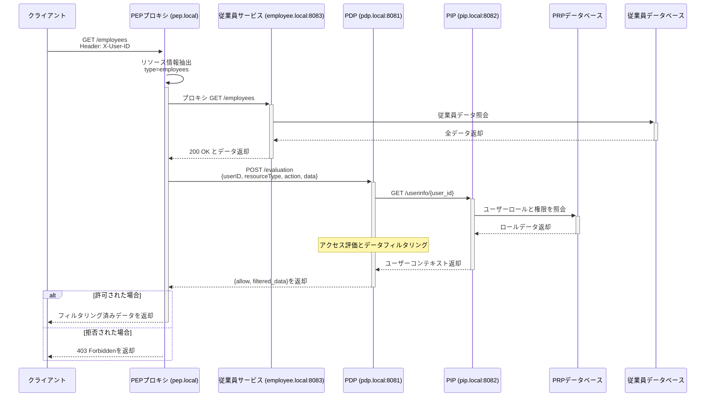

# OPAを使用したマイクロサービスのアクセス制御システムの実装

OPAを採用したアクセス制御システムのPOCに取り組んでみたので、その内容についてまとめておく。

POCの設計や実装は以下のリポジトリで公開しているため、そちらも合わせて参照されたい。

[bmf-san/poc-opa-access-control-system](https://github.com/bmf-san/poc-opa-access-control-system)

## 1. はじめに

### 1.1 背景と課題

まず、本記事で扱う重要な概念として「権限制御」と「アクセスコントロール」の違いを以下のように定義する。

**権限制御（Authorization）**
- ユーザーが実行できる操作の範囲を定義
- 業務ロジックに紐づいた権限の付与
- 組織構造やワークフローに基づく制御
- より抽象的で「ビジネス」に近い概念

**アクセスコントロール（Access Control）**
- システムリソースへのアクセス可否を制御
- データやAPIへのアクセス制限
- 技術的な制御メカニズム
- より具体的で「システム」に近い概念

私はSaaSのプロダクト開発に携わっているのだが、権限管理に関する要件の複雑さや難しさに日々頭を悩ましている。

プロダクトを利用する顧客の組織構造、業務フロー、データアクセスパターンが多様化する中、権限管理システムには次のような課題があるように感じている。

1. **複雑な権限要件への対応**
   - 柔軟な権限設定
   - カスタマイズ可能な権限モデル
   - 権限管理システムを利用するシステムの要求への個別対応

2. **拡張性と保守性**
   - 新しい機能や権限パターンの追加
   - 既存の権限ロジックの修正
   - テストとデバッグの複雑さ

3. **柔軟性と一貫性のバランス**
   - システム全体での一貫した権限適用
   - パフォーマンスとのトレードオフ
   - 権限設定の柔軟性とシステムの複雑性のトレードオフ

上記の課題に対応するためには、権限システムには例えば次のようなアーキテクチャが求められると考えている。

1. **ビジネスロジックとの分離**
   - 権限ロジックの独立した進化
   - ビジネスロジックへの影響を最小化
   - 柔軟な権限モデルの実装

2. **きめ細かな制御**
   - リソースレベルの制御
   - フィールドレベルの制御
   - 動的なデータフィルタリング
   - コンテキストに応じた判断

3. **拡張可能な設計**
   - 新しい権限モデルの追加
   - カスタムルールの実装
   - スケーラビリティの確保

### 1.2 Open Policy Agent (OPA) について

これらの課題に対する解決策として、Cloud Native Computing Foundation (CNCF) のGraduatedプロジェクトであるOpen Policy Agent（OPA）をアクセス制御システムに採用する案を検討した。

OPAは以下のような特徴を持つポリシーエンジンである。

1. **Policy as Code**
   - ポリシーをコードとして管理可能
   - バージョン管理やレビュープロセスの適用が容易
   - テスト可能な形式でポリシーを記述可能

2. **宣言的なポリシー記述**
   - Rego言語による直感的なポリシー記述
   - ポリシーロジックの可読性と保守性が高い
   - モジュール化と再利用が容易

3. **サービスからの分離**
   - ポリシー決定を独立したサービスとして実装可能
   - アプリケーションコードとポリシーの完全な分離
   - ポリシーの動的な更新が可能

OPAを採用する優位性として、以下の点が挙げられる。

1. **マイクロサービスとの親和性**
   - サービスとして独立して動作可能
   - REST APIを通じた統合が容易
   - 高いパフォーマンスと軽量な実行環境

2. **豊富な機能**
   - フィールドレベルのアクセス制御
   - 複雑なポリシールールの記述
   - 包括的なテストサポート

3. **活発なコミュニティ**
   - CNCFのGraduatedプロジェクト
   - ドキュメントの充実性
   - 実績のある採用事例

## 2. アクセス制御システムの設計

### 2.1 アーキテクチャ概要

本システムでは、プロキシベースのアーキテクチャを採用し、以下の主要コンポーネントで構成されている。



#### Policy Enforcement Point (PEP)
- リバースプロキシとして動作
- すべてのリクエストを傍受
- PDPと連携してアクセス制御を実施
- レスポンスデータのフィルタリングを適用

#### Policy Decision Point (PDP)
- OPAを使用したポリシー評価エンジン
- RBACモデルに基づくアクセス判断
- フィールドレベルのフィルタリングルール適用
- PIPと連携したコンテキスト情報の活用

#### Policy Information Point (PIP)
- ポリシー判断に必要な情報を提供
- ユーザー情報とロールの管理
- 組織構造データの提供
- PRPとの連携

#### Policy Retrieval Point (PRP)
- ポリシー関連データの永続化
- ロールと権限のマッピング
- ユーザーとロールの関連付け
- アクセス制御設定の管理

### 2.2 アクセス制御フロー

基本的なリクエストフローは以下の通りである。

1. クライアントがリクエストを送信
2. PEPがリクエストを傍受し、必要な情報を抽出
3. PDPがポリシー評価を実行
4. PIPから追加のコンテキスト情報を取得
5. ポリシー評価結果に基づいてアクセスを制御
6. レスポンスデータにフィルタリングを適用
7. クライアントに結果を返却



## 3. 実装のポイント

### 3.1 PEPの実装パターン

PEP（Policy Enforcement Point）の実装には、大きく分けて以下のパターンが考えられる。

1. **プロキシベースの実装**
   - 単一の機能（アクセス制御）に特化したリバースプロキシ
   - 各マイクロサービスの前段に個別に配置
   - アクセス制御のみを担当し、他の機能は持たない
   - サービスに変更を加えない

2. **ライブラリベースの実装**
   - 各サービスにライブラリとして組み込み
   - アプリケーションコードと統合
   - よりきめ細かな制御が可能
   - サービスの変更が必要

3. **サイドカーパターン**
   - Kubernetesなどのコンテナ環境で使用
   - 各サービスのPodにサイドカーとして配置
   - サービスとPEPの分離を維持
   - コンテナオーケストレーションと親和性が高い

4. **APIゲートウェイ統合**
   - システム全体の入り口として機能
   - ルーティング、認証、レート制限など多機能
   - すべてのサービスへのトラフィックを集中管理
   - アクセス制御以外の横断的な関心事も担当
   - 単一障害点となるリスクあり

本PoCでは、以下の理由からプロキシベースの実装を選択した。

- サービスごとに独立したアクセス制御が可能
- アクセス制御の責務を明確に分離
- 他の機能との依存関係がない
- 各サービスの要件に応じた柔軟な制御が可能
- APIゲートウェイと比べて軽量で単純な実装

プロキシベースの実装は以下のような処理を行う：

```go
func (p *Proxy) handleRequest(w http.ResponseWriter, r *http.Request) {
    // ユーザーIDの取得
    userID := r.Header.Get("X-User-ID")
    if userID == "" {
        http.Error(w, "X-User-ID header is required", http.StatusBadRequest)
        return
    }

    // リソースとアクションの特定
    resource := extractResource(r.URL.Path)
    action := "view" // 本PoCではGETメソッドのみサポート

    // PDPでアクセス評価
    allowed, filteredData, err := p.evaluateAccess(userID, resource, action)
    if err != nil {
        http.Error(w, err.Error(), http.StatusInternalServerError)
        return
    }
    if !allowed {
        http.Error(w, "Forbidden", http.StatusForbidden)
        return
    }

    // プロキシ転送とレスポンスフィルタリング
    response := p.forwardRequest(r)
    filteredResponse := p.applyFiltering(response, filteredData)
    w.Write(filteredResponse)
}
```

### 3.2 アクセス制御モデルとポリシー実装

#### 3.2.1 サポート可能なアクセス制御モデル

OPAは柔軟なポリシーエンジンであり、様々なアクセス制御モデルを実装できる。

1. **RBAC (Role-Based Access Control)**
   - ロールベースのアクセス制御
   - 本PoCでの実装モデル
   - ユーザーにロールを割り当て
   - ロールに権限を付与

2. **ABAC (Attribute-Based Access Control)**
   - 属性ベースのアクセス制御
   - ユーザー属性（部署、役職など）
   - リソース属性（機密レベル、所有者など）
   - 環境属性（時間、場所など）に基づく判断

3. **ReBAC (Relationship-Based Access Control)**
   - 関係ベースのアクセス制御
   - ソーシャルグラフのような関係性
   - 組織階層に基づく制御

4. **その他のモデル**
   - MAC (Mandatory Access Control)
   - DAC (Discretionary Access Control)
   - これらの組み合わせも可能

#### 3.2.2 ポリシー定義のアプローチ

ポリシー定義には大きく2つのアプローチがある。

1. **事後フィルタリング方式**
   ```rego
   # 本PoCでの実装例：データ取得後にフィルタリング
   allowed_fields[field] {
       roles := user_roles[input.user_id]
       some role in roles
       field_permissions := role_field_permissions[role]
       field = field_permissions[_]
   }
   ```

2. **事前フィルタリング方式**
   ```rego
   # クエリ生成例：データ取得前にフィルタリング
   generate_sql_query {
       roles := user_roles[input.user_id]
       allowed_fields := get_allowed_fields(roles)
       query := sprintf("SELECT %s FROM employees WHERE %s",
           [concat(", ", allowed_fields), build_conditions(roles)])
   }
   ```

#### トレードオフの考察

1. **事後フィルタリング（本PoCの実装）**
   - 利点：
     * シンプルな実装
     * データベースクエリの最適化が容易
     * キャッシュの活用が容易
   - 欠点：
     * 不要なデータの取得
     * メモリ使用量の増加
     * ネットワーク帯域の浪費

2. **事前フィルタリング**
   - 利点：
     * リソース効率の最適化
     * 必要最小限のデータ取得
     * スケーラビリティの向上
   - 欠点：
     * 複雑なクエリ生成ロジック
     * データベース最適化の難しさ
     * キャッシュ戦略の複雑化

選択の指針としては以下のような観点がある。

- 大量データを扱う場合は事前フィルタリング
- シンプルな要件の場合は事後フィルタリング
- パフォーマンス要件に応じて使い分け

#### 3.2.3 実装例

本PoCではRBACモデルを採用し、以下のようなポリシーを実装している。

```rego
# ex.
package rbac

# デフォルトで拒否
default allow = false

# アクセス許可ルール
allow {
    # ユーザーのロールを取得
    roles := user_roles[input.user_id]

    # リソースとアクションの権限をチェック
    some role in roles
    permissions := role_permissions[role]
    some permission in permissions
    permission.resource == input.resource
    permission.action == input.action
}

# フィールドレベルのフィルタリング
allowed_fields[field] {
    roles := user_roles[input.user_id]
    some role in roles
    field_permissions := role_field_permissions[role]
    field = field_permissions[_]
}
```

このポリシーにより、以下が実現される。

1. デフォルトですべてのアクセスを拒否
2. ユーザーのロールに基づいて権限をチェック
3. 許可されたフィールドのみを返却

### 3.3 データモデル設計

PostgreSQLを使用して以下のようなスキーマを実装している。

```sql
-- PRPデータベース
CREATE TABLE roles (
    id UUID PRIMARY KEY,
    name VARCHAR(255) NOT NULL
);

CREATE TABLE users (
    id UUID PRIMARY KEY,
    name VARCHAR(255) NOT NULL
);

CREATE TABLE user_roles (
    user_id UUID REFERENCES users(id),
    role_id UUID REFERENCES roles(id),
    PRIMARY KEY (user_id, role_id)
);

CREATE TABLE role_permissions (
    role_id UUID REFERENCES roles(id),
    resource_id UUID REFERENCES resources(id),
    action_id UUID REFERENCES actions(id),
    PRIMARY KEY (role_id, resource_id, action_id)
);
```

このスキーマにより、以下が可能となる。

1. ユーザーとロールの柔軟な関連付け
2. ロールベースの権限管理
3. リソースとアクションの明確な定義

## 4. 実装から得られた知見

### 4.1 OPAの利点

1. **ポリシーとアプリケーションの分離**
   - ポリシーの変更がアプリケーションコードに影響を与えない
   - ポリシーの独立したバージョン管理とデプロイが可能
   - サービス間で一貫したポリシーの適用が容易

2. **宣言的なポリシー記述**
   - Regoによる直感的なポリシー実装
   - ポリシーロジックの可読性が高い
   - ユニットテストが容易

3. **高い柔軟性**
   - フィールドレベルの細かな制御が可能
   - 動的なコンテキストに基づく判断
   - 複雑なルールの実装が可能

### 4.2 実装上の課題

1. **学習コスト**
   - Rego言語の習得が必要
   - デバッグが難しい場合がある
   - ポリシーの設計の難しさ

2. **パフォーマンスへの影響**
   - プロキシによる若干のオーバーヘッド
   - ポリシー評価の追加レイテンシー
   - キャッシュ戦略の必要性

3. **運用の複雑さ**
   - 複数サービスの管理
   - ポリシーの配布と更新
   - 監視とトラブルシューティング

### 4.3 設計上の工夫

実装上の課題を解決していくために、例えば次のような工夫が求められる。

1. **パフォーマンス最適化**
   - ポリシー評価結果のキャッシュ
   - 必要最小限のコンテキスト取得
   - 効率的なデータベースクエリ

2. **エラーハンドリング**
   - 明確なエラーメッセージ
   - フォールバック戦略
   - 詳細なログ記録

3. **テスト容易性**
   - ポリシーの単体テスト
   - 統合テストの自動化
   - テスト環境の整備

## 5. PoCの成果と今後の展望

本システムを通じて、OPAを使用したアクセス制御システムが以下の点で有効であることが確認できた。

1. **アクセス制御の一貫性**
   - サービス間で統一されたポリシー適用
   - 保守性の高い実装
   - 柔軟な権限管理

2. **開発効率の向上**
   - ビジネスロジックとの分離
   - ポリシーの再利用性
   - ポリシーの可読性
   - テスト容易性の確保

3. **運用面での利点**
   - ポリシー変更の影響範囲の限定
   - ポリシーのデプロイの独立性
   - ポリシーの分離

一方で、学習コストやインフラの複雑化など、考慮すべき課題も明確になった。これらの課題に対しては、適切な教育とツール整備、そして段階的な導入アプローチが重要となる考えられる。

## 所感
権限管理システムで最も重要なロジックは、ポリシーの記述とその実装であると思うが、その部分をOPAで実装することで、柔軟性と保守性を高めることができると感じた。

特に、ビジネスロジックの分離ができることで、アクセス制御の変更がアプリケーションコードに影響を与えないという点は大きなメリットであると感じる。

今回はプロキシベースの構成としたが、プロキシの責務が重くなるため、クライアントベースの構成を検討するほうがよりスケーラブルであると思う。

ポリシーとアプリケーションコードが密結合であると、権限システムを開発するチームと権限システムを利用するシステムを開発するチームのコミュニケーションコストが高くなる。プロダクトの成長に伴い権限管理の要件にも柔軟な変化が求められる場合、この点は特に重要であると感じている。

また、ポリシーのテストが容易であることも、ポリシーの品質を高める上で重要であると感じた。ポリシーのテストを自動化することで、ポリシーの変更に伴うリスクを低減することができる。

今回はパフォーマンスを最適化するような工夫は行っていないが、大規模なシステムでOPAを採用する場合は、ポリシーの評価結果のキャッシュやデータベースクエリの最適化など、パフォーマンスに配慮した実装やポリシーの設計が求められると考えられる。

OPAのようなポリシーエンジンを採用していない既存システムからの移行については、ポリシーの抽出と分離、そして段階的な導入が重要であるかつ難しい課題であると感じた。
