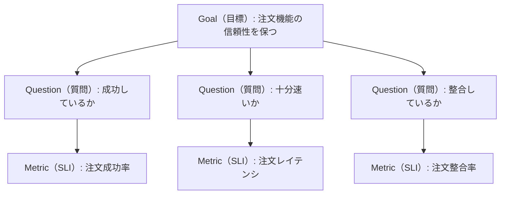

監視を「監視ツールで何を拾うか」から考え始めると、アラートは増えるのに判断には使えない、という状態に陥りやすい。この記事では監視の目的を意思決定と捉え直し、特定のツールやシステムに依存しない監視設計の進め方を、全体像・設計原則・シナリオ洗い出し・SLI定義という順序で整理する。

# 監視の目的

監視の目的は検知そのものではなく**意思決定**である。一般に監視の目的として語られる次の4つのユースケースは、いずれも観測をもとに**誰かが次の行動を決める**ことで初めて価値になる。

- **異常の早期発見**：故障にすぐ気づき、停止時間を短くする
- **予防と対策**：予兆を見つけ、大きくなる前に手を打つ
- **安全とセキュリティ**：不正アクセスや危険な動きを検知し、被害を防ぐ
- **品質の維持**：いつも通りに動く状態を保つ

意思決定として具体化すると、監視システムは次の3つの問いに答える存在である。

1. **今、人を呼ぶべきか** — アラート
2. **何が起きているか** — 状況把握（ダッシュボード）
3. **なぜ起きたか** — 調査・事後分析（テレメトリの探索）

この3つは要求特性が異なるため、混ぜて設計しない（混同がノイズとアラート疲れの最大要因になる）。以降の設計では、この3つの問いのどれに答えるためのものかを常に区別して進める。

# スコープ

本記事は監視の入門として、監視の全体像と設計の進め方を、特定のツールや特定のシステムに依存しない形で一通り把握できることを目指す。用語や分類は一般に確立された定義（OpenTelemetry・Google SRE本・ITIL 4・ISO/IEC 27001/27002など）に基づく（「監視の全体像」を参照）。本記事は「測れる状態を作る」（SLI定義と計測開始）までを扱う。

# 監視の全体像

監視の全体像は「何を材料にするか（データの型）」「どこで測るか（計測位置）」「何を測るか（指標）」の3つの軸で押さえられる。加えて、イベント・アラートや監査監視といった運用・セキュリティの用語も、確立された標準に対応づけておく。なお「死活監視・性能監視」といった分類を定めた単一の規格は存在しない（業界慣習の語彙である）ため、以下は確立された定義体系に基づいて整理する。

**データの型** — OpenTelemetry（CNCFプロジェクトであり、計装の事実上の標準）のシグナル定義に従う。

- **メトリクス**：数値の時系列。集計に強く、アラートの主材料
- **ログ**：イベントの記録。調査の主材料
- **トレース**：リクエストの流れ。ボトルネック・障害箇所の特定

監視の主材料となるのはこの3つである（OpenTelemetryはこのほかに、コンテキストを伝播するBaggageもシグナルと位置づけ、Profilesをシグナルとして開発中である）。アラートやダッシュボードはシグナルではなく、出力形態である（テレメトリ→判定・可視化→通知）。

**計測位置** — Google SRE本の定義に従う。

- **ブラックボックス監視**：ユーザーから見える外形挙動を外から測る。ユーザーの困りごとを直接捉えられるが、検知できるのは今起きている問題に限られる
- **ホワイトボックス監視**：システム内部のテレメトリで測る。エラー率・レイテンシといった症状の計測から、原因の特定・予兆検知まで幅広く担う

人を呼ぶ根拠にできるかは計測位置ではなく、症状を捉えているかで決まる（「設計原則」の原則1）。実務では、ロードバランサで測ったエラー率のようにホワイトボックス計測が症状を捉えることも多い。

**何を測るか** — 4大シグナル（レイテンシ・トラフィック・エラー・飽和度）を最小セットとする（Google SRE本）。リクエスト側の整理にはRED（Rate/Errors/Duration）、リソース側にはUSE（Utilization/Saturation/Errors）を補助的に使う。具体的なメトリクスに落とすと次のとおり。

| 対象 | フレーム | 見るメトリクスの例 |
| --- | --- | --- |
| アプリケーション（リクエストを受けるもの） | RED | リクエスト数／エラー率／応答時間の分布（p95・p99）。加えてスレッドプール・コネクションプールなどの飽和度 |
| システムリソース | USE | CPU・メモリ・ディスク・ネットワークそれぞれの使用率／飽和度／エラー |

**運用・セキュリティの用語** — イベント・アラートは、ITIL 4の「監視とイベント管理（Monitoring and Event Management）」プラクティスの定義に基づく。ITIL 4はイベントを「サービスや構成要素（CI）の状態変化のうち、運用上意味を持つもの」と定義する。セキュリティ・監査の監視は、ISO/IEC 27002:2022の管理策に対応づける（8.15ログ取得〈Logging〉、8.16監視活動〈Monitoring activities〉）。これらの管理策はISO/IEC 27001:2022附属書Aから参照される。

# 設計原則

設計判断で迷ったときの拠り所となる原則を、「何を・どこで・どう測るか」の3つの問いに対応させて1つずつ定める。いずれも「監視の目的は意思決定である」ことからの帰結である。

1. **何を測るか — 症状を第一の計測対象にする**：「ユーザーが困っているか」に直接答える計測を最優先する。原因側（CPU・ディスクなど）の計測は予防・調査の補助とし、放置すれば確実に症状に至るもの（枯渇予測・証明書期限など）は予兆として計測に含める
2. **どこで測るか — ユーザーに近い側で測る**：計測点はユーザーに近いほど症状を正しく捉える。また計測経路は監視対象自身に依存させない（対象が止まると計測も止まる構成を避ける）
3. **どう測るか — 失敗の型に合わせて計測を設計する**：エラー・遅延（顕在的失敗）はリクエストの計測で、成功に見えて中身が誤っている（暗黙的失敗）は整合性検証で捕らえる。検知手段は失敗の型から導き、両方の型をカバーする

# 前提情報を揃える

設計を始める前に、監視対象を説明できる状態を作る。対象を知らないまま設計すると、シナリオの洗い出しが浅くなり、計測点の選択（原則2）も誤る。揃えるものは次の4つ。

- **ユースケース**：誰が何のために使うか。ユーザー影響シナリオの母材になる
- **アーキテクチャ**：アプリケーション・インフラの構成、リクエストの経路、依存する外部サービス。計測点の候補の洗い出しと、計測経路の独立性の確認（原則2）に使う
- **既存のテレメトリ**：すでに取れているログ・メトリクス・トレースとその欠落。流用するか新設するかの判断材料
- **過去の障害・問い合わせ**：シナリオ洗い出しの素材

最新の資料がなければこの時点で作る。監視設計の過程で構成図が初めて描かれることは珍しくなく、それ自体に価値がある。

# ユーザー影響シナリオの洗い出し

設計の起点は「ユーザーに起きたら困ること」の一覧である。監視項目やメトリクスからではなくユーザー影響から出発することで、症状ベース（原則1）の設計が自然に導かれる。洗い出しの要領は次の3点。

- **2つの型の両方から出す**：顕在的失敗（エラー・遅延として見える）と暗黙的失敗（成功に見えるが中身が間違っている）。片方だけだと必ず漏れる
- **素材を使う**：過去のインシデント、サポート問い合わせ、類似システムの障害事例。ゼロからのブレストより網羅性が上がる
- **深刻度順に並べる**：影響の広さと深さで順位づけし、上位から監視設計の対象にする

この段階では想定原因を深追いしない。「なぜ起きるか」を考え始めると原因ベース設計に引き戻され、列挙も発散する。原因の特定は調査用テレメトリの役割である。

# SLI定義

SLI（Service Level Indicator）は、シナリオごとに「ユーザーが困っているか」を数値で答える指標である。本数は3〜5本に絞り、定義にあたっては次の4点を守る。

- **仕様と実装を分ける**：仕様は計測手段に依存しない定義（例：「ログイン要求のうち正しい結果を2秒以内に返した割合」）、実装は計測点・判定条件・母集団の具体化。仕様を先に合意しておくと、ツール選定や計測点の変更に定義が引きずられない
- **シナリオ→SLI の対応表を作る**：どのシナリオをどのSLIが守るかを明示し、カバーしないシナリオは理由を明記する。どのシナリオが守られていないかを明確にするため
- **分解軸をラベルとして持つ**：テナント・呼び出し元・時間帯などで切り分けられる実装にする。全体集計が隠す部分障害を切り分けるため
- **定義できたら即計測開始**：閾値やアラートが未定でも計測だけ先に始める。ベースラインの蓄積が、将来のアラート閾値やSLO導入の材料になる

# 監視設計の例

「ユーザー影響シナリオの洗い出し」と「SLI定義」を架空のECサイトの注文機能に適用し、監視設計の成果物のイメージを示す。

まずユーザー影響シナリオの一覧（洗い出しの成果物）。

| # | シナリオ | 型 | 深刻度 |
| --- | --- | --- | --- |
| S1 | 注文が完了できない（エラー・タイムアウト） | 顕在的 | 高 |
| S2 | 注文完了までが遅い | 顕在的 | 中 |
| S3 | 成功と表示されたが、実際には注文が受け付けられていない | 暗黙的 | 高 |
| S4 | 誤った金額・内容で注文が確定する | 暗黙的 | 高 |

次にシナリオ→SLIの対応表（SLI定義の成果物）。仕様と実装を分けて記述する。

| SLI | 仕様（計測手段非依存） | 実装（計測点・判定・母集団） | 守るシナリオ |
| --- | --- | --- | --- |
| 注文成功率 | 注文確定要求のうち、正しく受理された割合 | ロードバランサのアクセスログで5xx・タイムアウトを失敗と判定。母集団＝注文確定リクエスト全件 | S1 |
| 注文レイテンシ | 注文確定要求のうち、2秒以内に応答した割合 | 同じ計測点で応答時間を記録し、p95／p99も保持 | S2 |
| 注文整合率 | 成功と表示された注文のうち、注文データが正しい内容で存在する割合 | 注文完了イベントログと注文データベースを5分ごとに突合 | S3、S4 |

分解軸としてテナント・決済手段・クライアント種別をラベルで持たせる。SLIは3本に収まっており、各SLIは定義でき次第計測を開始してベースラインを蓄積する。ここまでが監視設計のアウトプットであり、この先（閾値・通知・対応手順）はアラート設計として検討を進められる。

# GQMアプローチ

ここまでの流れ（目的→ユーザー影響シナリオ→SLI）は、GQM（Goal-Question-Metric）という目標駆動の計測フレームワークを監視に当てはめたものと見なせる。GQMはVictor BasiliとDavid Weissが提唱し（1984年）、のちにBasili・Caldiera・Rombachが整理した、ソフトウェアの品質を測る考え方である。計測を次の3レベルで定義する。

- **Goal（目標・概念レベル）**：何を・誰の視点で・何のために評価するか
- **Question（質問・運用レベル）**：目標が達成できているかを判定するための問い
- **Metric（指標・定量レベル）**：各問いに定量的に答えるデータ

定義はGoalからMetricへと具体化し、解釈は逆にMetricからGoalへと積み上げる。要点は、すべての指標が問い（＝目標）に紐づくことである。目標に結びつく指標だけを残せば、目的のない計測がノイズやアラート疲れになるのを避けられる。これは、指標ではなく症状（ユーザー影響）を起点にするという原則1と重なる。

本記事の成果物は、GQMの各レベルにそのまま対応する。

| GQM | 本記事での対応 | ECサイトの例 |
| --- | --- | --- |
| Goal（目標） | 監視の目的・守りたい信頼性 | 注文機能の信頼性を保つ |
| Question（質問） | ユーザー影響シナリオ | 注文は成功しているか／十分速いか／整合しているか |
| Metric（指標） | SLI | 注文成功率／注文レイテンシ／注文整合率 |

Goalが曖昧だと後続の問いや指標もぶれる。Basiliらの目標テンプレート「〈対象〉を、〈目的〉のために、〈品質特性〉の観点で、〈立場〉の視点から評価する」に沿って言語化しておくとよい。ただしGQMは目標を起点とするため、掲げた目標が示唆しない失敗は取りこぼす。顕在的・暗黙的の2つの型からシナリオを洗い出す作業（前述）と併用して網羅性を補うとよい。

# 参考

- [OpenTelemetry — Signals](https://opentelemetry.io/docs/concepts/signals/)（データの型：メトリクス・ログ・トレース）
- [Google SRE Book — Monitoring Distributed Systems](https://sre.google/sre-book/monitoring-distributed-systems/)（ブラックボックス／ホワイトボックス、4大シグナル）
- [Brendan Gregg — The USE Method](https://www.brendangregg.com/usemethod.html)
- RED method（Rate/Errors/Duration。Tom Wilkieによる整理）
- ITIL 4 — 監視とイベント管理（Monitoring and Event Management）プラクティス（イベント・アラートの定義）
- ISO/IEC 27002:2022 — 8.15ログ取得（Logging）／8.16監視活動（Monitoring activities）
- GQM（Goal-Question-Metric）— Basili・Caldiera・Rombach「The Goal Question Metric Approach」（1994）
- [SLOを始めるためのスタートガイド](/posts/slo-start-guide/)（本記事がスコープ外としたSLOの始め方）
