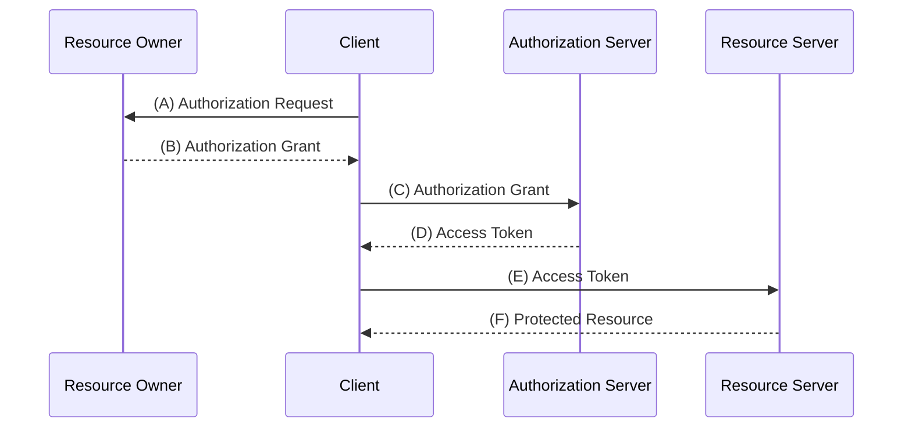
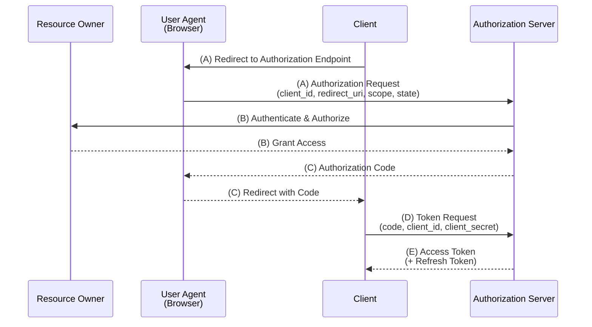
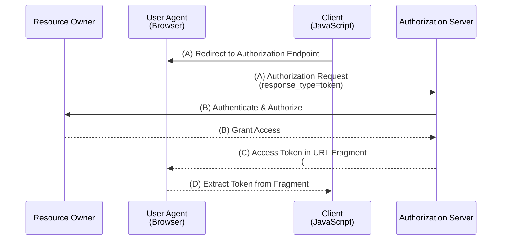
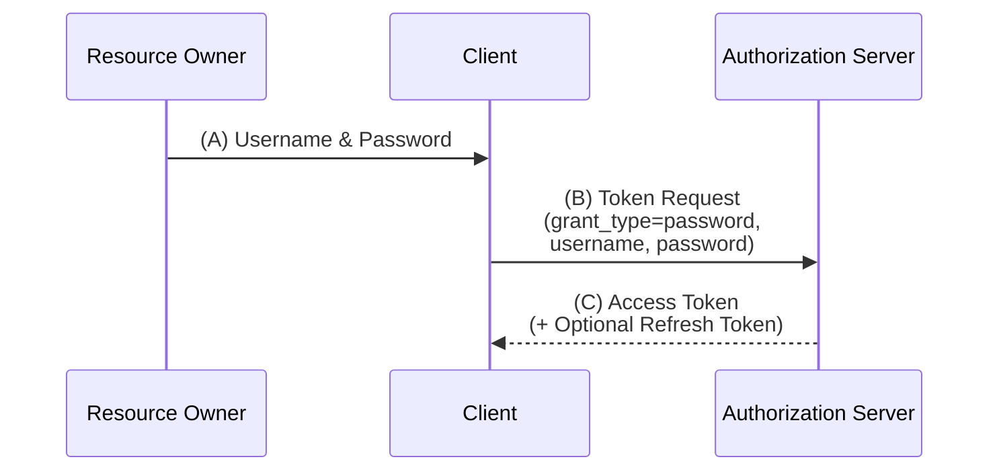
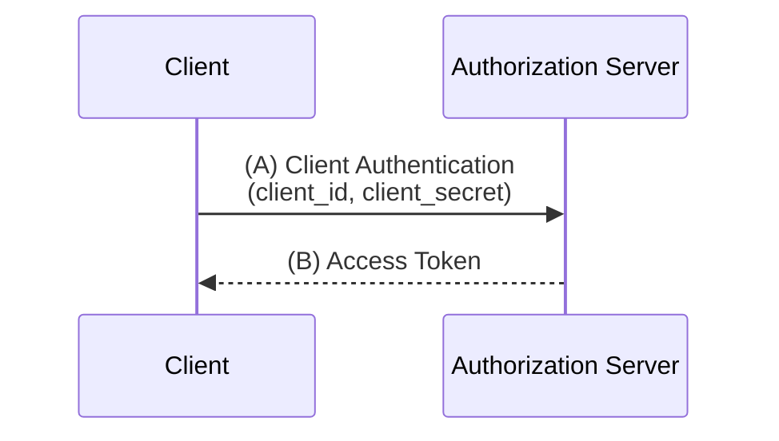
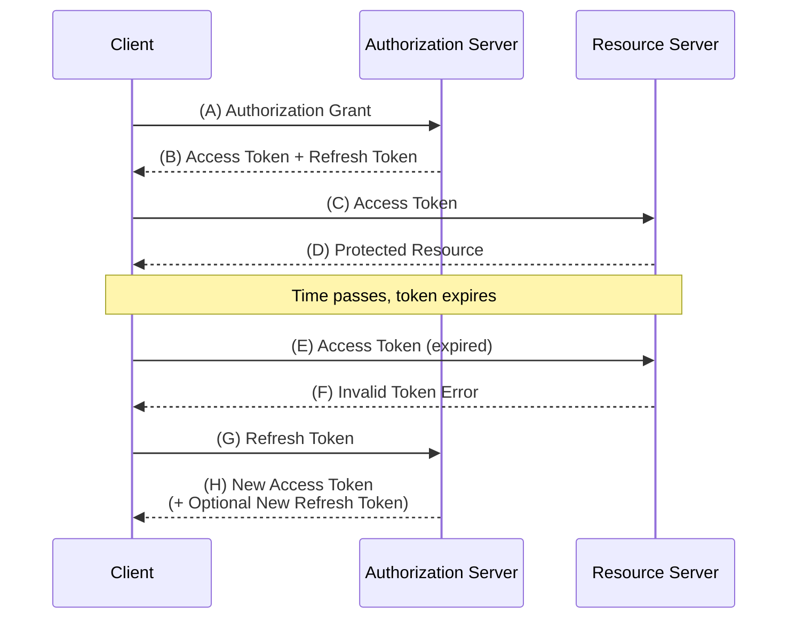
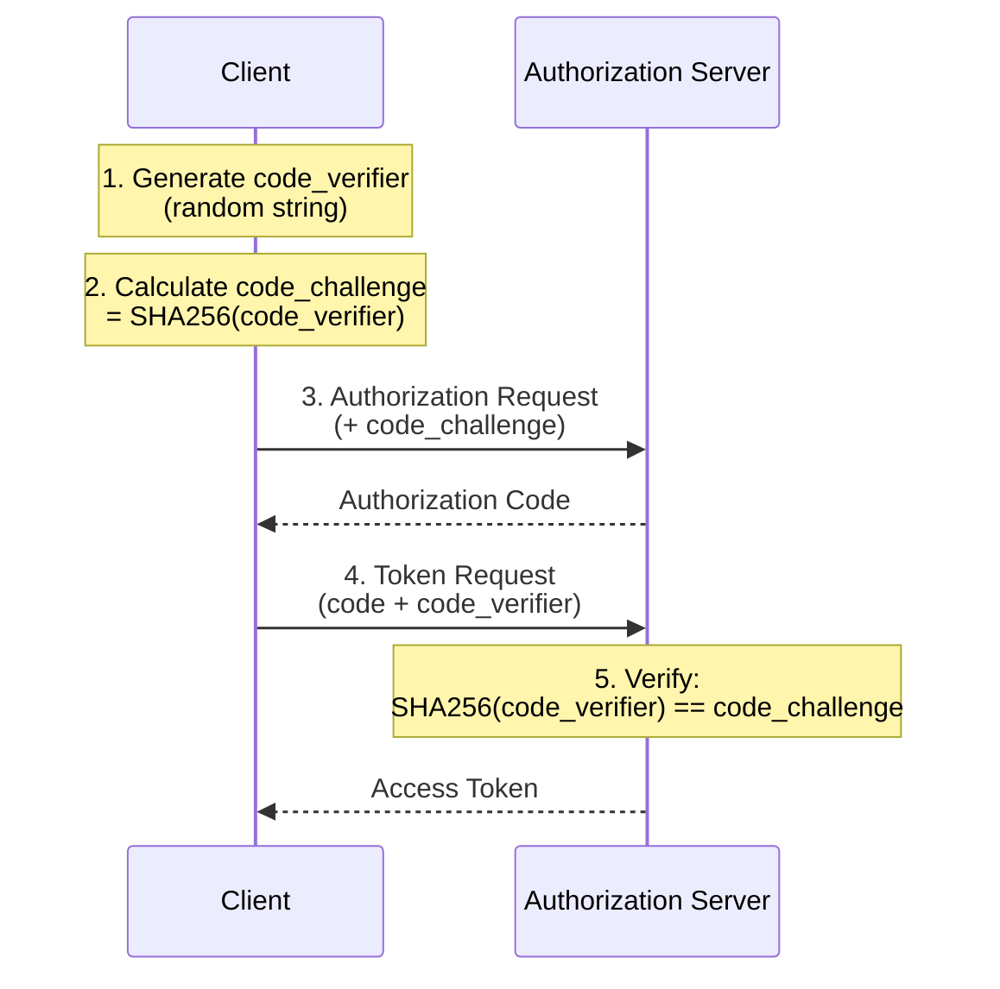

RFC 6749（OAuth 2.0 Authorization Framework）およびRFC 6750（Bearer Token Usage）に基づく要点整理。

---

## RFC用語（RFC 2119）

| 用語 | 意味 |
|-----|------|
| **MUST** / **REQUIRED** / **SHALL** | 絶対的な要求事項 |
| **MUST NOT** / **SHALL NOT** | 絶対的な禁止事項 |
| **SHOULD** / **RECOMMENDED** | 推奨（特別な理由がない限り従うべき） |
| **SHOULD NOT** / **NOT RECOMMENDED** | 非推奨（特別な理由がない限り避けるべき） |
| **MAY** / **OPTIONAL** | 任意（実装してもしなくてもよい） |

---

## 概要

OAuth 2.0は、サードパーティアプリケーションがHTTPサービスへの**限定的なアクセス**を取得するための認可フレームワーク。

従来のクライアント・サーバー認証モデルでは、サードパーティがリソースオーナーのクレデンシャルを直接使用する必要があった。OAuth 2.0は**アクセストークン**を導入することで、この問題を解決する。

---

## 4つのロール

| ロール | 説明 |
|-------|------|
| **リソースオーナー** | 保護されたリソースへのアクセスを許可するエンティティ（通常はエンドユーザー） |
| **リソースサーバー** | 保護されたリソースをホストし、アクセストークンによるリクエストを受け付けるサーバー |
| **クライアント** | リソースオーナーの認可を得て、代理として保護されたリソースにアクセスするアプリケーション |
| **認可サーバー** | リソースオーナーを認証し、認可を取得した後、アクセストークンを発行するサーバー |



---

## 4つのグラントタイプ

### 1. 認可コードグラント（Authorization Code）

**最も推奨されるフロー。Webアプリケーション向け。**



| ステップ | 内容 |
|---------|------|
| (A) | クライアントがユーザーエージェントを認可エンドポイントにリダイレクト |
| (B) | 認可サーバーがリソースオーナーを認証し、アクセスを許可/拒否 |
| (C) | 認可サーバーが認可コードを付与してリダイレクト |
| (D) | クライアントがトークンエンドポイントで認可コードをアクセストークンに交換 |
| (E) | 認可サーバーがアクセストークン（とリフレッシュトークン）を発行 |

**特徴**:
- 認可コードは短命（RECOMMENDED: 10分以内）
- リフレッシュトークンの発行が可能
- クライアント認証を実施

### 2. インプリシットグラント（Implicit）

**ブラウザ上で動作するJavaScriptアプリケーション向け。**



| 特徴 | 内容 |
|-----|------|
| トークン取得 | 認可エンドポイントから直接アクセストークンを取得 |
| リフレッシュトークン | 発行されない |
| クライアント認証 | 行われない |
| セキュリティ | 認可コードグラントより低い（トークンがURLフラグメントに露出） |

**注意**: OAuth 2.1（ドラフト）ではセキュリティ上の理由から**削除**。PKCE付き認可コードグラントの使用を推奨。

### 3. リソースオーナーパスワードクレデンシャルグラント

**クライアントがユーザーのID/パスワードを直接受け取るフロー。**



| 特徴 | 内容 |
|-----|------|
| 用途 | レガシーシステムからの移行、高度に信頼されたクライアント |
| リスク | クライアントがクレデンシャルにアクセスするため、悪用リスクあり |
| 推奨 | 他のグラントタイプが使用できない場合のみ |

**注意**: OAuth 2.1（ドラフト）ではセキュリティ上の理由から**削除**。

### 4. クライアントクレデンシャルグラント

**クライアント自身の権限でアクセスする場合のフロー。**



| 特徴 | 内容 |
|-----|------|
| 用途 | マシン間通信（M2M）、バッチ処理 |
| リソースオーナー | クライアント自身がリソースオーナー |
| ユーザー介在 | 不要 |

---

## トークン

### アクセストークン

| 項目 | 内容 |
|-----|------|
| 役割 | 保護されたリソースにアクセスするためのクレデンシャル |
| 有効期限 | 短期間（SHOULD: 1時間以下, RFC 6750） |
| 形式 | 仕様では規定なし（実装依存、JWTが一般的） |
| スコープ | アクセス可能な範囲を限定 |

### リフレッシュトークン

| 項目 | 内容 |
|-----|------|
| 役割 | アクセストークンの更新に使用 |
| 有効期限 | 長期間（日〜週単位） |
| 利用場所 | トークンエンドポイントのみ（リソースサーバーには送信しない） |
| 発行 | 認可コードグラントで発行可能、インプリシットでは発行されない |



---

## エンドポイント

### 認可エンドポイント（Authorization Endpoint）

| 項目 | 内容 |
|-----|------|
| 役割 | リソースオーナーの認証と認可の取得 |
| 通信 | TLS（MUST） |
| 使用グラント | 認可コード、インプリシット |
| HTTPメソッド | GET（SHOULD）、POST（MAY） |

**リクエストパラメータ**:

| パラメータ | 要否 | 説明 |
|-----------|:----:|------|
| `response_type` | REQUIRED | `code`（認可コード）または `token`（インプリシット） |
| `client_id` | REQUIRED | クライアント識別子 |
| `redirect_uri` | OPTIONAL | リダイレクト先URI |
| `scope` | OPTIONAL | アクセス範囲 |
| `state` | RECOMMENDED | CSRF対策用のランダム値 |

### トークンエンドポイント（Token Endpoint）

| 項目 | 内容 |
|-----|------|
| 役割 | 認可グラントをアクセストークンに交換 |
| 通信 | TLS（MUST） |
| HTTPメソッド | POST（MUST） |
| クライアント認証 | MUST（コンフィデンシャルクライアントの場合） |

**リクエストパラメータ（認可コードグラント）**:

| パラメータ | 要否 | 説明 |
|-----------|:----:|------|
| `grant_type` | REQUIRED | `authorization_code` |
| `code` | REQUIRED | 認可コード |
| `redirect_uri` | REQUIRED* | 認可リクエスト時と同じURI（*認可時に指定した場合） |
| `client_id` | REQUIRED* | クライアント識別子（*認証されていない場合） |

**レスポンス例**:
```json
{
  "access_token": "2YotnFZFEjr1zCsicMWpAA",
  "token_type": "Bearer",
  "expires_in": 3600,
  "refresh_token": "tGzv3JOkF0XG5Qx2TlKWIA",
  "scope": "read write"
}
```

---

## スコープ

| 項目 | 内容 |
|-----|------|
| 形式 | スペース区切りの文字列リスト |
| 役割 | アクセス可能な範囲を限定 |
| 定義 | 認可サーバーが定義（仕様では規定なし） |
| 原則 | クライアントは必要最小限のスコープを要求すべき |

**例**:
```
scope=read write profile email
```

認可サーバーは要求されたスコープを完全に無視するか、部分的に許可するか、追加のスコープを付与してもよい。

---

## Bearer Token（RFC 6750）

### Bearer Tokenとは

トークンを所有する任意のパーティが、暗号鍵の所持を証明することなく利用可能なセキュリティトークン。

### トークン送信方法

| 方法 | 要否 | 例 |
|-----|:------:|-----|
| **Authorization Header** | MUST（サーバー）/ SHOULD（クライアント） | `Authorization: Bearer mF_9.B5f-4.1JqM` |
| Form-Encoded Body | MAY | `access_token=mF_9.B5f-4.1JqM`（POST body） |
| URI Query Parameter | SHOULD NOT | `?access_token=mF_9.B5f-4.1JqM` |

リソースサーバーはAuthorization Headerによる方法をサポートしなければならない（MUST）。

### セキュリティ要件

| 要件 | 内容 | 強度 |
|-----|------|:----:|
| **TLS必須** | 常にHTTPS経由で送信 | MUST |
| **証明書検証** | TLS証明書チェーンを検証 | MUST |
| **クッキー保存禁止** | 平文で送信されうるクッキーに保存してはならない | MUST NOT |
| **短い有効期限** | 1時間以下を推奨（RFC 6750 Section 5.3） | SHOULD |
| **URL伝送回避** | ページURLにトークンを含めるべきではない | SHOULD NOT |

---

## セキュリティ考慮事項（RFC 6819より）

### 主要な脅威と対策

| 脅威 | 対策 |
|-----|------|
| **CSRF攻撃** | `state`パラメータによる検証 |
| **認可コード横取り** | PKCE（Proof Key for Code Exchange）の使用 |
| **トークン漏洩** | TLS必須、短い有効期限、スコープ制限 |
| **フィッシング** | 正規の認可サーバーのみを使用、証明書検証 |
| **クライアント偽装** | クライアント認証、リダイレクトURI検証 |

### PKCE（RFC 7636）

インプリシットグラントに代わり、パブリッククライアント（SPAやモバイルアプリ）でも安全に認可コードグラントを使用するための拡張。



---

## 現代的な推奨事項（OAuth 2.1）

OAuth 2.1はOAuth 2.0のベストプラクティスを統合したドラフト仕様。主な変更点：

| 変更点 | OAuth 2.0 | OAuth 2.1 |
|-------|-----------|-----------|
| インプリシットグラント | MAY | 削除 |
| パスワードグラント | MAY | 削除 |
| PKCE | OPTIONAL | REQUIRED |
| リダイレクトURIの厳密一致 | SHOULD | MUST |
| Bearer Token（クエリパラメータ） | SHOULD NOT | MUST NOT |
| リフレッシュトークンローテーション | - | SHOULD |

### 推奨プラクティス

| 項目 | 推奨 |
|-----|------|
| グラントタイプ | 認可コード + PKCE |
| インプリシット | 使用しない |
| パスワード | 使用しない |
| トークン形式 | JWT（署名付き） |
| トークン有効期限 | アクセストークンは短く（SHOULD: 1時間以下）、リフレッシュトークンで更新 |
| スコープ | 最小権限の原則 |

---

## 参考資料

- [RFC 6749: The OAuth 2.0 Authorization Framework](https://openid-foundation-japan.github.io/rfc6749.ja.html)
- [RFC 6750: Bearer Token Usage](https://openid-foundation-japan.github.io/rfc6750.ja.html)
- [RFC 6819: OAuth 2.0 Threat Model and Security Considerations](https://openid-foundation-japan.github.io/rfc6819.ja.html)
- [RFC 7636: Proof Key for Code Exchange (PKCE)](https://datatracker.ietf.org/doc/html/rfc7636)

