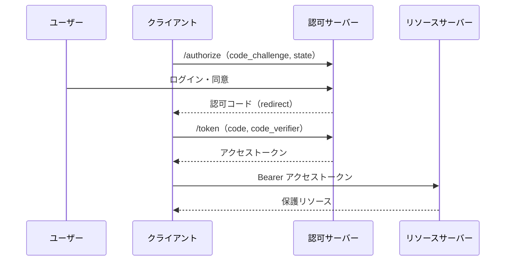

# 概要

OAuth 2.0（RFC 6749）は2012年に登場して以来、広く使われてきた。しかしその柔軟さゆえに「危険な選択肢」も選べてしまい、実運用で多くの攻撃が発見されてきた。その教訓を集約したのが**RFC 9700（OAuth 2.0 Security Best Current Practice）**であり、それを成文化して「最初から安全な」仕様にしたのが**OAuth 2.1**である。

この記事では、OAuth 2.0から2.1への変更点と、RFC 9700・RFC 6819（脅威モデル）が示すセキュリティ対策を整理する。

関連する仕様は以下の通り。

- [RFC 9700 Best Current Practice for OAuth 2.0 Security](https://www.rfc-editor.org/rfc/rfc9700)
- [RFC 6819 OAuth 2.0 Threat Model and Security Considerations](https://www.rfc-editor.org/rfc/rfc6819)
- [RFC 7636 PKCE](https://www.rfc-editor.org/rfc/rfc7636)
- [The OAuth 2.1 Authorization Framework (draft)](https://datatracker.ietf.org/doc/draft-ietf-oauth-v2-1/)

# 位置づけ：6749 → 9700 → OAuth 2.1

3つの関係を押さえると全体像がわかりやすい。

```
6749 (2012)          9700 (2025)              OAuth 2.1
素のOAuth   ──実運用の教訓──▶  対策BCP  ──成文化──▶  「最初から安全な」仕様
「危険も選べる」        「守るべき点」          「危険な選択肢を消した」
```

RFC 9700のヘッダには`Updates: 6749, 6750, 6819`とあり、元のRFCを上書き・拡張する位置づけであることがわかる。

# 前提：認可コードフロー

OAuthの登場人物は3つである。

- **クライアント**: APIを呼びたいアプリ。
- **認可サーバー（AS）**: 認可コードやトークンを発行する。
- **リソースサーバー（RS）**: アクセストークンを検証してAPIを提供する。

現在の基本は「認可コードフロー + PKCE」である。



# RFC 6819：脅威モデル

RFC 6819（2013年）は、OAuth 2.0の脅威を体系的に網羅したカタログである。クライアント・認可サーバー・トークン・リフレッシュトークン・認可コードといったコンポーネント別に、脅威と対策を並べている。

現代版の対策BCPは9700なので、実務では「まず9700、深掘りや網羅確認で6819」という使い方になる。6819は辞書的に「このパターンの脅威は何があるか」を引くのに向いている。

# RFC 9700：主要な推奨

RFC 9700は「§2 Best Practices（結論）」と「§4 Attacks and Mitigations（根拠）」の2部構成である。まず§2で「何を」を掴み、気になった項目だけ§4で「なぜ」を深掘りするのがよい。

主な推奨を表にまとめる。

| 項目 | 内容 |
| --- | --- |
| redirect_uri | 完全一致で照合する（例外はnativeのlocalhostポート番号のみ） |
| PKCE | Public clientは必須、Confidentialでも推奨 |
| CSRF対策 | PKCE / OIDC nonce / state のいずれか |
| Mix-Up対策 | 複数ASを使うなら必須（`iss`で照合） |
| Implicit Grant | 使わない（`response_type=token`は非推奨） |
| Sender-Constrained | mTLS / DPoP を推奨 |
| ROPC | 使わない（パスワードグラントはMUST NOT） |
| audience制限 | scope / resource でトークンの宛先を絞る |
| クライアント認証 | 共有鍵より非対称鍵（mTLS / private_key_jwt）を推奨 |

## 非推奨になった2つ

特に、次の2つが正式に非推奨（MUST NOT / SHOULD NOT）となった点は重要である。

- **Implicit Grant（`response_type=token`）**: アクセストークンがURLフラグメントで露出し、ブラウザ履歴・Referer・ログから漏れる。送信者制約もできない。代替は認可コードフロー。
- **ROPC（Resource Owner Password Credentials）**: ユーザーのパスワードをクライアントが直接握る。攻撃面が増え、MFAやパスキーと両立できない。代替は認可コードフロー。

# 代表的な攻撃と対策

## Authorization Code Injection

攻撃者が盗んだ認可コードを自分のセッションに注入し、被害者になりすます攻撃。**PKCE**で防ぐ。

```
① 認可リクエスト時: code_challenge = SHA256(verifier) をASに預ける
② トークン交換時:   code + code_verifier を提示
                    AS が SHA256(verifier) == challenge を検証
攻撃者は code を盗めても、クライアントだけが持つ verifier を知らないため失敗する
```

## Mix-Up 攻撃

クライアントが複数のASを使うとき、攻撃者のASが正規ASに丸投げして「どのASからの応答か」を取り違えさせる攻撃。応答に発行者識別子`iss`（RFC 9207）を含め、送信先と一致するか照合することで防ぐ。

なお、`iss`の運び方には2つある。1つはRFC 9207の`iss`パラメータ（署名なしの平文）で、もう1つは署名付きID Tokenの`iss`クレームである。前者は「悪意あるASを運営できるが通信経路には介在できない」攻撃者を想定した対策で、正規ASからクライアントへ届く応答の経路に攻撃者がいないため書き換えられない、という前提に依存する。ネットワークの中間者（MITM）まで想定するなら、改ざんすると署名が壊れる署名付きID Token（またはJARM）で`iss`を運ぶ必要がある。

## CSRF

`state`（またはPKCE / nonce）で、認可応答が自分の開始したフローに対応するかを検証する。

# PKCE の仕組み（RFC 7636）

PKCEは「認可コードを盗まれても、正しいクライアント以外はトークン化できない」ようにする仕組みである。

- **code_verifier**: クライアントだけが知るランダムな秘密の文字列。
- **code_challenge**: `code_verifier`をSHA-256でハッシュ化したもの（S256方式）。

認可リクエストに`code_challenge`を載せ、トークン交換時に`code_verifier`を送って検証してもらう。もともとネイティブアプリ向けに設計されたが、現在はWebアプリを含むすべてのクライアントに推奨されている。

# まとめ

- OAuth 2.0は柔軟すぎて危険な選択肢も選べた。その教訓を集約したのがRFC 9700、成文化したのがOAuth 2.1である。
- 守るべき点は、redirect_uri完全一致・PKCE必須・Implicit/ROPC非推奨・Mix-Up対策・送信者制約・audience制限。
- これらの多くはRFC 6819の脅威が源流であり、9700で対策として体系化された。

# 参考リンク

- [RFC 9700 Best Current Practice for OAuth 2.0 Security](https://www.rfc-editor.org/rfc/rfc9700)
- [RFC 6819 OAuth 2.0 Threat Model and Security Considerations](https://www.rfc-editor.org/rfc/rfc6819)
- [RFC 7636 Proof Key for Code Exchange](https://www.rfc-editor.org/rfc/rfc7636)
- [RFC 9207 OAuth 2.0 Authorization Server Issuer Identification](https://www.rfc-editor.org/rfc/rfc9207)
- [The OAuth 2.1 Authorization Framework (draft)](https://datatracker.ietf.org/doc/draft-ietf-oauth-v2-1/)
