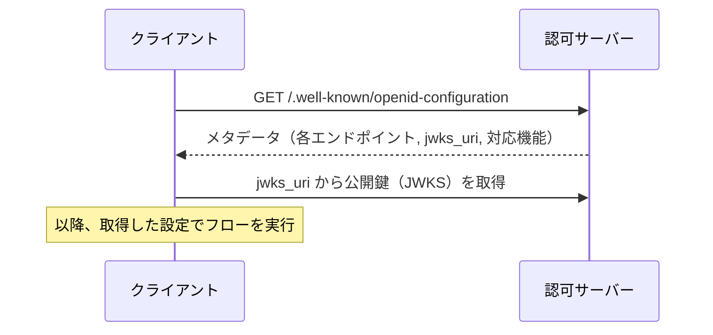
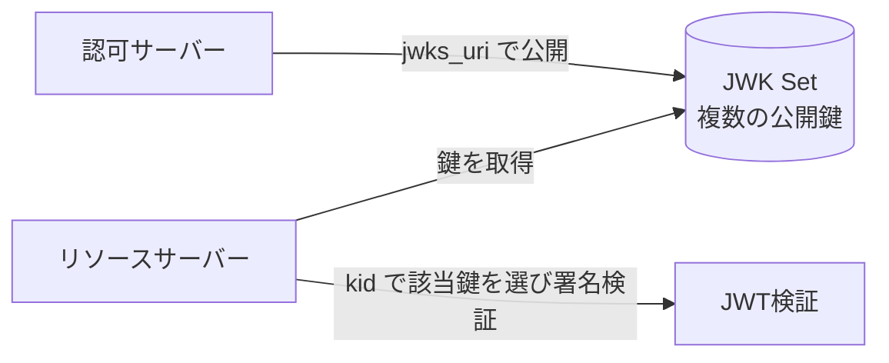

# 概要

OpenID Connect（OIDC）を実装するとき、認可エンドポイントやトークンエンドポイント、公開鍵の場所などを一つひとつ手で設定するのは手間がかかり、設定ミスの温床にもなる。これを自動化するのが**Discovery**と**メタデータ**の仕組みである。

この記事では、まずOIDCのID Tokenの役割を確認する。そのうえで、OpenID Connect DiscoveryとRFC 8414（OAuth 2.0 Authorization Server Metadata）による自動設定・鍵取得の仕組みを整理する。

関連する仕様は以下の通り。

- [OpenID Connect Core 1.0](https://openid.net/specs/openid-connect-core-1_0.html)
- [OpenID Connect Discovery 1.0](https://openid.net/specs/openid-connect-discovery-1_0.html)
- [RFC 8414 OAuth 2.0 Authorization Server Metadata](https://www.rfc-editor.org/rfc/rfc8414)

# OAuth と OIDC の違い

まず前提を整理する。

- **OAuth 2.0**:「このクライアントにユーザーの代わりにAPIを呼ぶ権限を与える」＝**認可**の仕組み。主役はアクセストークン。
- **OpenID Connect**: OAuth 2.0の上に「このユーザーは誰か」を乗せた仕様。**ID Token**というJWTが追加され、**認証**の役割を持つ。

# ID Token の中身

ID Tokenは「このユーザーがいつ・どうやって認証されたか」を表すJWTである。主なクレームは以下の通り。

| クレーム | 意味 |
| --- | --- |
| `iss` | 発行者（Issuer）。ASの識別子 |
| `sub` | ユーザーの一意な識別子 |
| `aud` | このトークンの宛先（クライアントID） |
| `nonce` | リプレイ対策。認可リクエストの値と一致するか検証する |
| `auth_time` | 認証が行われた時刻 |
| `exp` / `iat` | 有効期限 / 発行時刻 |

クライアントはこれらのクレームを検証することで、「正規のASが発行した、自分宛の、改ざんされていないID Token」であることを確認する。

# Discovery とは

Discoveryは、クライアントがASの設定情報を**自動的に取得**するための仕組みである。エンドポイントのURLや対応する機能、公開鍵の場所などを、ASが公開するメタデータ文書から読み取る。

手で設定しないことには、次の利点がある。

- 設定ミス（攻撃者のURLを誤って設定するなど）を減らせる。
- 新しい機能を、対応ライブラリが自動で有効化できる。
- 鍵のローテーションや暗号方式の変更に追従しやすい。

# OpenID Connect Discovery

OIDCでは、`/.well-known/openid-configuration`にメタデータ文書が公開される。

メタデータには、`authorization_endpoint`、`token_endpoint`、`userinfo_endpoint`、`jwks_uri`、対応するスコープや署名アルゴリズムなどが含まれる。

# RFC 8414：AS Metadata

OpenID Connect DiscoveryはOIDC向けだが、それをOAuth 2.0全般へ広げたのが**RFC 8414（OAuth 2.0 Authorization Server Metadata）**である。`/.well-known/oauth-authorization-server`にメタデータを公開する。

RFC 9700（Security BCP）も、AS Metadataの公開・利用を推奨している。たとえば`code_challenge_methods_supported`を公開すれば、クライアントはASがPKCEに対応しているかを検出できる。

# jwks_uri と鍵ローテーション

メタデータの中でも特に重要なのが`jwks_uri`である。これはASの公開鍵（JWK Set）を配布するURLで、クライアントやリソースサーバーはここから鍵を取得してJWS署名を検証する。

鍵には`kid`（Key ID）が付いており、JWTのヘッダの`kid`と突き合わせて該当する鍵を選ぶ。この仕組みにより、ASは古い鍵と新しい鍵を並行して公開しながら、無停止で鍵をローテーションできる。JWK/JWKSの詳細は「[JOSEとは？JWT・JWS・JWE・JWK・JWAの全体像](/posts/jose-overview/)」を参照。

# メタデータのセキュリティ上の利点

RFC 8414は、メタデータ利用の利点として次を挙げている。

- 準拠ライブラリがセキュリティ機能を自動で有効化できる。
- エンドポイントURLの誤設定（攻撃者のURLを指すなど）を減らせる。
- 鍵のローテーションと暗号方式の俊敏性（cryptographic agility）を確保できる。

# まとめ

- OIDCのID Tokenは「認証の証拠」であり、iss/sub/aud/nonceなどを検証して使う。
- Discoveryとメタデータ（OIDC Discovery / RFC 8414）により、エンドポイントや鍵を手で設定せず自動取得できる。
- `jwks_uri`による公開鍵配布と`kid`により、無停止の鍵ローテーションが可能になる。

# 参考リンク

- [OpenID Connect Core 1.0](https://openid.net/specs/openid-connect-core-1_0.html)
- [OpenID Connect Discovery 1.0](https://openid.net/specs/openid-connect-discovery-1_0.html)
- [RFC 8414 OAuth 2.0 Authorization Server Metadata](https://www.rfc-editor.org/rfc/rfc8414)
