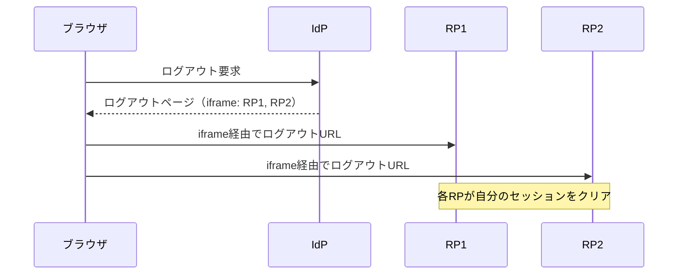
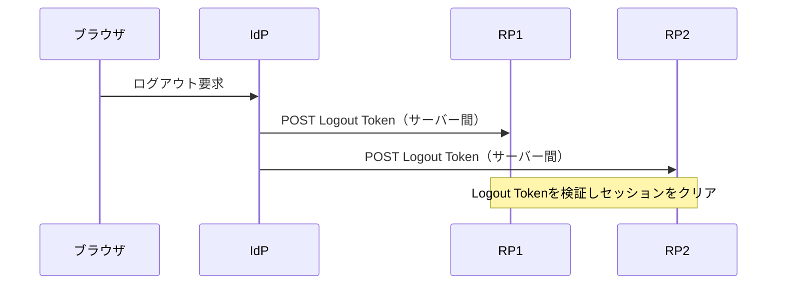

# 概要

ログインの仕組みはよく解説されるが、「ログアウト」は意外と難しい。特に、1つのIdP（認可サーバー）で複数のアプリにシングルサインオンしている環境では、「どこまでセッションを消すか」「他のアプリにどう伝えるか」を考える必要がある。

この記事では、OpenID ConnectのFront-Channel Logout / Back-Channel Logoutと、Security Event Token（RFC 8417）によるイベント通知の仕組みを整理する。

関連する仕様は以下の通り。

- [RFC 8417 Security Event Token (SET)](https://www.rfc-editor.org/rfc/rfc8417)
- [OpenID Connect Front-Channel Logout 1.0](https://openid.net/specs/openid-connect-frontchannel-1_0.html)
- [OpenID Connect Back-Channel Logout 1.0](https://openid.net/specs/openid-connect-backchannel-1_0.html)

# なぜ分散環境でログアウトが難しいのか

シングルサインオン（SSO）では、1つのIdPで認証し、複数のRP（Relying Party = アプリ）がそのセッションを共有する。このとき「ログアウト」は、次のように複数の場所に影響する。

- IdP側のセッション
- 各RP側のセッション

一箇所を消しただけでは、他のRPではログインが継続してしまう。そこで、IdPが各RPに「このユーザーはログアウトした」と伝える仕組みが必要になる。伝え方に2つの方式がある。

# Front-Channel Logout

Front-Channel Logoutは、**ブラウザ経由**でログアウトを伝える。IdPのログアウトページに、各RPのログアウトURLを指す`<iframe>`を並べ、ブラウザがそれぞれを読み込むことで各RPのセッションをクリアさせる。



- 利点: 実装が比較的シンプル。
- 欠点: ブラウザに依存する。iframeのブロックやサードパーティCookie制限の影響を受けやすい。

# Back-Channel Logout

Back-Channel Logoutは、**サーバー間の直接通信**でログアウトを伝える。IdPが各RPのログアウトエンドポイントに、**Logout Token**（JWT）を直接POSTする。



- 利点: ブラウザの状態に依存しない。サードパーティCookie制限の影響を受けにくい。
- 欠点: RP側がバックチャネルのエンドポイントを用意し、トークン検証を実装する必要がある。

Logout Tokenは、`events`クレームにログアウトイベントを含むJWTで、次に述べるSecurity Event Tokenの一種である。

# Security Event Token（RFC 8417）

Security Event Token（SET）は、「セキュリティに関する出来事（イベント）」を表現するためのJWTである。ログアウト、セッション失効、アカウント無効化などを、関係するシステムへ通知する用途で使う。

- メディアタイプ／`typ`は**`secevent+jwt`**。これにより通常のアクセストークンやID Tokenと混同されるのを防ぐ（JWT BCP RFC 8725のExplicit Typingの実践例）。
- `events`クレームにイベントの種類と詳細を含む。

```json
{
  "iss": "https://idp.example.com",
  "aud": "https://rp.example.com",
  "iat": 1700000000,
  "jti": "abc123",
  "events": {
    "http://schemas.openid.net/event/backchannel-logout": {}
  }
}
```

SETは、後述のCAEP（Continuous Access Evaluation Protocol）やSSF（Shared Signals Framework）といった、より広いイベント連携の基盤にもなっている。

# Front-Channel と Back-Channel の比較

| 観点 | Front-Channel | Back-Channel |
| --- | --- | --- |
| 伝達経路 | ブラウザ（iframe） | サーバー間（直接POST） |
| ブラウザ依存 | あり | なし |
| 実装難度 | 比較的シンプル | RP側にエンドポイントが必要 |
| Cookie制限の影響 | 受けやすい | 受けにくい |

サードパーティCookieの制限が進む現在、Back-Channel Logoutの方が堅牢とされることが多い。

# まとめ

- 分散環境（SSO）のログアウトは、IdPと複数RPのセッションを整合させる必要があり、意外と難しい。
- Front-Channelはブラウザ経由（iframe）、Back-Channelはサーバー間（Logout Token）で伝える。
- Logout TokenはSecurity Event Token（RFC 8417）の一種で、`secevent+jwt`で用途を明示する。

# 参考リンク

- [RFC 8417 Security Event Token (SET)](https://www.rfc-editor.org/rfc/rfc8417)
- [OpenID Connect Front-Channel Logout 1.0](https://openid.net/specs/openid-connect-frontchannel-1_0.html)
- [OpenID Connect Back-Channel Logout 1.0](https://openid.net/specs/openid-connect-backchannel-1_0.html)
