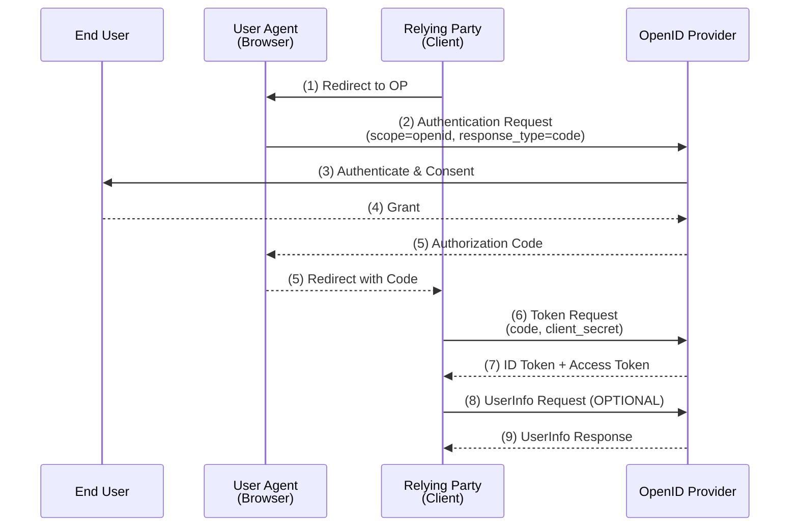
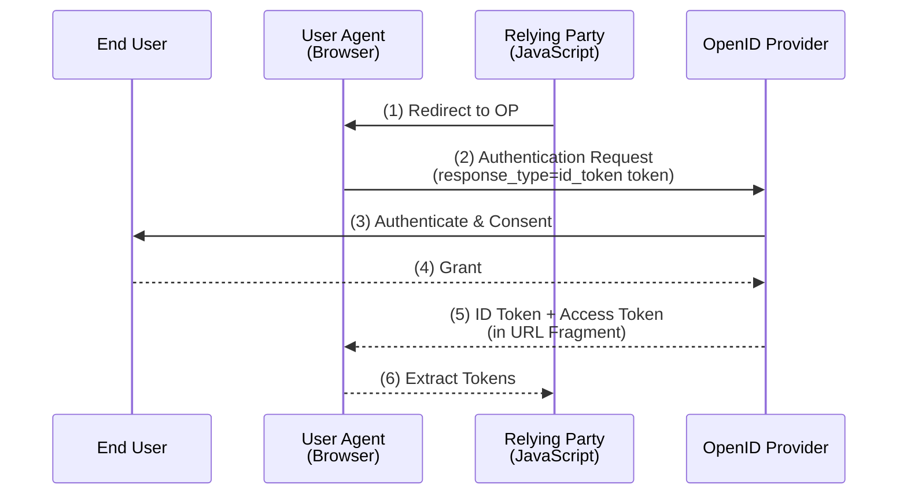
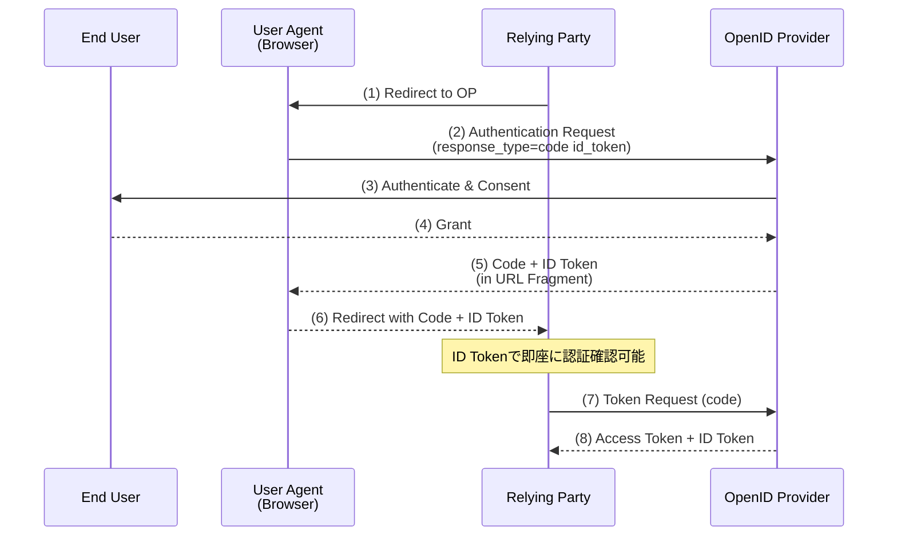

OpenID Connect Core 1.0 に基づく要点整理。

---

## RFC用語（RFC 2119）

| 用語 | 意味 |
|-----|------|
| **MUST** / **REQUIRED** / **SHALL** | 絶対的な要求事項 |
| **MUST NOT** / **SHALL NOT** | 絶対的な禁止事項 |
| **SHOULD** / **RECOMMENDED** | 推奨（特別な理由がない限り従うべき） |
| **SHOULD NOT** / **NOT RECOMMENDED** | 非推奨（特別な理由がない限り避けるべき） |
| **MAY** / **OPTIONAL** | 任意（実装してもしなくてもよい） |

---

## 概要

OpenID Connect（OIDC）は、**OAuth 2.0プロトコルの上にシンプルなアイデンティティレイヤーを付与した**認証プロトコル。

OAuth 2.0が「認可」のためのフレームワークであるのに対し、OIDCは「認証」を実現する。

| 項目 | OAuth 2.0 | OpenID Connect |
|-----|-----------|----------------|
| 目的 | 認可（Authorization） | 認証（Authentication） |
| 取得するもの | アクセストークン | ID Token + アクセストークン |
| ユーザー情報 | 標準化されていない | 標準クレームが定義 |

---

## 用語

| OAuth 2.0 | OpenID Connect | 説明 |
|-----------|----------------|------|
| 認可サーバー | **OpenID Provider（OP）** | ユーザーを認証し、ID Tokenを発行 |
| クライアント | **Relying Party（RP）** | OPに認証を依頼するアプリケーション |

---

## ID Token

OIDCの中核となる概念。**認証イベントに関するClaimを含むJWT（JSON Web Token）**。

### ID Tokenの構造

```
ヘッダー.ペイロード.署名
```

JWTは3つの部分からなり、それぞれBase64URLエンコードされている。

### 必須クレーム（REQUIRED）

| クレーム | 説明 |
|---------|------|
| **iss** | Issuer Identifier。OPを識別するURL（httpsスキーム、MUST） |
| **sub** | Subject Identifier。エンドユーザーの識別子（255文字以下、ASCII） |
| **aud** | Audience。このID Tokenの対象者。client_idを含むこと（MUST） |
| **exp** | Expiration Time。有効期限（UNIX時刻） |
| **iat** | Issued At。発行時刻（UNIX時刻） |

### 条件付き必須クレーム

| クレーム | 条件 | 説明 |
|---------|------|------|
| **auth_time** | max_age指定時（REQUIRED） | 認証が行われた時刻 |
| **nonce** | リクエストに含まれた場合（REQUIRED） | リプレイアタック対策 |

### オプションクレーム

| クレーム | 説明 |
|---------|------|
| **acr** | Authentication Context Class Reference。認証コンテキストクラス |
| **amr** | Authentication Methods References。認証方法の配列 |
| **azp** | Authorized Party。認可された関係者（audが複数の場合） |
| **at_hash** | Access Token Hash。アクセストークンのハッシュ値 |

### 署名と暗号化

| 要件 | 強度 |
|-----|:----:|
| ID Tokenは署名されなければならない | MUST |
| 署名アルゴリズムはnone以外 | MUST |
| 暗号化する場合、署名後に暗号化する | MUST |

---

## 3つの認証フロー

### フロー選択ガイド

| フロー | response_type | 用途 |
|-------|---------------|------|
| **Authorization Code Flow** | `code` | サーバーサイドアプリケーション |
| **Implicit Flow** | `id_token` または `id_token token` | SPAなどブラウザベースアプリ |
| **Hybrid Flow** | `code id_token` / `code token` / `code id_token token` | 両方の特性が必要な場合 |

### 1. Authorization Code Flow

**最も推奨されるフロー**。トークンがUser Agentを経由しない。



| 特徴 | 内容 |
|-----|------|
| トークン取得 | Token Endpointから取得 |
| クライアント認証 | 可能 |
| リフレッシュトークン | 発行可能 |
| セキュリティ | 高い（トークンがブラウザに露出しない） |

### 2. Implicit Flow

**ブラウザベースのJavaScriptアプリケーション向け。**



| 特徴 | 内容 |
|-----|------|
| トークン取得 | Authorization Endpointから直接取得（URLフラグメント） |
| nonce | REQUIRED（リプレイアタック対策） |
| クライアント認証 | 不可 |
| リフレッシュトークン | 発行されない |
| セキュリティ | Authorization Code Flowより低い |

**注意**: OAuth 2.1ではセキュリティ上の理由から**非推奨**。PKCE付きAuthorization Code Flowを使用すべき。

### 3. Hybrid Flow

**Authorization Code FlowとImplicit Flowの特性を組み合わせたフロー。**



| response_type | Authorization Endpointから | Token Endpointから |
|---------------|---------------------------|-------------------|
| `code id_token` | Code, ID Token | Access Token, ID Token |
| `code token` | Code, Access Token | Access Token, ID Token |
| `code id_token token` | Code, ID Token, Access Token | Access Token, ID Token |

---

## 認証リクエストパラメータ

### 必須パラメータ（REQUIRED）

| パラメータ | 説明 |
|-----------|------|
| **scope** | `openid`を含むこと（MUST） |
| **response_type** | `code`, `id_token`, `id_token token`, `code id_token`等 |
| **client_id** | OPに登録されたクライアント識別子 |
| **redirect_uri** | 登録済みURIと完全一致（MUST） |

### 推奨パラメータ（RECOMMENDED）

| パラメータ | 説明 |
|-----------|------|
| **state** | CSRF対策用のランダム値 |

### オプションパラメータ（OPTIONAL）

| パラメータ | 説明 |
|-----------|------|
| **nonce** | リプレイアタック対策。Implicit/Hybrid FlowではREQUIRED |
| **display** | 認証UIの表示方法（`page`, `popup`, `touch`, `wap`） |
| **prompt** | 認証動作の指定（`none`, `login`, `consent`, `select_account`） |
| **max_age** | 最大認証経過時間（秒） |
| **ui_locales** | UIの言語（BCP47形式、スペース区切り） |
| **id_token_hint** | 以前発行されたID Token |
| **login_hint** | ログイン識別子のヒント（メールアドレス等） |
| **acr_values** | 要求する認証コンテキストクラス |

### prompt パラメータの値

| 値 | 動作 |
|----|------|
| `none` | UIを表示せず認証。未認証の場合はエラー |
| `login` | 再認証を要求 |
| `consent` | 同意画面を表示 |
| `select_account` | アカウント選択画面を表示 |

---

## UserInfo Endpoint

認証されたユーザーに関するClaimを返すOAuth 2.0 Protected Resource。

### 要件

| 項目 | 要件 |
|-----|:----:|
| TLS | MUST |
| HTTP GET対応 | MUST |
| HTTP POST対応 | MUST |
| Bearer Token | MUST |
| CORS対応 | SHOULD |

### リクエスト例

```http
GET /userinfo HTTP/1.1
Host: op.example.com
Authorization: Bearer SlAV32hkKG
```

### レスポンス例

```json
{
  "sub": "248289761001",
  "name": "Jane Doe",
  "given_name": "Jane",
  "family_name": "Doe",
  "email": "janedoe@example.com",
  "email_verified": true,
  "picture": "https://example.com/janedoe/me.jpg"
}
```

### 検証要件

| 要件 | 強度 |
|-----|:----:|
| UserInfo Response の `sub` が ID Token の `sub` と一致すること | MUST |
| OPのTLS証明書を検証すること | MUST |
| 署名されている場合、署名を検証すること | SHOULD |

---

## 標準クレーム（Standard Claims）

### プロフィール関連

| クレーム | 型 | 説明 |
|---------|-----|------|
| sub | string | Subject Identifier（REQUIRED） |
| name | string | フルネーム |
| given_name | string | 名（ファーストネーム） |
| family_name | string | 姓（ファミリーネーム） |
| middle_name | string | ミドルネーム |
| nickname | string | ニックネーム |
| preferred_username | string | 希望するユーザー名 |
| profile | string | プロフィールページURL |
| picture | string | プロフィール画像URL |
| website | string | WebサイトURL |
| gender | string | 性別 |
| birthdate | string | 生年月日（YYYY-MM-DD形式） |
| zoneinfo | string | タイムゾーン（例: `Asia/Tokyo`） |
| locale | string | ロケール（BCP47形式、例: `ja-JP`） |
| updated_at | number | 情報の最終更新時刻（UNIX時刻） |

### 連絡先関連

| クレーム | 型 | 説明 |
|---------|-----|------|
| email | string | メールアドレス |
| email_verified | boolean | メールアドレス検証済みか |
| phone_number | string | 電話番号（E.164形式推奨） |
| phone_number_verified | boolean | 電話番号検証済みか |
| address | object | 住所情報（構造化オブジェクト） |

### address オブジェクト

```json
{
  "formatted": "〒100-0001 東京都千代田区...",
  "street_address": "千代田1-1-1",
  "locality": "千代田区",
  "region": "東京都",
  "postal_code": "100-0001",
  "country": "JP"
}
```

### 注意事項

| 要件 | 強度 |
|-----|:----:|
| `preferred_username` をユニークと仮定してはならない | MUST NOT |
| `email` をユニークと仮定してはならない | MUST NOT |

---

## スコープとクレームの対応

| スコープ | 返却されるクレーム |
|---------|-------------------|
| `openid` | sub |
| `profile` | name, family_name, given_name, middle_name, nickname, preferred_username, profile, picture, website, gender, birthdate, zoneinfo, locale, updated_at |
| `email` | email, email_verified |
| `address` | address |
| `phone` | phone_number, phone_number_verified |

---

## セキュリティ考慮事項

### TLS要件

| エンドポイント | TLS |
|---------------|:----:|
| Authorization Endpoint | MUST |
| Token Endpoint | MUST |
| UserInfo Endpoint | MUST |

### リプレイアタック対策

| 対策 | 強度 |
|-----|:----:|
| nonce値に十分なエントロピーを持たせる | MUST |
| nonceをセッションと紐づけて保存し、検証する | MUST |

### CSRF対策

| 対策 | 強度 |
|-----|:----:|
| stateパラメータを使用 | RECOMMENDED |
| stateをセッションと紐づけて検証 | RECOMMENDED |

### トークン置換攻撃対策

| 対策 | 強度 |
|-----|:----:|
| UserInfo ResponseのsubがID Tokenのsubと一致することを確認 | MUST |
| Implicit/Hybrid Flowでat_hashを検証 | SHOULD |

### その他

| 項目 | 推奨 |
|-----|------|
| Authorization Codeの有効期限 | 短く設定（RECOMMENDED: 10分以内） |
| 署名鍵・暗号化鍵のローテーション | 定期的に実施 |
| Clickjacking対策 | X-Frame-Optionsやframe-ancestors |

---

## OAuth 2.0との比較

| 項目 | OAuth 2.0 | OpenID Connect |
|-----|-----------|----------------|
| 主目的 | リソースへのアクセス認可 | ユーザー認証 |
| 取得トークン | Access Token | ID Token + Access Token |
| ユーザー識別 | 標準なし | sub クレーム |
| ユーザー情報取得 | 各サービス独自API | 標準化されたUserInfo Endpoint |
| scope | 任意定義 | openid, profile, email等が標準化 |
| セッション管理 | 規定なし | Session Management拡張で対応 |

---

## 関連仕様

| 仕様 | 説明 |
|-----|------|
| OpenID Connect Core 1.0 | コア仕様（本文書の対象） |
| OpenID Connect Discovery 1.0 | OPのメタデータ自動取得 |
| OpenID Connect Dynamic Client Registration 1.0 | クライアントの動的登録 |
| OpenID Connect Session Management 1.0 | セッション管理 |
| OpenID Connect Front-Channel Logout 1.0 | フロントチャネルログアウト |
| OpenID Connect Back-Channel Logout 1.0 | バックチャネルログアウト |

---

## 参考資料

- [OpenID Connect Core 1.0](https://openid-foundation-japan.github.io/openid-connect-core-1_0.ja.html)
- [OpenID Connect Discovery 1.0](https://openid-foundation-japan.github.io/openid-connect-discovery-1_0.ja.html)
- [OpenID Connect Dynamic Client Registration 1.0](https://openid-foundation-japan.github.io/openid-connect-registration-1_0.ja.html)

