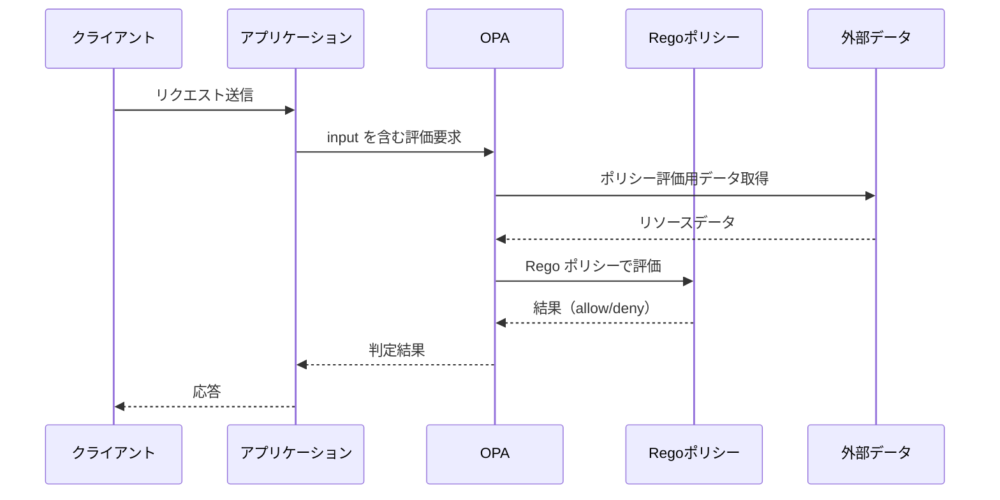
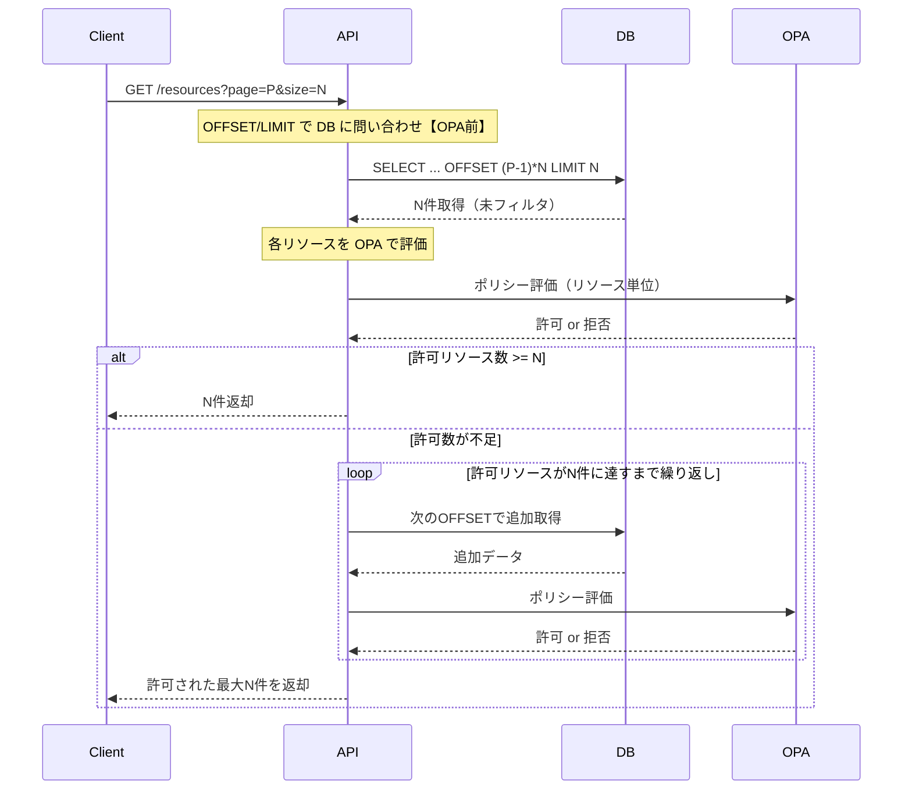
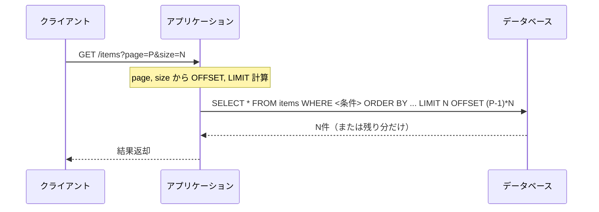
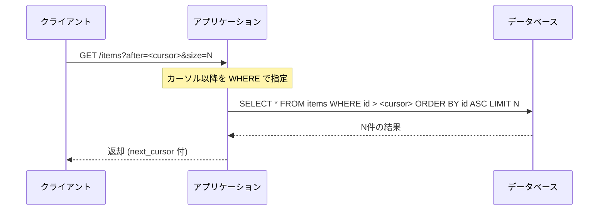

# OPA の基本と課題背景
OPA（Open Policy Agent）は Rego 言語で記述されたポリシーを用いて、入力（input）や外部データ（data）に基づいて評価を行い、許可／拒否などの判定を行うエンジンである。

実装例については、[AWS Prescriptive Guidance のマルチテナント API 認可制御ガイド](https://docs.aws.amazon.com/ja_jp/prescriptive-guidance/latest/saas-multitenant-api-access-authorization/introduction.html)が参考になる。OPA を活用した SaaS におけるマルチテナント認可の実装戦略が紹介されており、本稿の背景理解にも役立つ。

## 基本的なOPAのシーケンス
以下はOPAを使ったアクセス制御の基本的なシーケンスである。

## ページネーションでの課題
以下はページネーションにおいて OPA をナイーブに適用した場合のシーケンスである。

## オフセットページネーション

## カーソルページネーション

## 課題（SQLでは可能だったが、OPAナイーブ評価では困難になること）

|        観点        |          SQLフィルタリングで可能だったこと           |                     OPAナイーブ評価での制約                      |
| ------------------ | ---------------------------------------------------- | ---------------------------------------------------------------- |
| 件数の把握         | WHERE句で事前に総件数を取得可能                      | 評価後でなければ許可件数が確定せず、事前の予測ができない         |
| 順序の一貫性       | ORDER BY＋OFFSET/LIMITで安定した順序とスライスを実現 | 拒否リソースが混在すると、表示順序やページ境界が不安定になる     |
| ページ番号の整合性 | 「21件目～40件目」といった明示的なページ表示が可能   | 許可結果ベースでのみページを組み立てる必要があり、整合性が崩れる |
| クエリ効率         | インデックス活用などにより最小限の取得・処理が可能   | 許可件数が足りないたびに再取得・再評価が必要で負荷が高まる       |

## 解決方法の検討
### 1. ナイーブ実装（オフセットまたはカーソルページネーション）
事前に対象リソースを全件取得し、それらを OPA に渡して評価を行う方式。OPA は各リソースに対する許可／拒否の判定に加え、許可リストや拒否件数といった集計情報を返すことで、アプリ側でのページネーションや総ヒット件数の表示が可能となる。

- メリット:
  - 実装が比較的シンプル
  - OPA評価結果をもとに安定したページネーションやヒット件数表示が可能
  - クライアント要求に対し正確なスライスを返せる
- デメリット:
  - 全件取得・全件評価のため、データ件数が増えるとメモリ消費やレイテンシの課題が発生
  - 評価済みリストを保持・キャッシュしない限り、再リクエスト時に再評価が必要になる可能性がある

### 2. OPAでSQL生成のための条件を返す
OPAポリシーを「許可条件を表すSQL WHERE句相当の条件」として部分評価し、アプリ側でSQLクエリに適用する方式。

- メリット: SQLでのフィルタリングにより高効率に処理できる
- デメリット: 条件生成のための入力データがOPAに必要となり、Regoポリシーが条件生成器となってしまう（ポリシー設計としての一貫性が薄れる）

### 3. フロントエンド側でページネーションを実装
バックエンドは全許可リソースを返し、クライアント側でページングする方式。

- メリット: 実装が単純であり、OPAの適用順や件数に影響されない
- デメリット: 全件取得のため、初期負荷・通信量が大きくなりやすい

## まとめ
OPA をナイーブに適用したリスト取得においては、ページネーションとポリシー評価の非整合によって、返却件数の不定・処理負荷の増大・ページ境界の曖昧化・ユーザー体験の低下といった複合的な問題が発生する。

ページネーションにおける OPA 適用にはトレードオフが存在する。「何を重視するか（実装容易性・性能・表現力・整合性）」を明確にした上で、実装を検討する必要がある。

## 参考
- [Write Policy in OPA, Enforce in SQL](https://blog.openpolicyagent.org/write-policy-in-opa-enforce-policy-in-sql-d9d24db93bf4)
- [GitHub Issue #1252: Pagination in OPA](https://github.com/open-policy-agent/opa/issues/1252)
- [AWS Prescriptive Guidance: マルチテナント API アクセスの認可](https://docs.aws.amazon.com/ja_jp/prescriptive-guidance/latest/saas-multitenant-api-access-authorization/introduction.html)

