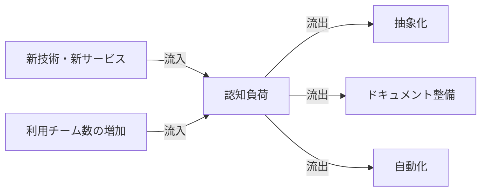
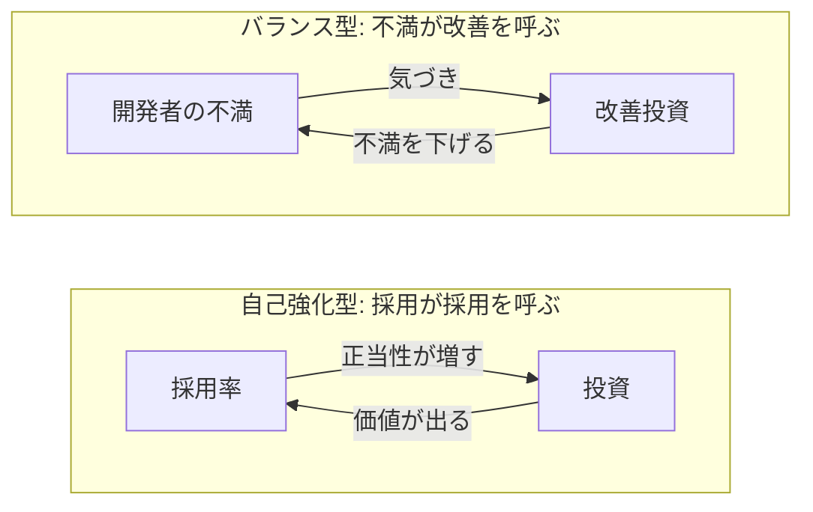
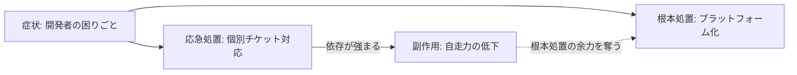

## はじめに

プラットフォームエンジニアリングとシステム思考は親和性が高いのではないか――そう感じる場面がここのところ続いた。本記事ではその直感を一度ことばに落としてみる試みである。

前提となる中心概念は[システム思考の基本](/posts/systems-thinking-basics)にまとめた。プラットフォームエンジニアリング自体の定義や内部開発者プラットフォーム（IDP）の輪郭については[プラットフォームエンジニアリングとは？内部開発者プラットフォームの構築](/posts/platform-engineering-explained)で扱っている。本記事ではシステム思考の語彙――ストック・フロー・遅延・原型・レバレッジポイント――を、プラットフォームエンジニアリングの現場に当てて読み直していく。

## 親和性の輪郭

プラットフォームエンジニアリングとシステム思考の相性は、扱う対象が動的であることに尽きる。代表的な性質を五つに整理しておく。

- 利用者・能力・ライフサイクルが時間とともに動くシステムである
- 認知負荷というストックを下げる装置として機能する
- 内部顧客との連続的なフィードバックがないと立ち行かない
- 投資・移行・抽象化の効果には大きな遅延が伴う
- 部分最適と全体最適のトレードオフが常に顕在になる

ここから先は、この五つを順に読み解いていく。

## ストックで読む

プラットフォームを設計するときに、いちばん見落としやすいのが「ストック」である。一見ツールやUIに目を奪われがちだが、本当の関心事は溜まり方のほうにある。代表的なストックを並べると次のようになる。

- 開発者の認知負荷
- プラットフォームの採用率(adoption)
- 開発者の信頼
- 技術負債
- ドキュメントの鮮度

中でも認知負荷は中心的なストックである。新しい技術やサービスが追加されるたびに流入し、抽象化・ドキュメント整備・自動化によって流出する。流入だけが続けば溢れる。流出を絞れば淀む。浴槽の水位と同じである。

ストックは急には変わらない。新しいゴールデンパスを公開しても、認知負荷がすぐに下がるわけではない。水位は急には動かない。流入と流出のバランスを地道に決めていく作業になる。

## フィードバックで読む

プラットフォームには二種類のループが同居する。両方が回っていないと長続きしない。

一つは、不満や問題を起点にした調整のループである。開発者の不満やFour Keysの悪化が出てきたら、ペインを下げる方向に投資する。これはバランス型ループにあたる。もう一つは自己強化型のループである。採用が広がるほど投資の正当性は増し、機能と品質もさらに改善していく。Platform as a Productの発想はこちらに乗せる。

逆向きの自己強化型も同時に動いていることが多い。プラットフォームが使いにくいと、各チームは独自に道具を組み始める。いわゆるシャドーITである。広がるほど標準への戻りが遠のき、認知負荷とサポートコストはさらに膨らむ。意図して投資しない限り、こちらのループの勢いに飲み込まれる。

## 遅延を読む

プラットフォームの効果は遅れて出る。基盤の入れ替えには半年単位の時間がかかる。抽象化の浸透にはさらに四半期単位の時間が必要になる。メトリクスが改善方向に振れるのは、その後である。Four KeysやDevExスコアの変化は、今日の打ち手とすぐには結びつかない。短絡すると見立てを誤る。

遅延を見落とすと、待ちきれなくなる。すると次の手を重ねてしまう。ダッシュボードが動かないからと別のツールを並走させてしまう。移行が進まないからと締め切りを前倒しする。よく見る光景である。たいていは行き過ぎを生み、運用や認知負荷の上塗りで終わる。効果が出るまで待つ姿勢は、プラットフォームでは特に効く。

## 陥りやすいシステム原型

別々の組織で同じ失敗が繰り返される。背後の構造が似ているからである。プラットフォーム文脈で再現性の高い原型をいくつか挙げる。

### 問題のすり替わり

トイル(運用作業)が膨らむと、一番手早いのは個別のチケット対応である。ところが対応を重ねるほど、運用チームへの依存が固まる。やがてプラットフォーム化に手を回す余力もなくなる。「うちはチケットで回している」のが当たり前になる。これが問題のすり替わりである。

抜け道は、応急処置の総量に上限を設けることである。チケット対応に使う時間を予算化しておく。超えそうになったら根本処置側へ時間が回るよう、仕組みで強制する。

### 応急処置の失敗

手元の不便を解消するために、シェルスクリプトやコピペ手順書が積み上がる。短期的には便利だが、抽象化を経ない自動化はやがて互いに矛盾しはじめ、改修コストが雪だるまになる。応急処置の失敗(Fixes That Fail)である。

### 共有地の悲劇

共有基盤は全員のものであり、誰のものでもない。フィードバックを返さず、ベストプラクティスからも外れた使い方が積み重なると、運用コストは利用者全員に薄く広く転嫁される。ここに費用回収やSLOの可視化を入れないと、共有地の劣化は止まらない。

### 成長の限界

プラットフォームの利用は成功とともに広がり、広がるほど認知負荷もまた膨らむ。途中で改善のペースが頭打ちになると、満足度は急に下がり始める。能力や対応範囲をひたすら増やしても、いつか頭打ちになる。層構造の整理と抽象度の引き上げが、長く効く打ち手になる。

## レバレッジポイントの当てどころ

Meadowsはレバレッジポイントを弱い順（#12）から強い順（#1）に12段で並べた。その並びをそのまま、プラットフォーム文脈に当ててみる。

| # | Meadowsの語彙 | プラットフォーム文脈の例 |
| --- | --- | --- |
| 12 | 数値・パラメータ | SLOの閾値、予算配分、リソース割当 |
| 11 | バッファ | 余裕を持たせたキャパシティ、リードタイムの余白 |
| 10 | ストックとフローの構造 | 認識負荷を逃がす抽象化、ストック可視化 |
| 9 | 遅延 | 移行スプリント、コミュニティ形成期間 |
| 8 | バランス型ループ | 不満メトリクスから改善へ戻すループ |
| 7 | 自己強化型ループ | 採用→投資→価値→さらなる採用 |
| 6 | 情報の流れ | ポータル、サービスカタログ、ダッシュボード |
| 5 | ルール | ゴールデンパス、ポリシー・アズ・コード |
| 4 | 自己組織化 | Inner Source、プラットフォームへのコントリビューションモデル |
| 3 | 目標 | Velocityではなく Flow / DevEx を目標に置く |
| 2 | パラダイム | 統制ではなく内製プロダクトとして見る |
| 1 | パラダイムの超越 | 「何のためのプラットフォームか」を問い直す態度 |

番号の小さい段ほど効きは大きいが、その分手を入れにくい。SLOや予算（#12）をいじっても、認識負荷の構造（#10）は動かない。逆にパラダイム（#2）が変われば、目標・ルール・情報の流れも引きずられて動く。プラットフォームを統制装置とみる立場から、内製プロダクトとみる立場へ。この転換が、最も強いレバレッジになる。

## 組織構造もレバレッジである

プラットフォームの挙動を決める要因は、コードや基盤だけではない。コンウェイの法則のとおり、組織の構造はアーキテクチャと挙動を縛る。組織を変えずにプラットフォームだけ変えようとしても、もとに引き戻されることが多い。

組織側の処方箋として知られるのが、SkeltonとPaisのTeam Topologiesである。設計対象はチームの種類とインタラクションのモードである。認識負荷を組織の構造で下げにいく。これは、システム思考でいえばより強いレバレッジの段（自己組織化〜パラダイム）に手を入れる行為である。本記事では深入りしないが、プラットフォームのレバレッジは技術の中だけでは閉じない、という前提だけ押さえておきたい。

## まとめ

プラットフォームエンジニアリングはツール群ではなく、人と道具と相互作用が織りなすシステムである。挙動を読む。よく出る原型を診る。効く急所に手を当てる。この姿勢の有無で、同じ予算でも届く距離は変わってくる。

新しい機能を一つ足す前に、立ち止まってみるといい。自分たちのプラットフォームを循環の図に描いてみる。世界がシステムで動いているという感覚は、自分たちの足元でも見えてくる。

## 参考文献

- ドネラ・H・メドウズ『世界はシステムで動く ―いま起きていることの本質をつかむ考え方』(枝廣淳子訳、英治出版、2015)
- Cloud Native Computing Foundation App Delivery TAG「CNCF Platforms White Paper」(2023)
- Nicole Forsgrenほか『LeanとDevOpsの科学 ―テクノロジーの戦略的活用が組織変革を加速する』(インプレス、2018)
- Matthew Skelton、Manuel Pais『チームトポロジー ―価値あるソフトウェアをすばやく届ける適応型組織設計』(日本能率協会マネジメントセンター、2021)

