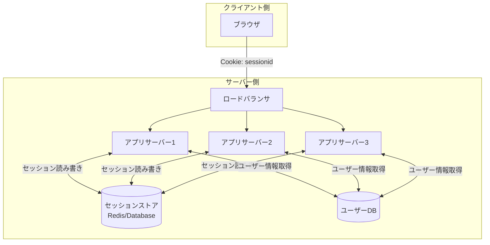
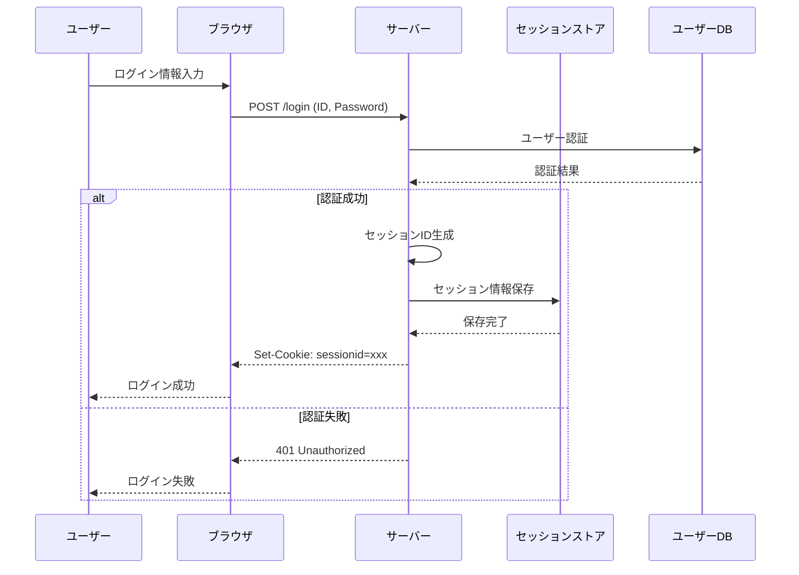
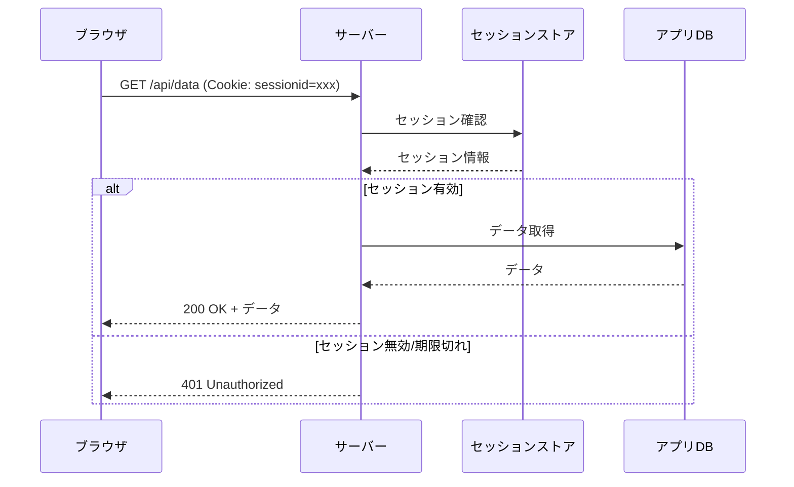
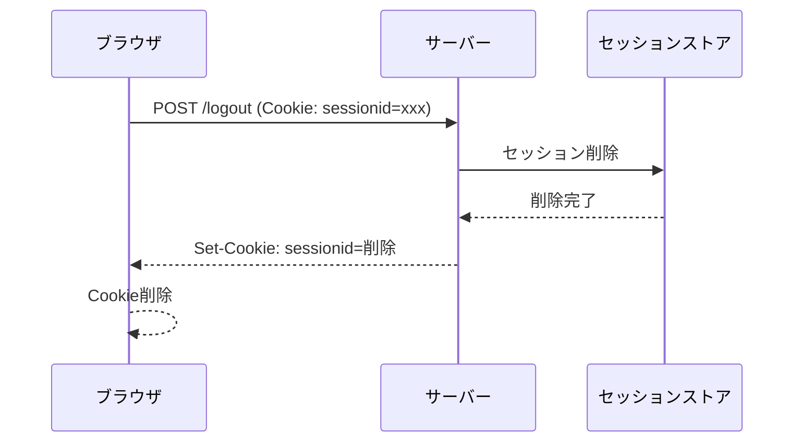
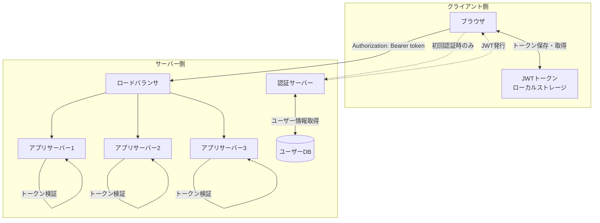
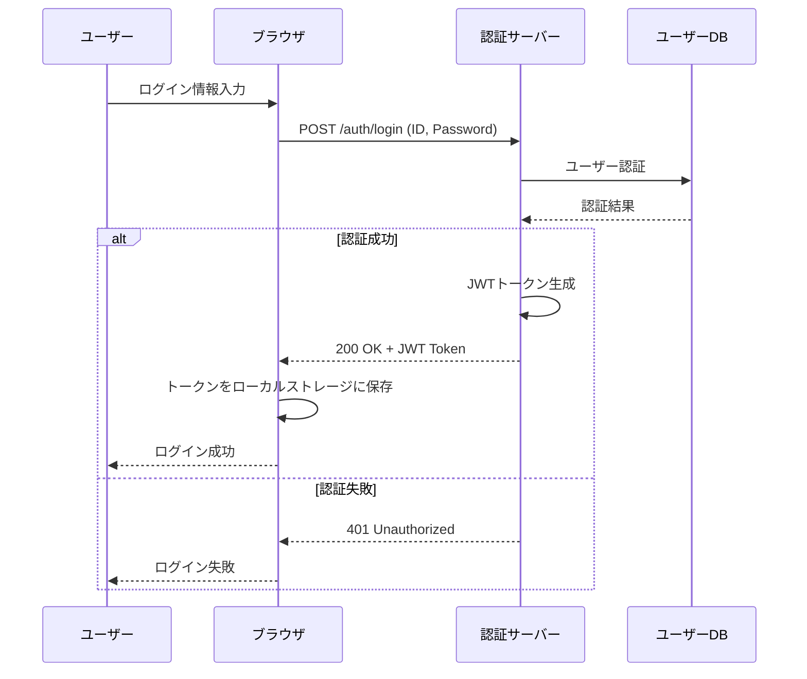
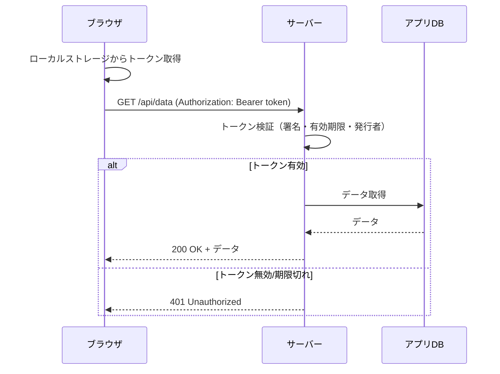
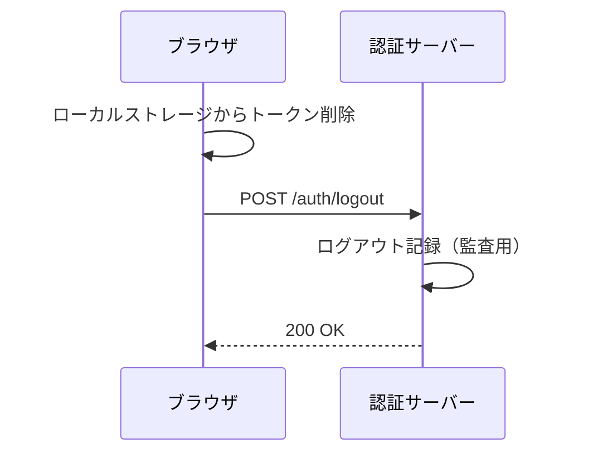

# セッションベースとトークンベースの認証方式について

## 概要

Webアプリケーション開発において、認証方式の選択は システムのスケーラビリティ、セキュリティ、保守性に大きな影響を与える設計判断である。この記事では、セッションベース認証とトークンベース認証について、技術的な詳細から実装上の考慮事項まで包括的に比較・解説する。

## 認証の基礎知識

### 認証とは？
認証（Authentication）とは、システムにアクセスしようとするユーザーが「本人である」ことを確認するプロセスである。ユーザーの身元を検証し、正当なユーザーのみがシステムにアクセスできるようにする仕組みである。

**認証 vs 認可の違い**：
- **認証（Authentication）**: 「誰であるか」を確認する
- **認可（Authorization）**: 「何ができるか」を決定する

### 機能
認証システムが提供する基本的な機能には以下のものがある。

1. **身元確認**
   - ユーザーIDとパスワードの照合
   - 多要素認証（MFA）の対応
   - 生体認証や証明書認証への拡張性

2. **セッション管理**
   - ログイン状態の維持
   - セッションの有効期限管理
   - ログアウト処理

3. **セキュリティ制御**
   - パスワードポリシーの適用
   - アカウントロック機能
   - 不正アクセスの検知・防止

4. **監査・ログ**
   - ログイン・ログアウトの記録
   - 認証失敗の追跡
   - セキュリティイベントの監視

### 非機能
認証システムに求められる非機能要件には以下のものがある。

1. **パフォーマンス**
   - 高速な認証処理
   - 大量の同時認証リクエストへの対応
   - レスポンス時間の安定性

2. **スケーラビリティ**
   - ユーザー数の増加に対する線形スケール
   - 水平スケーリングの対応
   - 負荷分散の効率性

3. **可用性**
   - 高可用性（目安：99.9%以上）
   - 障害時の自動復旧
   - サービス継続性の確保

4. **セキュリティ**
   - 暗号化通信（TLS）
   - 認証情報の安全な保存
   - セッションハイジャック対策

5. **保守性**
   - 設定変更の容易さ
   - 監視・運用の効率性
   - 障害対応の迅速性

システムの根幹となる機能であるため、高い可用性やスケーラビリティが求められる。

## セッションベース認証

### 構成
セッションベース認証は、サーバー側でユーザーのログイン状態を管理する方式である。

主なコンポーネントには以下のものがある。

- **セッションストア**: セッション情報を保存（Redis、Database等）
- **セッションID**: クライアントに発行される一意の識別子
- **Cookie**: セッションIDをクライアント側で保持

### シーケンス

#### ログインフロー

#### 認証済みリクエストフロー

#### ログアウトフロー

### メリット・デメリット

#### メリット

1. **セキュリティ**
   - セッション情報がサーバー側で管理される
   - セッション無効化が即座に反映される
   - 機密情報がクライアント側に保存されない

2. **シンプルな実装**
   - 従来からある確立された方式
   - フレームワークの標準機能で実装可能
   - デバッグ・トラブルシューティングが容易

3. **細かい制御**
   - セッションタイムアウトの柔軟な設定
   - セッション情報の動的更新が可能
   - ユーザー単位でのセッション管理

4. **ブラウザ対応**
   - Cookieの自動送信でシームレスな体験
   - JavaScript無効環境でも動作
   - CSRF対策との組み合わせが容易

#### デメリット

1. **スケーラビリティの制約**
   - セッションストアが単一障害点になりやすい
   - 水平スケーリング時の複雑性
   - セッションストアの容量制限

2. **パフォーマンスの課題**
   - 毎リクエストでセッションストアアクセスが必要
   - ネットワークレイテンシの影響
   - セッションストアの負荷集中

3. **運用の複雑性**
   - セッションストアの監視・保守が必要
   - 分散環境でのセッション同期
   - バックアップ・復旧の考慮

4. **マルチプラットフォーム対応**
   - モバイルアプリでのCookie管理の制約
   - API間連携での複雑性
   - マイクロサービス間での認証情報共有の困難

5. **障害時の影響**
   - セッションストア障害で全ユーザーに影響
   - スケールアウト時のセッション移行の複雑性
   - 災害復旧時のセッション復元の課題

## トークンベース認証

### 構成
トークンベース認証は、クライアント側でトークンを保持し、各リクエストでトークンを送信して認証する方式である。

主なコンポーネントには以下のものがある。

- **JWTトークン**: ユーザー情報と権限を含む自己完結型トークン
- **認証サーバー**: トークンの発行・管理を担当
- **ローカルストレージ**: クライアント側でのトークン保存

### シーケンス

#### ログインフロー

#### 認証済みリクエストフロー

#### ログアウトフロー

**注意**: JWTトークンは自己完結型のため、サーバー側での即座な無効化は困難である。実際の無効化は以下の方法で実現される：

- **クライアント側削除**: ローカルストレージからトークンを削除（主要な無効化手段）
- **短期有効期限**: アクセストークンの有効期限を短く設定（15分〜1時間）
- **リフレッシュトークン無効化**: サーバー側でリフレッシュトークンのみ無効化
- **鍵ローテーション**: 緊急時には署名鍵を変更してすべてのトークンを無効化

### メリット・デメリット

#### メリット

1. **スケーラビリティ**
   - サーバー側でのセッション管理が不要
   - 水平スケーリングが容易
   - 各アプリサーバーが独立してトークン検証可能

2. **パフォーマンス**
   - セッションストアへのアクセスが不要
   - ローカル検証で高速な認証処理
   - ネットワーク通信の削減

3. **マルチプラットフォーム対応**
   - モバイルアプリでの実装が容易
   - API間連携での標準的な方式
   - マイクロサービス間での認証情報共有が簡単

4. **ステートレス**
   - サーバー側で状態を保持する必要がない
   - 負荷分散が簡単
   - 障害時の影響範囲が限定的

5. **標準化**
   - JWT等の業界標準に準拠
   - ライブラリやツールが豊富
   - 他システムとの連携が容易

#### デメリット

1. **セキュリティリスク**
   - トークンがクライアント側に保存される（XSS攻撃の脅威）
   - トークン盗取時の影響範囲が大きい
   - サーバー側での即座な無効化が困難（JWTの自己完結性による制約）
   - ローカルストレージ使用時のセキュリティリスク

2. **トークンサイズ**
   - JWTは通常のセッションIDより大きい
   - 権限情報を含むとさらに肥大化
   - ネットワーク帯域への影響

3. **実装の複雑性**
   - アクセス・リフレッシュトークンペアの管理
   - セキュリティ対策の考慮事項が多い（鍵管理・署名アルゴリズム）
   - トークンリフレッシュフローの実装
   - 鍵ローテーション戦略の検討

4. **デバッグの困難性**
   - トークン内容の確認が必要
   - 分散環境での問題特定が複雑
   - ログ管理の複雑性

5. **ブラウザ制限**
   - ローカルストレージのサイズ制限
   - XSS攻撃に対する脆弱性
   - プライベートブラウジングでの制約

## 方式別比較

### 技術的特徴の比較

|          項目          |           セッションベース           |             トークンベース             |
| ---------------------- | ------------------------------------ | -------------------------------------- |
| **状態管理**           | ステートフル（サーバー側で状態保持） | ステートレス（トークンに情報を含む）   |
| **データ保存場所**     | サーバー側（セッションストア）       | クライアント側（ローカルストレージ等） |
| **ネットワーク通信**   | 毎リクエストでセッション確認         | トークン検証のみ（ローカル処理）       |
| **スケーラビリティ**   | セッションストア依存                 | 水平スケーリング容易                   |
| **セキュリティモデル** | サーバー側制御中心                   | クライアント・サーバー分散型           |

### パフォーマンス比較

|         指標         |          セッションベース          |        トークンベース        |
| -------------------- | ---------------------------------- | ---------------------------- |
| **認証処理時間**     | セッションストアアクセス時間に依存 | トークン検証時間（通常数ms） |
| **ネットワーク負荷** | セッションID（小）                 | JWT（中〜大）                |
| **サーバー負荷**     | セッションストアへの読み書き       | CPU集約的な署名検証          |
| **メモリ使用量**     | セッション数に比例                 | ほぼ一定                     |

### セキュリティ比較

|            脅威            |      セッションベース      |         トークンベース         |
| -------------------------- | -------------------------- | ------------------------------ |
| **セッション固定攻撃**     | 脆弱（対策必要）           | 影響なし                       |
| **セッションハイジャック** | 脆弱（HTTPS必須）          | 脆弱（HTTPS必須）              |
| **XSS攻撃**                | HttpOnly Cookie で軽減     | ローカルストレージ使用時は脆弱 |
| **CSRF攻撃**               | 脆弱（CSRF Token必要）     | 影響軽微                       |
| **トークン漏洩**           | セッションID漏洩時は限定的 | JWT漏洩時は影響大              |

## 選択指針

### セッションベース認証が適している場面

1. **従来型のWebアプリケーション**
   - サーバーサイドレンダリング中心
   - 単一ドメインでの運用
   - 既存システムとの互換性重視

2. **高いセキュリティが求められる場合**
   - 即座なセッション無効化が必要
   - サーバー側での完全な制御を望む
   - 金融系システムなど

3. **シンプルな構成を望む場合**
   - 小規模〜中規模のアプリケーション
   - 運用チームのスキルレベル
   - 開発・保守コストの最小化

### トークンベース認証が適している場面

1. **モダンなWebアプリケーション**
   - SPA（Single Page Application）
   - マイクロサービスアーキテクチャ
   - API中心の設計

2. **スケーラビリティが重要な場合**
   - 大規模なユーザーベース
   - 水平スケーリングが必要
   - クラウドネイティブな環境

3. **マルチプラットフォーム対応**
   - モバイルアプリとの連携
   - 複数ドメインでの利用
   - 外部APIとの統合

### 実装時の考慮事項

#### セッションベース認証の実装ポイント

1. **セッションストアの選択**
   - Redis: 高性能、分散対応
   - Database: 永続化、トランザクション対応
   - Memory: シンプル、単一サーバー限定

2. **セキュリティ対策**
   - HttpOnly、Secure Cookie の設定
   - CSRF Token の実装
   - セッション固定攻撃対策

3. **運用面の配慮**
   - セッションストアの監視
   - バックアップ・復旧手順
   - 負荷分散時のSticky Session設定

#### トークンベース認証の実装ポイント

1. **トークン設計**
   - アクセストークン
   - リフレッシュトークン
   - 必要最小限のペイロード
   - トークンペアによる安全な更新メカニズム

2. **セキュリティ対策**
   - 強固な署名アルゴリズム（RS256推奨）
   - 鍵管理・ローテーション戦略
   - トークン保存場所の選択

3. **運用面の配慮**
   - トークン無効化の仕組み
   - 鍵管理インフラの整備
   - 監査ログの設計

## まとめ

セッションベース認証とトークンベース認証は、それぞれ異なる特徴と適用場面を持つ認証方式である。

適切な認証方式の選択は、システムの要件、スケール、セキュリティ要求、開発チームのスキル、運用体制などを総合的に考慮して決定する必要がある。また、両方式を組み合わせたハイブリッドなアプローチを取ることも可能である。

技術の進歩とともに認証方式も進化し続けているため、継続的な技術動向の把握と、システムの成長に合わせた認証方式の見直しも重要な要素となる。
