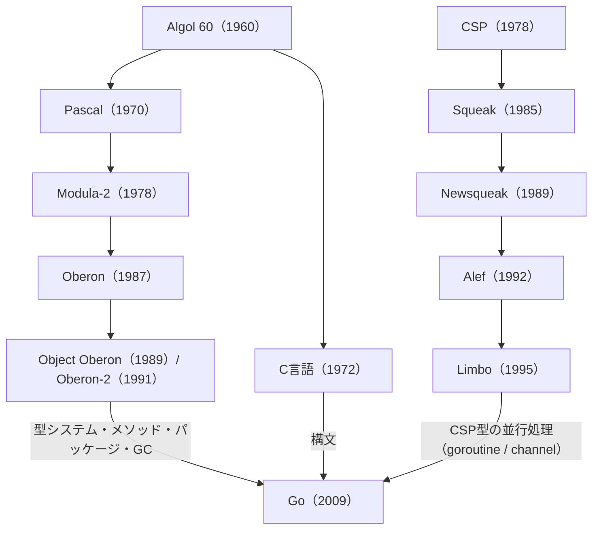

# 概要

プログラミング言語の歴史には、大きく2つの系譜がある。1つはニクラウス・ヴィルトがPascalから磨き上げた「構造とモジュール化」の系譜、もう1つはトニー・ホアのCSPに始まる「並行処理」の系譜である。この2つの大河は長い時間をかけて交差し、最終的にGoへと合流した。

本記事では、Algol 60からGoに至るまでの言語をたどり、それぞれの特徴と歴史的なつながりを整理する。記述は末尾の参考文献にもとづき、Goの公式FAQや各言語の一次資料で裏づけを取った。

# 2つの大きな系譜

先に全体像を示す。Goの公式FAQは、Goの祖先を3つの流れで説明している。構文の大半はC系、宣言とパッケージはPascal/Modula/Oberon系、並行処理はホアのCSPを源流とするNewsqueakやLimboである。本記事も、この整理に沿って系譜をたどる。

- Oberon系: シンプルな型システム、継承のないオブジェクト指向、パッケージによるモジュール管理、ガベージコレクション
- CSP系: チャネルによるプロセス間通信、`select`構文、軽量プロセス

# 1. Algol 60の系譜：構造化プログラミングの原点

## Algol 60（1960年）

現代のほぼすべての手続き型言語は、Algol 60を直系の祖先に持つ。

`begin ... end`によるブロック構造、ローカル変数のスコープ、再帰呼び出しを備える。さらに、文法をBNF（バッカス・ナウア記法）で形式的に定義した言語としても名高い。C、Pascal、Java、Goに至るまで、構文の基本ルールはここから始まっている。

## Pascal（1970年）

Pascalは、ニクラウス・ヴィルトが教育用およびシステム記述用として設計した言語である。

Algol 60をよりシンプルにし、`record`型に代表される厳格な型システムを導入した。コンパイル速度が速いことでも知られる。構造化プログラミングを世界へ広め、C言語と並ぶ標準的な言語になった。

# 2. モジュール化とOberonの系譜：ヴィルトの探求

ここからは、ヴィルトが「ソフトウェアの複雑化」に抗い、シンプルさとモジュール化を追求した歴史である。

## Modula-2（1978年）

Modula-2はPascalの後継であり、その名のとおりモジュールを言語の中核に据えた。

定義部（`DEFINITION MODULE`）と実装部（`IMPLEMENTATION MODULE`）を分離し、分割コンパイルとカプセル化を可能にした。コルーチンによる簡易な並行処理もサポートしている。

## Oberon（1987年）

Oberonは、ニクラウス・ヴィルトがModula-2を極限まで削ぎ落として設計した言語である。同名の超軽量OS（Oberon System）は、ヴィルトとユルク・グトクネヒトが共同で作り上げた。

複雑な機能を排除し、単一継承に似た「型拡張（Type Extension）」と、ガベージコレクションだけを新たに加えた。「最小限の機能で最大の表現力を得る」という、ヴィルトの哲学が到達した1つの答えである。

## Object Oberon（1989年）／Oberon-2（1991年）

Oberonに本格的なオブジェクト指向を持ち込んだ拡張版が、この2つである。Object Oberonはメスンベック、テンプル、グリーゼマーが、Oberon-2はメスンベックとヴィルトが設計した。とくにOberon-2は、レシーバを持つ「型バインド手続き」、すなわちメソッドの形を確立した。

特徴的なのは、`class`構文を新設しなかった点である。Oberonの「型拡張」に対して、メソッドを直接関連付けている。

### Goとのつながり

Goの設計には、Oberon系の影響がはっきりと表れている。

- `class`を持たず、構造体にメソッドをバインドする
- 継承ではなく、型の埋め込み（embedding）を使う
- パッケージによってモジュールを管理する

ここで見逃せないのが、Goの共同設計者ロバート・グリーゼマーの経歴である。彼はETHチューリッヒでヴィルトとメスンベックに師事し、先ほどのObject Oberon（1989年）の共著者でもある。Oberonの系譜を受け継ぐ人物が、そのままGoの設計へ加わった。

# 3. CSPと並行処理の系譜：Goの並行処理の祖先

Go最大の特徴であるゴルーチンとチャネルは、ベル研究所を中心とする並行処理モデルの系譜から生まれた。

## CSP（1978年）

CSP（Communicating Sequential Processes）は、トニー・ホアが1978年の論文で示した並行処理のモデルである。当初は並行プログラミング言語に近い形で提案され、のちにホアやロスコーらの手でプロセス代数（並行性の数学的理論）として整えられた。特定の実装言語というより、並行処理を捉えるための枠組みである。

その核心は、メモリを共有するのではなく、独立したプロセスがメッセージのやり取りで協調するという考え方にある。スレッドやロックに頼る手法とは対照的なこの発想は、のちのGoの有名な格言『通信によってメモリを共有せよ』へと受け継がれた。

## Squeak（1985年）

Squeakは、ベル研究所のルカ・カルデリとロブ・パイクが、CSPの考え方をUI記述に応用して作った小さな言語である。マウスやキーボードといった入力を扱う画面について、その並行性をプログラムとして表現するのが狙いだった。CSPを実際の言語に落とし込んだ初期の試みである。発表論文の副題は「マウスと対話するための言語」であった。なお、Smalltalk実装のSqueakとは同名の別物である。

## Newsqueak（1989年）

Newsqueakは、ロブ・パイクがSqueakをもとに開発した、より実用的な並行処理言語である。

構文はCに近い。最大の特徴は、チャネルをファーストクラスの値として扱える点にある。CSPやSqueakと違い、チャネルを変数に入れたり、関数へ渡したり、チャネル越しに送ったりできる。動的にプロセスやチャネルを生成でき、複数のチャネルを待ち受け、通信を選ぶ仕組み（Goの`select`の直接の祖先）も備えていた。これらはいずれも、現在のGoに通じる特徴である。

## Alef（1992年）

Alefは、ベル研究所のフィル・ウィンターボトムが、次世代OSプロジェクトPlan 9のために設計した言語である。1992年ごろに登場し、言語リファレンスはPlan 9第2版（1995年）とともに公開された。NewsqueakのチャネルベースのCSP型並行処理（`proc`、`task`、`chan`）を、C言語風のコンパイル言語で実現した。

ところが、Alefには致命的な弱点があった。自動メモリ管理、すなわちガベージコレクションを持たなかったのである。パイクらはウィンターボトムにGCの追加を促したが、実現しなかった。並行処理と手動のメモリ管理は相性が悪く、複数アーキテクチャにまたがる言語の維持も難しかった。結果としてAlefはPlan 9第3版で捨てられ、その概念はC言語のスレッドライブラリ（libthread）へと引き継がれた。

## Limbo（1995年）

Alefの直接の後継として設計されたのがLimboである。ショーン・ドーワード、フィル・ウィンターボトム、ロブ・パイクが、分散OSであるInfernoのために開発した。

Limboは、NewsqueakとAlefで培われたCSP型の並行処理を受け継ぎつつ、Alefに欠けていた自動ガベージコレクションを備えた。型付きチャネルによるプロセス間通信、強い型付け、モジュール化といった特徴は、Goの設計へ色濃く引き継がれている。Goの公式FAQが並行処理の祖先にNewsqueakとLimboを挙げているのも、この系譜ゆえである。

# まとめ：すべての系譜はGoへ

ここまで見てきた言語は、Goの設計者たちがGoを作るまでに通過し、洗練させてきた技術の系譜である。

2つの系譜は、最後にGoの開発チームで文字どおり交わった。Oberonの系譜からはロバート・グリーゼマーが、CSPとベル研究所の系譜からはロブ・パイクやケン・トンプソンが加わり、2007年からGoの設計を始めた。

Goは、C言語のシンプルな構文を土台にした。そこへOberonやOberon-2から「無駄のない型システムとパッケージによるモジュール管理」を、NewsqueakからLimboへと磨かれた「CSPによる並行処理」を取り込んだ。そして、Alefが実現できなかったメモリ管理を、モダンなランタイムのガベージコレクションで解決した。

普段何気なく書いているGoの1行の背後には、半世紀を超える言語設計の積み重ねがある。その系譜を知ると、Goというデザインに込められた意図が、より深く見えてくる。

# 参考文献

- [Go FAQ — What are Go's ancestors? / Why build concurrency on the ideas of CSP?](https://go.dev/doc/faq)
- [Rob Pike, "Origins of Go concurrency style"（OSCON 2010）](https://www.youtube.com/watch?v=3DtUzH3zoFo)
- [Russ Cox, "Bell Labs and CSP Threads"](https://swtch.com/~rsc/thread/)
- [Wikipedia: Communicating sequential processes](https://en.wikipedia.org/wiki/Communicating_sequential_processes)
- [Wikipedia: Newsqueak](https://en.wikipedia.org/wiki/Newsqueak)
- [Wikipedia: Alef (programming language)](https://en.wikipedia.org/wiki/Alef_(programming_language))
- [Wikipedia: Limbo (programming language)](https://en.wikipedia.org/wiki/Limbo_(programming_language))
- [Mössenböck, Templ, Griesemer, "Object Oberon: An Object-Oriented Extension of Oberon"（ETH TR 109, 1989）](https://www.research-collection.ethz.ch/handle/20.500.11850/68697)
- [Cardelli, Pike, "Squeak: a language for communicating with mice"（SIGGRAPH 1985）](http://ordiecole.com/squeak/cardelli_squeak1985.pdf)
