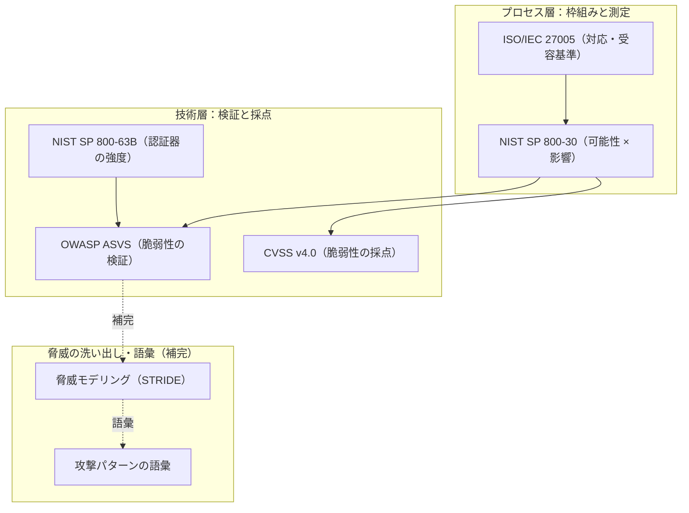

# 概要

リスクアセスメントに取り組もうとすると、NIST・ISO・OWASPといった標準やガイドが次々に出てきて、「どれを・どの順で・何のために読めばいいのか」で迷いやすい。それぞれが扱う範囲は違うのに、用語や粒度もバラバラなまま並べると議論が噛み合わなくなる。

この記事は、リスクアセスメントの**やり方そのもの**を解説するものではない。着手する前に共通言語として押さえておきたい**前提知識を一枚の地図に整理する**ことを目的とする。具体的には次を扱う。

- 資産・脅威・脆弱性・リスクという基礎概念（すべての土台）
- 主要な5つのドキュメント（NIST SP 800-30/ISO/IEC 27005/OWASP ASVS/NIST SP 800-63B/CVSS v4.0）が、リスクのどの部分を担うか
- 5つだけでは手薄になる「脅威の洗い出し」を補う手法・語彙（脅威モデリング/OWASP Top 10/MITRE ATT&CK）

特定のドメインには寄せず、汎用的な前提知識として整理する。

# 基礎概念：資産・脅威・脆弱性・リスク

すべてのドキュメントの土台になるのが、次の4つの用語である。まずここを揃えないと、以降の議論がずれる。

| 用語 | 定義 | 例 |
| --- | --- | --- |
| 資産（Asset） | 守りたいもの | 個人データ、システム、サービスへの信頼、可用性 |
| 脅威（Threat） | 資産に害を与えうる事象・主体 | 外部攻撃者、内部不正、設定ミス、災害 |
| 脆弱性（Vulnerability） | 脅威に悪用されうる弱点 | 実装バグ、設計不備、運用不備、パッチ未適用 |
| リスク（Risk） | 脅威が脆弱性を突いて資産に影響を与える可能性 × 影響度 | 「公開サーバーの既知の脆弱性が悪用され、個人データが漏洩する」など |

重要なのは、リスクを次のように分解して捉えることである。

> **リスク = f(脅威の発生可能性, 脆弱性の悪用しやすさ, 影響の大きさ)**

この3変数を軸にすると、各ドキュメントを「どの変数を扱っているか」で位置づけられる。以降はこの分解を背骨として使う。

# 全体マップ：各ドキュメントがどの変数・どの層を担うか

主要な5つと補完手法を、リスクの3変数と「層」で整理すると次のようになる。

| ドキュメント | 主に担う変数 | 層 | 一言でいうと |
| --- | --- | --- | --- |
| NIST SP 800-30 | 可能性 × 影響（測り方） | プロセス（測定） | リスクをどう測るか |
| ISO/IEC 27005 | 対応・受容基準（測った後） | プロセス（枠組み） | どこまで受け入れ、どう扱うか |
| OWASP ASVS | 脆弱性（網羅的な洗い出し） | 技術（検証） | 何を検証すべきか |
| NIST SP 800-63B | 脆弱性・対策の強度 | 技術（認証固有） | 認証の強度の物差し |
| CVSS v4.0 | 脆弱性の深刻度（採点） | 技術（採点） | 個別脆弱性に点を付ける |
| 脅威モデリング（STRIDE） | 脅威（設計時の洗い出し） | 手法 | 脅威を体系的に列挙する |
| OWASP Top 10 / MITRE ATT&CK | 脅威（攻撃の語彙） | 語彙 | 攻撃を語る共通言語 |

層で見ると、大きく「プロセス層（枠組み・測定）」と「技術層（検証・採点）」に分かれる。

この地図で見ると、5つのドキュメントは**脆弱性・影響・測定/対応に厚く、脅威そのものの洗い出しが手薄**だとわかる。そこを補うのが最後のセクションで触れる脅威モデリングと攻撃の語彙である。

# 各ドキュメントで押さえること

以下、各ドキュメントを「何のための文書か／押さえる要点／3変数のどこを担うか／使いどころ」で整理する。

## NIST SP 800-30 Rev.1 — リスクの測り方

リスクアセスメントの手順を定めた文書。「リスクをどう測るか」への直接の答えになる。

- リスクアセスメントの4ステップ：**準備 → 実施 → 結果の共有 → 維持**
- **脅威源（Threat Source）と脅威イベント（Threat Event）の区別**（付録D・Eの一覧表がそのまま使える）
- 可能性（Likelihood）と影響（Impact）の**定性尺度**（Very Low〜Very High）の定義の仕方
- Appendix Iの**リスクマトリクス**（可能性 × 影響でリスクレベルを決める表）
- **担う変数**：可能性 × 影響（＝リスクの測定そのもの）
- **使いどころ**：リスクの大きさを一貫した尺度で見積もりたいとき

## ISO/IEC 27005 — リスクマネジメントの枠組み

リスクマネジメント全体の枠組みを示す文書。800-30が「測り方」なら、こちらは「測った後どうするか」まで含む。

- リスク**アセスメント**（特定 → 分析 → 評価）とリスク**対応**の違い
- リスク対応の4択：**回避 / 低減（修正）/ 共有（移転）/ 保有（受容）** と、それぞれの判断基準
- **リスク受容基準（risk acceptance criteria）** を事前に決める考え方。「どこまで受け入れるか」を先に定義しないと評価が恣意的になる
- **担う変数**：測った後の意思決定（対応・受容）
- **使いどころ**：見積もったリスクに方針を決めるとき。有料規格なので、概要理解ならJIPDECやIPAの解説資料で代替できる

## OWASP ASVS — 何を検証すべきかのチェックリスト

アプリケーションのセキュリティ検証項目を体系化したリスト。「脆弱性」側を網羅的に洗い出すツールとして使う。

- レベル1〜3の使い分け（L2が一般的なアプリの標準ライン、L3は高リスク向け）
- 認証・セッション管理などのカテゴリ別に、具体的な検証要件が並ぶ
- **担う変数**：脆弱性（の網羅）
- **使いどころ**：自分たちの実装に抜けがないかを項目単位で確認するとき

## NIST SP 800-63B — 認証器の強度の物差し

認証の強度を測るための物差し。認証まわりのリスクを論じるときに効く。

- **AAL1/2/3**（認証保証レベル）の定義と、各レベルで許される認証器
- パスワード（memorized secret）の要件、レート制限、verifier compromise resistance
- **識別子（identifier）と認証器（authenticator）の分離**という原則（識別子は秘密ではない）
- **担う変数**：脆弱性・対策の強度（認証固有）
- **使いどころ**：「推測可能な識別子を認証に使ってしまっている」といった、認証固有の弱点を論じるとき

## CVSS v4.0 — 個別脆弱性の採点

個別の脆弱性に深刻度スコアを付けるための共通指標。

- Base/Threat/Environmentalメトリクスの構造
- **CVSS は「脆弱性の深刻度」であって「リスク」そのものではない**（FIRST自身が明言している）。Environmentalメトリクスで自組織の文脈を加味して初めてリスクに近づく
- **担う変数**：脆弱性の深刻度（採点）
- **使いどころ**：個別の脆弱性に優先度を付けるとき。ただしスコアをそのままリスクとして扱わない

# 5つだけだと手薄な領域：脅威の洗い出しと攻撃の語彙

全体マップで見たとおり、5つのドキュメントは脆弱性・影響・測定/対応には厚い一方、**脅威そのものをどう洗い出すか**が手薄になりやすい。ここを補うのが次の2つである。

## 脅威モデリング（STRIDE など）

設計段階で脅威を体系的に列挙する手法。STRIDEは次の6カテゴリで脅威を洗い出す。

- Spoofing（なりすまし）
- Tampering（改ざん）
- Repudiation（否認）
- Information Disclosure（情報漏洩）
- Denial of Service（サービス妨害）
- Elevation of Privilege（権限昇格）

ASVSの「何を検証すべきか（What）」に対して、脅威モデリングは「そもそもどんな脅威があるか」を埋めるので、両者は相補的である。

## OWASP Top 10 / MITRE ATT&CK

実際の攻撃パターンを語るための語彙として使う。

- **OWASP Top 10**：Webアプリでよくある重大なリスクのカテゴリ集。優先度の高い定番の弱点を共通言語にできる。
- **MITRE ATT&CK**：攻撃者の戦術・技術を体系化したナレッジベース。「どう攻撃されるか」を具体的な語彙で語れる。

これらは脅威と脆弱性を「実際の攻撃」として結びつけ、リスクの可能性を具体的に見積もる助けになる。

# まとめ

- リスクは **f(脅威の発生可能性, 脆弱性の悪用しやすさ, 影響の大きさ)** に分解して捉える。各ドキュメントは、この3変数のどれを担うかで位置づけられる。
- プロセス層は **NIST SP 800-30（測り方）** と **ISO/IEC 27005（対応・受容基準）**、技術層は **OWASP ASVS（検証）／ NIST SP 800-63B（認証強度）／ CVSS v4.0（採点）**。
- 目的別の入り口：リスクを測りたい → 800-30 ／ 対応方針を決めたい → 27005 ／ 脆弱性を洗い出したい → ASVS ＋ 脅威モデリング ／ 認証の強度を見たい → 800-63B ／ 個別脆弱性に点を付けたい → CVSS。
- 5つだけでは「脅威の洗い出し」が手薄。**脅威モデリング（STRIDE）** と **OWASP Top 10 / MITRE ATT&CK** で補う。
- CVSSのスコアやASVSのチェックはあくまで材料であり、そのまま「リスク」ではない。受容基準と組織の文脈に照らして初めて意思決定につながる。

# 参考リンク

- [NIST SP 800-30 Rev.1 Guide for Conducting Risk Assessments](https://csrc.nist.gov/pubs/sp/800/30/r1/final)
- [ISO/IEC 27005 Guidance on managing information security risks](https://www.iso.org/standard/80585.html)
- [OWASP Application Security Verification Standard (ASVS)](https://owasp.org/www-project-application-security-verification-standard/)
- [NIST SP 800-63B Digital Identity Guidelines: Authentication and Lifecycle Management](https://pages.nist.gov/800-63-3/sp800-63b.html)
- [CVSS v4.0 Specification Document (FIRST)](https://www.first.org/cvss/v4-0/)
- [OWASP Top 10](https://owasp.org/www-project-top-ten/)
- [MITRE ATT&CK](https://attack.mitre.org/)
- [OWASP Threat Modeling](https://owasp.org/www-community/Threat_Modeling)
- [認証・認可の基本](/ja/posts/authentication-authorization-basics/)
- [OAuth 2.1とは？OAuth 2.0からの変更点とSecurity BCP（RFC 9700）](/ja/posts/oauth-2-1-security-bcp/)
- [セキュア・バイ・デザイン: 安全なソフトウェア設計](/ja/posts/secure-by-design-software/)
- [デジタルアイデンティティのすべて](/ja/posts/digital-identity-overview/)
