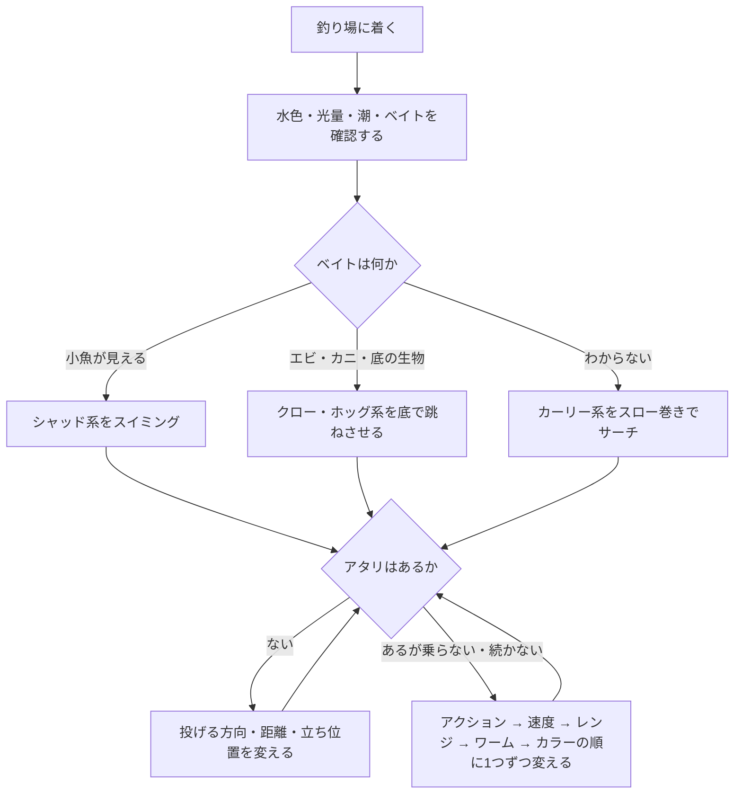
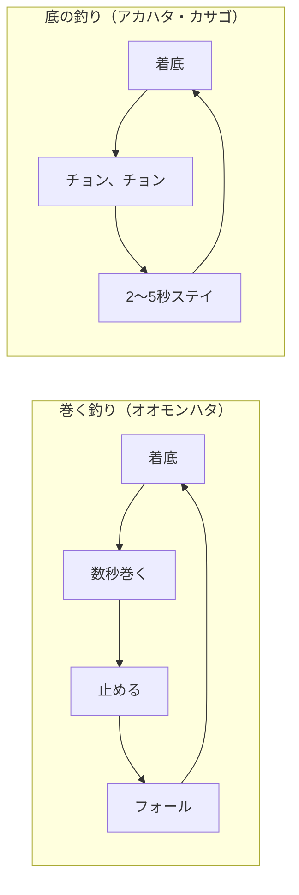
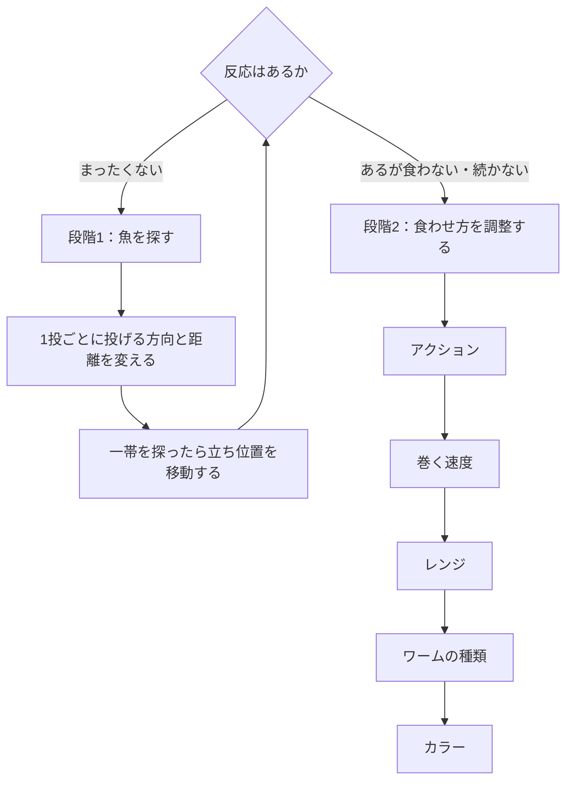

※本記事はAmazonアソシエイトのリンク（広告）を含む。

# はじめに
ロックフィッシュ（根魚）をワームで狙うときの判断材料を、釣り場で上から読めば次の一手が決まる形にまとめた。

対象はオオモンハタ・アカハタ・カサゴの3種である。軽いジグヘッドで小型を狙うライトロックと、重めのリグで大型を狙うハードロックの両方に共通する考え方を軸にしている。

商品名ではなく「ワームの種類」と「アクション」で整理しているので、手持ちのワームに読み替えて使える。判断の順番は「魚種 → ワームの種類 → アクション → カラー → だめなら次」である。

# 全体の判断フロー
まず全体像を図にする。細かい内容は以降の節で説明する。

# 3魚種の違いを先に押さえる
ロックフィッシュは「泳ぐ根魚」と「底に付く根魚」に分けて考えると判断が速くなる。オオモンハタは前者、アカハタとカサゴは後者に近い。

| 項目 | オオモンハタ | アカハタ | カサゴ |
| --- | --- | --- | --- |
| 学名 | Epinephelus areolatus | Epinephelus fasciatus | Sebastiscus marmoratus |
| 生息場所 | 岩礁の周り、岩礁に砂地が絡む場所 | サンゴ礁・岩礁（水深4〜160m） | 沿岸の岩礁域（海岸近く〜水深200m） |
| 主なエサ | 小魚 | エビ・カニなどの甲殻類 | ゴカイ・甲殻類・小魚 |
| 動き方 | 回遊性が強く、中層まで浮く | 根や地形の周りが中心 | 泳ぎ回らず物陰に潜む。夜に活発になる |
| 狙うレンジ | 底〜中層 | 底 | 底・根の際・穴 |
| 基本の攻め方 | 巻く | 跳ねさせて止める | 小さく動かして長く止める |
| 第一候補のワーム | シャッド系 | クロー・ホッグ系 | クロー系・カーリー系・ストレート系 |

## オオモンハタ：泳ぐハタは巻いて探す
オオモンハタはハタ科のなかでも遊泳力が高く、小魚を追って中層まで浮くことがある。底だけ探ると、浮いている個体を見逃す。

基本は着底させてからゆっくりタダ巻きし、投げる方向とレンジを変えながら探る。アタリがなければ着底の回数を増やし、フォールで見せる時間を作る。

## アカハタ：甲殻類を意識して底で見せる
アカハタは岩礁やサンゴ礁の底周りが中心になる。釣り上げたアカハタがエビやカニを吐き出すこともあり、甲殻類を意識した底の釣りが基本である。

根の周りでワームを小さく跳ねさせ、止めて食わせる間を作る。

## カサゴ：移動しない魚の目の前で誘い続ける
カサゴは泳ぎ回らず、昼は物陰に潜み、夜になるとエサを探して出てくる。遠くからワームを見つけて追ってくる魚ではない。

穴や根の際にワームを通し、小さく動かして長めに止める。テトラや岩の隙間では、着底と同時に食ってくることが多い。ジグヘッドリグなら、根へ潜られる前に素早く合わせる。

## その他のロックフィッシュ
ほかの根魚も、2つの型に当てはめると判断しやすい。

- 小魚を追って浮く魚：オオモンハタ型として巻く釣りで探す
- 根や底から離れない魚：アカハタ・カサゴ型として底の釣りで探す

# ワームの種類で使い分ける
ワームは「何のエサに見せるか」で選ぶ。

| 種類 | 見せるエサ | 得意な場面 | 狙うレンジ | 基本の操作 |
| --- | --- | --- | --- | --- |
| シャッド系 | 小魚 | オオモンハタ、ベイトを追う高活性の魚 | 底〜中層、かけ上がり、潮が効く場所 | 着底 → 巻く → 止める → フォール → 巻く |
| クロー・ホッグ系 | エビ・カニ | アカハタ、カサゴ、底にいる魚 | 岩周り、根の際、ボトム | 着底 → チョン → チョン → 止める |
| カーリー・グラブ系 | 波動で広く見せる | 魚種や居場所を絞れないとき | 底〜中層、広範囲 | 着底 → スロー巻き → フォール |
| ストレート・ピンテール系 | 弱く自然な小さいエサ | 小型、食い渋り、スレた魚 | ボトム中心 | タダ巻き、小さなリフト＆フォール、シェイク、ステイ |

- シャッド系は、とにかく泳がせる。オオモンハタはスイミングへの反応がよく、最初のサーチに向く。
- クロー・ホッグ系は、底から離しすぎない。10〜20cm程度の小さな動きから始め、強く跳ねさせすぎない。
- カーリー・グラブ系は、スローに巻いても尻尾が動く。まず魚の居場所を探すのに使いやすい。
- ストレート・ピンテール系は、主にライトロックで使う。弱く、小さく、自然に見せる。

釣れた魚がエサを吐き出したら、それに合わせる。小魚を吐いたらシャッド系、エビやカニを吐いたらクロー・ホッグ系に寄せる。

# リグとタックルの目安
## リグ
| リグ | 構成 | 向く場面 | 注意点 |
| --- | --- | --- | --- |
| ジグヘッドリグ | ジグヘッドにワームを刺す | スイミング、テトラや岩の隙間への落とし込み | 根掛かりしやすい。カサゴは早めに合わせる |
| テキサスリグ | バレットシンカーとオフセットフックにワームを付ける | 根周りや沖のシモリをズル引き・リフト＆フォールで探る | 即合わせだと掛かりにくい。重みが乗ってからしっかり合わせる |
| フリーリグ・ジカリグ | シンカーとフックを組み合わせたボトム用リグ | 根周りのボトム | 場所やターゲットに合わせて使い分ける |

## タックル
以下はシマノの初心者向けガイドの目安を、ライトロックとハードロックで並べたものである。

| 項目 | ライトロック | ハードロック |
| --- | --- | --- |
| ロッド | 7〜7.6ft前後のライトゲームロッド | 7〜8ft前後のロックフィッシュロッド |
| リール | 2000〜2500番のスピニング | 3000〜4000番のハイギアスピニング。大型狙いはベイト |
| ライン | PE0.3〜0.4号とフロロリーダー1〜1.5号（60〜80cm）。フロロ0.8〜1号の直結も可 | PE1.5〜2号とフロロリーダー5〜8号（約1.5m） |
| リグの重さ | 1〜1.5gが中心。潮や風が強い日は2〜3g | 5〜30g。水深と潮の速さで調整する |
| 主な対象 | 小型のカサゴなど | オオモンハタ、アカハタ、良型のカサゴ |

掛けたら、根へ潜られる前にロッドのパワーで浮かせる。中層で掛けた魚は根へ潜られにくいので、スイミングで食わせるとキャッチ率も上がる。

# カラーの選び方
カラーの効果は状況による差が大きく、決まった正解はない。以下は現場でよく使われる経験則である。魚種より先に、光量、水の透明度、ベイト、魚の活性、プレッシャーの5つで考える。

| 系統 | 使う場面 | ねらい |
| --- | --- | --- |
| 白・パール・小魚系 | 日中、小魚が見える、オオモンハタ狙い、広く探す | 小魚に見せる |
| グリーンパンプキン系 | 澄み潮、晴天、食い渋り | エビ・カニなど底の生物に見せる。迷ったらまずこれ |
| 赤・オレンジ系 | 濁り、反応が薄い、甲殻類を意識する | 強めにアピールする |
| ラメ・フレーク系 | 日中、光がある | フラッシングで目立たせる |
| グロー系 | 暗い時間、マズメ、濁り、深い場所 | 光が少ない中で見つけてもらう |

## 赤は深くなると暗く見える
海水は赤い光を最初に吸収する。そのため、深い場所や濁った場所では、赤いワームは鮮やかな赤ではなく暗い影のように見えやすい。

深い場所に棲むカサゴが鮮やかな赤い体色をしているのも、海中では赤が地味な灰色に見え、保護色になるためと説明されている。「赤は目立つ」というのは浅い場所の話である。深い場所では「暗いシルエットで目立たせる色」と考えるとよい。

## カラーを替える順番
ナチュラル系から始め、反応がなければアピール系に替える。それでも反応しなければ、その場所に魚はいないと考える。後述の段階1に戻り、投げる場所を変える。

# 基本アクション
障害物が少ない場所ではズル引き、岩がある場所ではリフト＆フォールやボトムバンプ、岩穴の前ではシェイクが基本になる。

| アクション | 操作 | 向く魚・状況 | コツ |
| --- | --- | --- | --- |
| タダ巻き | 一定の速度で巻く | オオモンハタ、シャッド系・カーリー系 | 遅めから始め、速くしたり遅くしたりして反応を比べる |
| スイミング | 底から少し浮かせて巻き、止めてフォールさせる | オオモンハタ、活性が高い魚 | ずっと底を引かない |
| リフト＆フォール | 持ち上げて落とし、着底を繰り返す | 3魚種とも | フォール中のアタリに注意する |
| ボトムバンプ | 底を小さく叩き、2〜5秒止める | アカハタ、カサゴ、低活性 | 強く動かしすぎない。エビが底で跳ねるイメージ |
| ズル引き | 底をゆっくり引いて止める | カサゴ、アカハタ、低活性 | 根掛かりしそうなら少し浮かせて再開する |
| シェイク | その場で細かく揺らす | カサゴ、魚がいるのに食わないとき | 移動距離を小さくし、魚の前で誘い続ける |

巻く釣りと底の釣りの基本サイクルは次のとおりである。

# 魚種別の基本パターン
## オオモンハタ
第一候補はシャッド系で、基本は巻く釣りである。

1. キャストして着底させる
2. ゆっくり巻く
3. 少し止めてフォールさせる
4. また巻く

レンジは底、50cm上、1m上、さらに上と刻んで探る。魚が浮いているなら底にこだわらない。反応がなければカーリー系に替え、その次にカラーを替える。

## アカハタ
第一候補はクロー・ホッグ系で、基本は底で跳ねさせる釣りである。

1. キャストして着底させる
2. チョン、チョンと小さく跳ねさせる
3. ステイして食わせる間を作る
4. 着底を繰り返す

根の周りを丁寧に探る。反応がなければカーリー系に替える。

## カサゴ
第一候補はクロー系・カーリー系・ストレート系で、基本は小さく、ゆっくり、止める釣りである。

1. 着底させる
2. 小さく動かす
3. ステイする
4. 少しだけ移動させる
5. またステイする

穴・岩・根の際を重点的に探る。夜は活性が上がりやすい。

# アタリがないときの変更順
根魚には大きく移動しない魚が多い。魚がいない場所でワームやカラーを替えても釣果は変わらない。まず魚を探し、魚がいるとわかってから食わせ方を調整する。

段階2では、一度に変えるのは1つだけにする。複数を同時に変えると、何が効いたのかわからなくなる。釣れた条件をメモしておくと、次の釣行の判断材料になる。

# 状況別の考え方
| 状況 | カラー | ワーム・アクション |
| --- | --- | --- |
| 晴天・澄み潮 | ナチュラル系 | 小さめ・弱めのアクション。食い渋りならストレート系 |
| 曇り | ナチュラル系〜アピール系 | 普通のアクション |
| 濁り | 赤系・グロー・ラメ系 | 波動の強いワームを大きめに動かす |
| 暗い時間・マズメ | グロー・パール系 | 波動の強いワーム |
| 小魚が見える | 白・パール・小魚系 | シャッド系のスイミング |
| 底に魚がいそう | グリーンパンプキン系・赤系 | クロー系のボトムバンプ |
| 食い渋り | ナチュラル系 | ストレート系・カーリー系、小さいアクション、長めのステイ |

# 釣り場に着いたら最初に見ること
- [ ] 水の色（澄み・濁り）
- [ ] 明るさ（日中・マズメ・夜）
- [ ] 潮の動き
- [ ] 風の向きと強さ
- [ ] ベイトの有無（小魚・甲殻類）
- [ ] 岩・根の位置
- [ ] かけ上がり
- [ ] テトラなどの障害物
- [ ] 足元の水深
- [ ] ほかの釣り人が攻めた跡

# 安全とマナー
- 磯ではライフジャケットとスパイクシューズを着用する。
- カサゴのヒレや頭の棘に刺されると痛む。フィッシュグリップで持つ。
- カサゴはあまり移動しないため、釣られた場所では数が回復しにくい。小型はリリースし、持ち帰りは食べる分だけにする。
- サイズや採捕の規則は地域ごとに異なる。釣行前に、その地域の漁業調整規則などを確認する。

# 現場用まとめ
スマホのメモに貼るならこの6行でよい。

- オオモンハタ：シャッド系を巻く。底だけにこだわらない
- アカハタ：クロー系を底で跳ねさせて止める
- カサゴ：根際で小さく動かし、長めに止める
- 小魚を意識：シャッド系のスイミング
- 底を意識：クロー系のボトムバンプ
- 釣れない：まず投げる場所を変え、次に1つずつ変える

# 関連アイテム（PR）
この節はAmazonアソシエイトのリンク（広告）であり、ワームの種類ごとの検索結果ページに移動する。

- [シャッドテール系ワーム](https://www.amazon.co.jp/s?k=%E3%82%B7%E3%83%A3%E3%83%83%E3%83%89%E3%83%86%E3%83%BC%E3%83%AB+%E3%83%AF%E3%83%BC%E3%83%A0+%E3%83%AD%E3%83%83%E3%82%AF%E3%83%95%E3%82%A3%E3%83%83%E3%82%B7%E3%83%A5&tag=bmf035-22)
- [クロー・ホッグ系ワーム](https://www.amazon.co.jp/s?k=%E3%82%AF%E3%83%AD%E3%83%BC+%E3%83%9B%E3%83%83%E3%82%B0+%E3%83%AF%E3%83%BC%E3%83%A0+%E3%83%AD%E3%83%83%E3%82%AF%E3%83%95%E3%82%A3%E3%83%83%E3%82%B7%E3%83%A5&tag=bmf035-22)
- [カーリーテール・グラブ系ワーム](https://www.amazon.co.jp/s?k=%E3%82%AB%E3%83%BC%E3%83%AA%E3%83%BC%E3%83%86%E3%83%BC%E3%83%AB+%E3%82%B0%E3%83%A9%E3%83%96+%E3%83%AF%E3%83%BC%E3%83%A0&tag=bmf035-22)
- [ストレート・ピンテール系ワーム](https://www.amazon.co.jp/s?k=%E3%83%94%E3%83%B3%E3%83%86%E3%83%BC%E3%83%AB+%E3%82%B9%E3%83%88%E3%83%AC%E3%83%BC%E3%83%88+%E3%83%AF%E3%83%BC%E3%83%A0+%E3%83%A9%E3%82%A4%E3%83%88%E3%82%B2%E3%83%BC%E3%83%A0&tag=bmf035-22)
- [ロックフィッシュ用ジグヘッド](https://www.amazon.co.jp/s?k=%E3%83%AD%E3%83%83%E3%82%AF%E3%83%95%E3%82%A3%E3%83%83%E3%82%B7%E3%83%A5+%E3%82%B8%E3%82%B0%E3%83%98%E3%83%83%E3%83%89&tag=bmf035-22)
- [テキサスリグ用バレットシンカー](https://www.amazon.co.jp/s?k=%E3%83%86%E3%82%AD%E3%82%B5%E3%82%B9%E3%83%AA%E3%82%B0+%E3%83%90%E3%83%AC%E3%83%83%E3%83%88%E3%82%B7%E3%83%B3%E3%82%AB%E3%83%BC&tag=bmf035-22)
- [フィッシュグリップ](https://www.amazon.co.jp/s?k=%E3%83%95%E3%82%A3%E3%83%83%E3%82%B7%E3%83%A5%E3%82%B0%E3%83%AA%E3%83%83%E3%83%97&tag=bmf035-22)
- [釣り用ライフジャケット](https://www.amazon.co.jp/s?k=%E3%83%A9%E3%82%A4%E3%83%95%E3%82%B8%E3%83%A3%E3%82%B1%E3%83%83%E3%83%88+%E9%87%A3%E3%82%8A&tag=bmf035-22)

# 参考
- [fish.shimano.com - オオモンハタの特徴と釣り方](https://fish.shimano.com/ja-JP/content/beginners/fish/oomonhata/index.html)
- [fish.shimano.com - カサゴの特徴と釣り方](https://fish.shimano.com/ja-JP/content/beginners/fish/kasago/index.html)
- [fish.shimano.com - ロックフィッシュとは？釣れる魚・必要な道具・釣り方のコツを解説](https://fish.shimano.com/ja-JP/content/beginners/fishingstyle/lurefishing/rockfish/index.html)
- [fish.shimano.com - ライトゲームとは？釣れる魚・必要な道具・釣り方のコツを解説](https://fish.shimano.com/ja-JP/content/beginners/fishingstyle/lurefishing/lightgame/index.html)
- [ja.wikipedia.org - オオモンハタ](https://ja.wikipedia.org/wiki/%E3%82%AA%E3%82%AA%E3%83%A2%E3%83%B3%E3%83%8F%E3%82%BF)
- [ja.wikipedia.org - アカハタ (魚類)](https://ja.wikipedia.org/wiki/%E3%82%A2%E3%82%AB%E3%83%8F%E3%82%BF_%28%E9%AD%9A%E9%A1%9E%29)
- [ja.wikipedia.org - カサゴ](https://ja.wikipedia.org/wiki/%E3%82%AB%E3%82%B5%E3%82%B4)
- [oceanservice.noaa.gov - Why is the ocean blue?](https://oceanservice.noaa.gov/facts/oceanblue.html)

