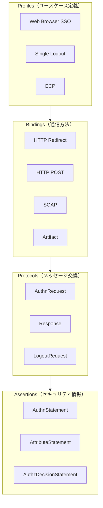
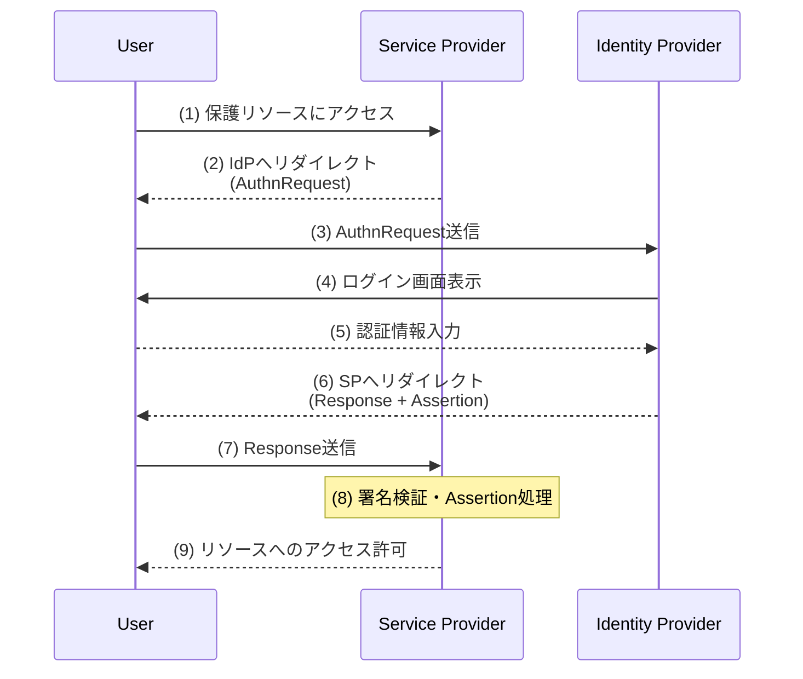
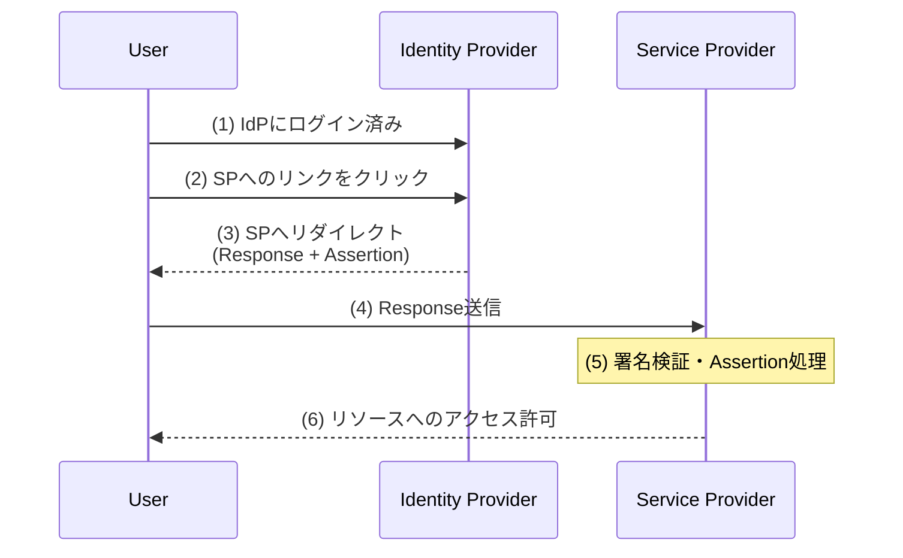
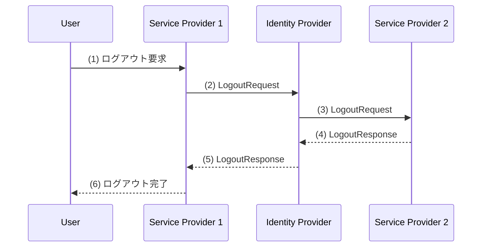

OASIS Security Assertion Markup Language (SAML) 2.0 に基づく要点整理。

---

## 概要

SAML（Security Assertion Markup Language）は、**XMLベースの認証・認可データ交換標準**。

異なるセキュリティドメイン間で、ユーザーの認証情報や属性情報を安全にやり取りするためのフレームワーク。主にエンタープライズ環境でのSSO（シングルサインオン）に使用される。

| 項目 | 内容 |
|-----|------|
| 策定 | OASIS（2005年3月） |
| 形式 | XML |
| 主な用途 | Web Browser SSO、フェデレーション |
| 前身 | SAML 1.1 |

---

## OAuth/OIDCとの比較

| 項目 | SAML 2.0 | OAuth 2.0 / OIDC |
|-----|----------|------------------|
| 目的 | 認証 + 属性交換 | 認可（OAuth）/ 認証（OIDC） |
| データ形式 | XML | JSON |
| トークン形式 | XML Assertion | JWT（OIDC） |
| 署名方式 | XML Signature | JWS |
| 暗号化方式 | XML Encryption | JWE |
| 主な用途 | エンタープライズSSO | Web/モバイルアプリ |
| 複雑さ | 高い | 低い |

---

## 主要な用語

| 用語 | 説明 |
|-----|------|
| **Identity Provider（IdP）** | ユーザーを認証し、Assertionを発行するエンティティ |
| **Service Provider（SP）** | Assertionを受け取り、サービスを提供するエンティティ |
| **Assertion** | IdPが発行する認証・属性・認可情報を含むXMLドキュメント |
| **Principal** | 認証対象となるエンティティ（通常はエンドユーザー） |

---

## SAMLの4つの構成要素

SAMLは階層的な設計で構成される。



### 1. Assertions（アサーション）

主体に関するセキュリティ情報を含むXMLドキュメント。

### 2. Protocols（プロトコル）

リクエスト/レスポンス形式のメッセージセット。

### 3. Bindings（バインディング）

SAMLメッセージを下位層プロトコル上で転送する方法。

### 4. Profiles（プロファイル）

特定のユースケースでAssertions、Protocols、Bindingsを組み合わせたもの。

---

## Assertion（アサーション）

### 構造

```xml
<saml:Assertion Version="2.0"
    ID="_abc123"
    IssueInstant="2024-01-15T10:00:00Z">

    <saml:Issuer>https://idp.example.com</saml:Issuer>

    <saml:Subject>
        <saml:NameID>user@example.com</saml:NameID>
        <saml:SubjectConfirmation Method="urn:oasis:names:tc:SAML:2.0:cm:bearer">
            <saml:SubjectConfirmationData
                NotOnOrAfter="2024-01-15T10:05:00Z"
                Recipient="https://sp.example.com/acs"/>
        </saml:SubjectConfirmation>
    </saml:Subject>

    <saml:Conditions NotBefore="..." NotOnOrAfter="...">
        <saml:AudienceRestriction>
            <saml:Audience>https://sp.example.com</saml:Audience>
        </saml:AudienceRestriction>
    </saml:Conditions>

    <saml:AuthnStatement AuthnInstant="2024-01-15T09:59:00Z">
        ...
    </saml:AuthnStatement>

    <saml:AttributeStatement>
        ...
    </saml:AttributeStatement>

</saml:Assertion>
```

### 3種類のStatement

| Statement | 説明 |
|-----------|------|
| **AuthnStatement** | 認証イベントに関する情報（認証方法、認証時刻） |
| **AttributeStatement** | ユーザーの属性情報（名前、メール、グループ等） |
| **AuthzDecisionStatement** | 認可決定（リソースへのアクセス許可/拒否） |

### SubjectConfirmation Method

Assertionの有効性を確認する方法。

| Method | 説明 |
|--------|------|
| **bearer** | Assertionを持っている者が使用可能 |
| **holder-of-key** | 特定の鍵の所持を証明する者が使用可能 |
| **sender-vouches** | 発行者が確認する基準で使用可能 |

---

## Protocols（プロトコル）

### 主要なプロトコル

| プロトコル | 説明 |
|-----------|------|
| **Authentication Request Protocol** | SPがIdPに認証を要求 |
| **Single Logout Protocol** | 全SPからのログアウト |
| **Artifact Resolution Protocol** | Artifact経由でAssertionを取得 |
| **Name Identifier Management Protocol** | 識別子の変更・終了 |

### AuthnRequest（認証リクエスト）

```xml
<samlp:AuthnRequest
    ID="_req123"
    Version="2.0"
    IssueInstant="2024-01-15T10:00:00Z"
    Destination="https://idp.example.com/sso"
    AssertionConsumerServiceURL="https://sp.example.com/acs"
    ProtocolBinding="urn:oasis:names:tc:SAML:2.0:bindings:HTTP-POST">

    <saml:Issuer>https://sp.example.com</saml:Issuer>

    <samlp:NameIDPolicy
        Format="urn:oasis:names:tc:SAML:1.1:nameid-format:emailAddress"
        AllowCreate="true"/>

</samlp:AuthnRequest>
```

### Response（認証レスポンス）

```xml
<samlp:Response
    ID="_res456"
    Version="2.0"
    IssueInstant="2024-01-15T10:00:05Z"
    Destination="https://sp.example.com/acs"
    InResponseTo="_req123">

    <saml:Issuer>https://idp.example.com</saml:Issuer>

    <samlp:Status>
        <samlp:StatusCode Value="urn:oasis:names:tc:SAML:2.0:status:Success"/>
    </samlp:Status>

    <saml:Assertion>
        <!-- Assertion内容 -->
    </saml:Assertion>

</samlp:Response>
```

---

## Bindings（バインディング）

SAMLメッセージを転送する方法。

| Binding | メソッド | 特徴 |
|---------|---------|------|
| **HTTP Redirect** | GET | URLクエリパラメータにDEFLATE圧縮して送信。サイズ制限あり |
| **HTTP POST** | POST | HTMLフォームでBase64エンコードして送信 |
| **HTTP Artifact** | GET/POST | 参照用の小さなArtifactを送信し、別途取得 |
| **SOAP** | POST | SOAPエンベロープで送信。バックチャネル通信 |
| **PAOS** | - | Reverse SOAP。ECP Profile用 |

### HTTP Redirect Binding

```
https://idp.example.com/sso?
    SAMLRequest=fZJNT8MwDIbv...（DEFLATE + Base64）
    &RelayState=token
    &SigAlg=...
    &Signature=...
```

### HTTP POST Binding

```html
<form method="post" action="https://sp.example.com/acs">
    <input type="hidden" name="SAMLResponse" value="PHNhbW...（Base64）"/>
    <input type="hidden" name="RelayState" value="token"/>
    <input type="submit" value="Submit"/>
</form>
```

---

## Profiles（プロファイル）

### Web Browser SSO Profile

最も一般的なプロファイル。2つのフローがある。

#### SP-Initiated SSO（SPから開始）



**特徴**: ユーザーがまずSPにアクセスし、IdPへ認証を依頼するフロー。

#### IdP-Initiated SSO（IdPから開始）



**特徴**: ユーザーが先にIdPにログインし、そこからSPにアクセスするフロー。AuthnRequestが不要。

### Single Logout Profile



---

## Binding × Profile の組み合わせ

Web Browser SSO Profileで使用可能な組み合わせ：

| AuthnRequest送信 | Response送信 |
|-----------------|--------------|
| HTTP Redirect | HTTP POST |
| HTTP POST | HTTP POST |
| HTTP Redirect | HTTP Artifact |
| HTTP POST | HTTP Artifact |

---

## メタデータ

IdPとSPの設定情報を記述するXMLドキュメント。

### IdPメタデータ例

```xml
<EntityDescriptor entityID="https://idp.example.com">
    <IDPSSODescriptor>
        <KeyDescriptor use="signing">
            <ds:KeyInfo>...</ds:KeyInfo>
        </KeyDescriptor>
        <SingleSignOnService
            Binding="urn:oasis:names:tc:SAML:2.0:bindings:HTTP-Redirect"
            Location="https://idp.example.com/sso"/>
        <SingleLogoutService
            Binding="urn:oasis:names:tc:SAML:2.0:bindings:HTTP-POST"
            Location="https://idp.example.com/slo"/>
    </IDPSSODescriptor>
</EntityDescriptor>
```

### SPメタデータ例

```xml
<EntityDescriptor entityID="https://sp.example.com">
    <SPSSODescriptor>
        <KeyDescriptor use="signing">
            <ds:KeyInfo>...</ds:KeyInfo>
        </KeyDescriptor>
        <AssertionConsumerService
            Binding="urn:oasis:names:tc:SAML:2.0:bindings:HTTP-POST"
            Location="https://sp.example.com/acs"
            index="0"/>
        <SingleLogoutService
            Binding="urn:oasis:names:tc:SAML:2.0:bindings:HTTP-POST"
            Location="https://sp.example.com/slo"/>
    </SPSSODescriptor>
</EntityDescriptor>
```

### メタデータに含まれる情報

| 項目 | 説明 |
|-----|------|
| EntityID | エンティティの一意識別子（URI） |
| SSO Endpoint | シングルサインオンのURL |
| SLO Endpoint | シングルログアウトのURL |
| ACS | Assertion Consumer Service URL |
| 証明書 | 署名検証・暗号化用の公開鍵 |

---

## セキュリティ考慮事項

### 署名と暗号化

| 対象 | 署名 | 暗号化 |
|-----|:----:|:-----:|
| AuthnRequest | 推奨 | - |
| Response | 推奨 | - |
| Assertion | 必須（通常） | オプション |

### TLS要件

| 要件 | 推奨度 |
|-----|:-----:|
| HTTP over SSL 3.0 / TLS 1.0以上 | 推奨 |
| HTTP POST使用時のResponse署名 | 必須 |

### 主要な脅威と対策

| 脅威 | 対策 |
|-----|------|
| **リプレイ攻撃** | Assertion有効期限（NotOnOrAfter）、InResponseTo検証 |
| **中間者攻撃** | TLS必須、署名検証 |
| **Assertion偽造** | XML Signatureによる署名検証 |
| **セッションハイジャック** | セキュアなセッション管理、SLO実装 |

### Assertion検証チェックリスト

| 項目 | 検証内容 |
|-----|---------|
| 署名 | 正当なIdPの秘密鍵で署名されているか |
| Issuer | 信頼されたIdPのEntityIDか |
| Audience | 自SPが対象か |
| NotBefore / NotOnOrAfter | 有効期間内か |
| InResponseTo | 送信したAuthnRequestのIDと一致するか |
| Recipient | 自SPのACS URLと一致するか |

---

## NameID Format

ユーザー識別子の形式。

| Format | 説明 |
|--------|------|
| `unspecified` | 形式を指定しない |
| `emailAddress` | メールアドレス形式 |
| `persistent` | 永続的な疑似匿名識別子 |
| `transient` | 一時的な識別子（セッションごと） |
| `X509SubjectName` | X.509証明書のSubject |

### プライバシー考慮

| Format | 用途 |
|--------|------|
| **persistent** | 同一ユーザーを永続的に識別（ただし不透明な値） |
| **transient** | 一回限りの識別子。SP間での関連付け防止 |

---

## エラーハンドリング

### Status Code

| StatusCode | 説明 |
|------------|------|
| `Success` | 成功 |
| `Requester` | リクエスト側のエラー |
| `Responder` | レスポンス側のエラー |
| `VersionMismatch` | SAMLバージョン不一致 |

### 第2レベルStatus Code

| StatusCode | 説明 |
|------------|------|
| `AuthnFailed` | 認証失敗 |
| `NoPassive` | パッシブ認証不可 |
| `UnknownPrincipal` | 不明なユーザー |
| `RequestDenied` | リクエスト拒否 |

---

## 参考資料

- [SAML 2.0 Technical Overview](https://docs.oasis-open.org/security/saml/Post2.0/sstc-saml-tech-overview-2.0.html)
- [SAML 2.0 Core Specification](https://docs.oasis-open.org/security/saml/v2.0/saml-core-2.0-os.pdf)
- [SAML 2.0 Bindings](https://docs.oasis-open.org/security/saml/v2.0/saml-bindings-2.0-os.pdf)
- [SAML 2.0 Profiles](https://docs.oasis-open.org/security/saml/v2.0/saml-profiles-2.0-os.pdf)
- [SAML 2.0 - Wikipedia](https://en.wikipedia.org/wiki/SAML_2.0)

