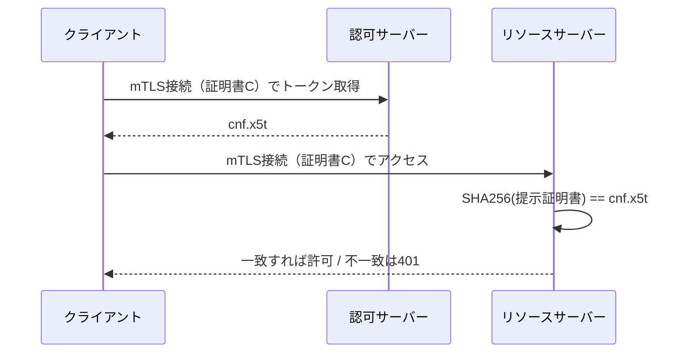
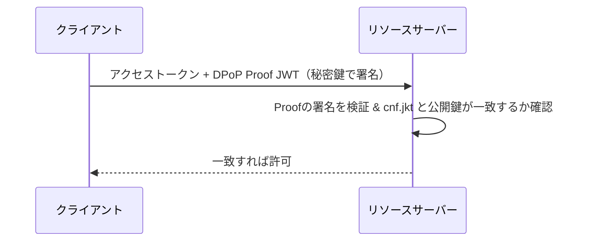

# 概要

通常のアクセストークン（bearerトークン）は「持っている人が正当な持ち主」とみなされる。つまり、盗まれたら攻撃者がそのまま使えてしまう。この弱点を塞ぐのが**送信者制約トークン（Sender-Constrained Token）**である。

この記事では、mTLS（RFC 8705）とDPoP（RFC 9449）による送信者制約と、トークンの宛先を絞るResource Indicators（RFC 8707）を整理する。

関連するRFCは以下の通り。

- [RFC 8705 OAuth 2.0 Mutual-TLS Client Authentication and Certificate-Bound Access Tokens](https://www.rfc-editor.org/rfc/rfc8705)
- [RFC 9449 OAuth 2.0 Demonstrating Proof of Possession (DPoP)](https://www.rfc-editor.org/rfc/rfc9449)
- [RFC 8707 Resource Indicators for OAuth 2.0](https://www.rfc-editor.org/rfc/rfc8707)

# bearerトークンの弱点

bearerトークンは、リクエストのAuthorizationヘッダに載せるだけで使える。

```
攻撃者が盗んだトークン ──▶ リソースサーバー
リソースサーバー「トークンがあるね、はいどうぞ」
```

トークンさえ持っていれば誰でも使えるため、漏洩・リプレイに弱い。

# 送信者制約（Sender-Constrained）とは

送信者制約トークンは、トークンを「特定の送信者専用」に束縛する。使用時に、その送信者だけが持つ秘密（鍵や証明書）の所持を証明させることで、盗んだだけの攻撃者には使えないようにする。

仕組みの共通点は、トークンに**`cnf`（confirmation）クレーム**で鍵や証明書のサムプリント（ハッシュ）を刻むことである。

```
発行時: トークンに cnf で鍵/証明書のサムプリントを刻む
使用時: 提示された鍵/証明書が cnf と一致するかを確認
        → 盗んでも秘密鍵を持たない攻撃者は一致させられない
```

これはkey confirmation / proof-of-possession / holder-of-keyなどと呼ばれる。bearerが「認可」だけなのに対し、送信者制約は「認可 + 送信者の証明（認証）」を組み合わせている。

# mTLS（RFC 8705）

RFC 8705は、相互TLS（mTLS）をOAuthに持ち込む仕様で、2つの独立した機能を定義する。

1. **mTLSクライアント認証**: `client_secret`の代わりにクライアント証明書で認証する。
2. **証明書束縛アクセストークン**: トークンをクライアント証明書に束縛する（送信者制約）。

証明書束縛の流れは次の通り。



`cnf.x5t#S256`は証明書のSHA-256サムプリントをbase64urlで表したもの。攻撃者はトークンを盗んでも証明書の秘密鍵を持たないため、mTLSハンドシェイクで同じ証明書を提示できず、使えない。

# DPoP（RFC 9449）

DPoP（Demonstrating Proof of Possession）は、証明書を使わず**アプリケーション層**で送信者制約を実現する。クライアントが鍵ペアを持ち、リクエストごとに秘密鍵で署名した**DPoP Proof JWT**をヘッダに添える。

- DPoP Proofには`htm`（HTTPメソッド）、`htu`（URL）、`jti`、`iat`を含み、リクエストに紐づける。
- アクセストークンには公開鍵のサムプリント`cnf.jkt`を刻む。リソースサーバーは、Proofの署名鍵とトークンの`cnf.jkt`が一致するかを確認する。



証明書運用が不要なため、SPAやモバイルアプリに向く。

なお、DPoPの仕組みは公開鍵暗号による所持証明（proof-of-possession）そのものだが、目的は「クライアントの身元を認証すること」ではない点に注意したい。鍵はクライアントがその場で自己生成したもので、CAや登録済みの身元は介在しない。DPoPが証明するのは「このアクセストークンに紐づけた鍵（`cnf.jkt`）を提示者が持っていること」だけであり、あくまで**bearerトークンを鍵に束縛する**のが役割である。「誰であるか」を非対称鍵で認証する`private_key_jwt`（RFC 7523）とは、同じ公開鍵技術でも狙いが異なる。また`htm`・`htu`・`jti`・`iat`によってProofを特定のリクエスト1回に紐づけるため、リプレイも防げる。

# mTLS と DPoP の使い分け

| 観点 | mTLS（8705） | DPoP（9449） |
| --- | --- | --- |
| 束縛の対象 | TLSクライアント証明書 | アプリ層の鍵ペア |
| 証明の場所 | TLS層（ハンドシェイク） | アプリ層（Proof JWT） |
| cnf の中身 | `x5t#S256`（証明書ハッシュ） | `jkt`（公開鍵ハッシュ） |
| 証明書運用 | 必要 | 不要 |
| 向く相手 | サービス間（インフラでmTLSを張りやすい） | SPA / モバイル |

# Resource Indicators（RFC 8707）：audを絞る

送信者制約と直交する対策が、トークンの宛先（`aud`）を絞る**Resource Indicators**である。トークンリクエストに`resource`パラメータを付けると、ASは発行トークンの`aud`をその宛先に限定する。

```
resource なし: aud が広い → あるRS向けトークンが別RSでも通る（横展開リスク）
resource あり: aud = 特定RS → 盗まれても他のRSでは弾かれる（被害の局所化）
```

- **Audience制限（8707）**: 盗まれても「別のRSでは通らない」＝被害の範囲を絞る。
- **送信者制約（8705 / 9449）**: 盗まれても「秘密鍵がない攻撃者は使えない」＝盗難自体を無効化。

この2つは直交しており、両方を組み合わせると最も堅牢になる。RFC 9700もこの両輪を推奨している。

# まとめ

- bearerトークンは「持っていれば使える」ため盗難に弱い。
- 送信者制約トークンは`cnf`で鍵/証明書に束縛し、盗んでも秘密鍵のない攻撃者には使えないようにする。
- mTLS（8705）はTLS層・証明書束縛、DPoP（9449）はアプリ層・鍵束縛。サービス間はmTLS、SPA/モバイルはDPoPが向く。
- Resource Indicators（8707）でaudを絞る対策と組み合わせると、被害の局所化と盗難無効化を両立できる。

# 参考リンク

- [RFC 8705 OAuth 2.0 Mutual-TLS Client Authentication and Certificate-Bound Access Tokens](https://www.rfc-editor.org/rfc/rfc8705)
- [RFC 9449 OAuth 2.0 Demonstrating Proof of Possession (DPoP)](https://www.rfc-editor.org/rfc/rfc9449)
- [RFC 8707 Resource Indicators for OAuth 2.0](https://www.rfc-editor.org/rfc/rfc8707)
