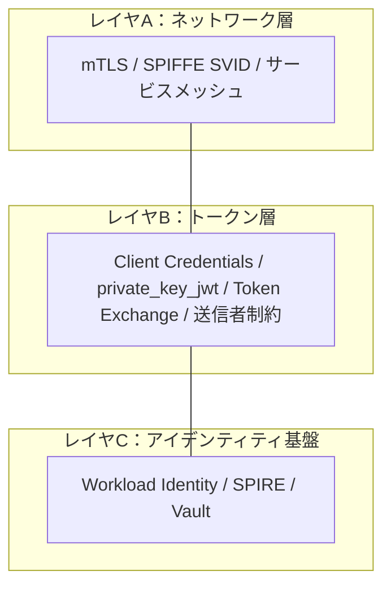
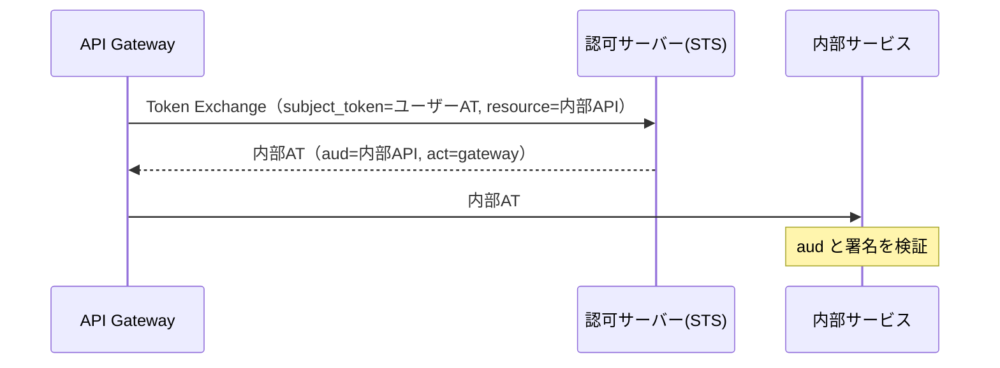

# 概要

認証というとブラウザ越しの「人間 → サービス」の認証がよく語られるが、マイクロサービスでは「サービス → サービス」の認証も同じくらい重要である。サービスAがサービスBを呼ぶとき、Bは「呼び出し元が本当にAか」をどう確かめるのか。ユーザーの権限をサービス間でどう引き継ぐのか。

この記事では、サービス間認証を「ネットワーク層 / トークン層 / アイデンティティ基盤」の3レイヤで整理し、mTLS・Token Exchange・SPIFFE・ゼロトラストまでを俯瞰する。

関連する仕様・資料は以下の通り。

- [RFC 8693 OAuth 2.0 Token Exchange](https://www.rfc-editor.org/rfc/rfc8693)
- [RFC 7521 Assertion Framework for OAuth 2.0](https://www.rfc-editor.org/rfc/rfc7521) / [RFC 7523 JWT Profile for OAuth 2.0 Client Authentication](https://www.rfc-editor.org/rfc/rfc7523)
- [SPIFFE](https://spiffe.io/)
- [NIST SP 800-207 Zero Trust Architecture](https://doi.org/10.6028/NIST.SP.800-207) / [NIST SP 800-204A](https://doi.org/10.6028/NIST.SP.800-204A)
- [Google BeyondProd](https://cloud.google.com/docs/security/beyondprod)

# なぜサービス間認証は「別問題」なのか

エンドユーザー認証とは前提が違う。

| 観点 | エンドユーザー認証 | サービス間認証 |
| --- | --- | --- |
| 主体 | 人間（ブラウザ） | プロセス（自動） |
| 対話 | パスワード / MFA / 同意画面 | 非対話 |
| 状態 | Cookie / セッション | 東西トラフィック、Cookieは薄い |
| 攻撃者 | 外部の他人 | 侵入した内部サービス / なりすまし |

考えるべき問いは3つある。

1. 呼び出し元の身元は本物か → サービスの**認証（AuthN）**
2. その呼び出しは許可されるか → 呼び出しの**認可（AuthZ）**
3. 誰のユーザー文脈での呼び出しか → ユーザー権限の**委譲（Delegation）**

多くの事故は、①を「社内ネットワークだから安全」という前提のもとで省略して起きる。これはまさにゼロトラストが否定する前提である。

# 3レイヤの全体マップ



実務はA × B × Cの組み合わせになる。たとえば「Workload Identity（C）で鍵を配り、mTLS（A）で接続を認証し、Token Exchange（B）でユーザー文脈を引き継ぐ」といった構成になる。

# レイヤA：ネットワーク層

## mTLS

通常のTLSはサーバーのみを証明書で認証するが、mTLS（相互TLS）はクライアントも証明書を提示して双方向に認証する。「このコネクションの相手は、正規の証明書を持つ本物のサービスか」を保証する。ただし「どのユーザーの文脈か」までは分からないため、レイヤBと併用する。

## SPIFFE / SPIRE

SPIFFEは「サービスに検証可能なIDを与える」CNCF標準である。IPやホスト名でなく、ワークロードの正体でIDを与える。

```
SPIFFE ID:  spiffe://example.org/ns/prod/sa/payment-api
SVID:       そのIDを証明する X.509証明書 または JWT
SPIRE:      SVIDを自動発行・ローテーションする実装
```

SVIDには2形態あり、X.509-SVIDはmTLS用（レイヤA）、JWT-SVIDはトークン用（レイヤB）である。JWT-SVIDはJWSのCompact Serializationのみ・JOSEヘッダを制限するなど、JWTの落とし穴（alg混同など）を避ける設計になっている。

## サービスメッシュ

Istioなどのサービスメッシュは、サイドカー（Envoy等）がmTLSを透過的に張る。アプリはコードを変えずに相互認証を得られ、証明書のローテーションも自動化される。

# レイヤB：トークン層

## Client Credentials と private_key_jwt

ユーザー不在でサービスが「自分自身」としてトークンを取る基本形がClient Credentials Grantである。そのクライアント認証を、共有鍵（`client_secret`）ではなく非対称鍵で行うのが**private_key_jwt（RFC 7521 / 7523）**である。クライアントが秘密鍵で署名したJWTを提示し、ASが公開鍵で検証する。ASが秘密の共有鍵を保管しなくて済むため漏洩に強い。

## Token Exchange（RFC 8693）

ユーザーの権限をサービス間で安全に引き継ぐ標準グラントがToken Exchangeである。あるトークンを、別の用途・別の宛先へ合わせたトークンに変換する（ASをSecurity Token Serviceとして使う）。

2つのモードがある。

- **Impersonation（なりすまし）**: 新トークンは`sub=user`のみ。代理者の痕跡は残らない。
- **Delegation（委譲）**: 新トークンに`act`クレーム（例`{"sub":"user","act":{"sub":"serviceB"}}`）を含め、「実際に動いているのは誰か」を残す。監査できるため実務ではこちらが望ましい。

`act`はネストで委譲の連鎖を表現できる。アクセス制御の判断には、トップレベルのクレームと最も外側の`act`のみを使う（奥のactは履歴・情報）。



## 送信者制約とResource Indicators

サービス間でも、bearerを送信者に束縛する**送信者制約（mTLS / DPoP）**や、`resource`でaudを絞る**Resource Indicators**が有効である。詳細は「[送信者制約トークンとは？](/posts/sender-constrained-tokens-mtls-dpop/)」を参照。サービス間はインフラでmTLSを張りやすいため、mTLSが第一候補になる。

# レイヤC：アイデンティティ基盤

「秘密（証明書・鍵・トークン）をどう安全に配り、ローテーションするか」を担う層で、一番事故りやすい部分でもある。

| 基盤 | 仕組み |
| --- | --- |
| K8s ServiceAccount + Workload Identity | Podの短命SAトークンをクラウドIAMに連携 |
| GCP Workload Identity Federation | 外部IdP/K8s SAを短命のGoogle資格情報に交換 |
| AWS IAM Roles (IRSA) | Pod/インスタンスにIAMロール、STSで一時資格 |
| SPIFFE / SPIRE | ワークロードにSVIDを自動発行 |
| HashiCorp Vault | 動的シークレット発行・短命リース |

共通する思想は「長命の静的な秘密を置かない。短命 + 自動ローテーション + 身元ベースの発行」である。

# ゼロトラスト（NIST SP 800-207 / 800-204A）

サービス間認証はゼロトラストの中核をなす。

```
境界防御:     「社内ネットワークだから信頼」→ 侵入されたら横移動し放題
ゼロトラスト: 「ネットワーク位置で信頼しない」→ 全リクエストを検証
              = mTLS(誰から) + トークン検証(何が許可) + 最小権限(aud/scope)
```

NIST SP 800-207は、Policy Decision Point（PDP）とPolicy Enforcement Point（PEP）を中心とする。すべてのリソースアクセスを個別に認証・認可し、最小権限・動的ポリシー・常時監視を求める。NIST SP 800-204Aは、マイクロサービスでのサービスメッシュ利用（mTLS・L7認可）のガイドである。

# 実践例：Google BeyondProd

BeyondProdは「ネットワーク位置でなく、コードの起点・サービスID・信頼できるハードウェアで信頼を築く」というGoogleの実装である。

- **ALTS**: サービス間の相互認証とトランスポート暗号化。IDを（ホスト名でなく）サービスにバインドする。mTLSのGoogle版。
- **Binary Authorization for Borg (BAB)**: コードの出所を検証し、レビュー済み・検証可能なビルドのみデプロイを許可する。
- **End User Context (EUC) Ticket**: サービスIDとは別に、エンドユーザーIDをサービスに渡す短命チケット。呼び出しチェーンで転送する。Token Exchangeのユーザー文脈伝播に相当する発想である。

バックエンドは「証明書が有効か（信頼できるコードか）」「呼び出し元のサービスIDに許可があるか」「EUCチケットが有効か」「そのユーザーがデータにアクセス可能か」をすべて確認して初めて応答する。サービスID・コード信頼・ユーザー文脈の三位一体である。

# 選定チートシートとアンチパターン

| 状況 | 推奨 |
| --- | --- |
| 社内サービス間の全通信を相互認証したい | mTLS（メッシュで透過化）+ SPIFFE/SPIRE |
| ユーザー不在のサービス自身の処理 | Client Credentials（認証は mTLS / private_key_jwt） |
| ユーザー権限を内部サービスに引き継ぎたい | Token Exchange の Delegation（act付き） |
| トークン盗難対策を強くしたい | 送信者制約（サービス間は mTLS） |
| RSごとにトークンを分離したい | Resource Indicators で aud 限定 |
| 秘密の静的配布をやめたい | Workload Identity / SPIRE |

避けるべきアンチパターンは次の通り。

- 「社内ネットワークだから認証不要」→ 侵入後の横移動を許す。
- ユーザー向けトークンを内部サービスにそのまま横流し → Token Exchangeでaudを絞る。
- 長命のサービスアカウントキーをコンテナに焼き込む → Workload Identityで短命化。
- サービス間トークンをbearerのまま → mTLS/DPoPで束縛。
- サービスIDをIP/ホスト名から判定 → ワークロードIDで判定。

# まとめ

- サービス間認証は「誰から / 何を許可 / 誰の代理」を、ネットワーク層・トークン層・アイデンティティ基盤の3レイヤで守る。
- レイヤA（mTLS/SPIFFE）で接続を認証し、レイヤB（Token Exchange/送信者制約）でユーザー文脈と権限を扱い、レイヤC（Workload Identity）で秘密を安全に配る。
- ゼロトラスト（NIST 800-207）とBeyondProdは、この考え方を体系化・実装した好例である。

# 参考リンク

- [RFC 8693 OAuth 2.0 Token Exchange](https://www.rfc-editor.org/rfc/rfc8693)
- [RFC 7523 JWT Profile for OAuth 2.0 Client Authentication and Authorization Grants](https://www.rfc-editor.org/rfc/rfc7523)
- [SPIFFE](https://spiffe.io/)
- [NIST SP 800-207 Zero Trust Architecture](https://doi.org/10.6028/NIST.SP.800-207)
- [NIST SP 800-204A](https://doi.org/10.6028/NIST.SP.800-204A)
- [Google BeyondProd](https://cloud.google.com/docs/security/beyondprod)
