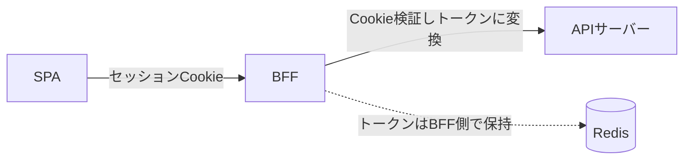
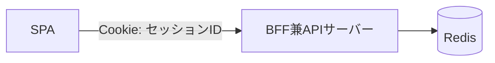

# 概要

SPA（シングルページアプリケーション）で認証を実装するとき、必ずぶつかるのが「アクセストークンをどこに保存するか」という問題である。localStorageは手軽だがXSSに弱い。かといってどこに置けばいいのか。

この記事では、トークンの置き場所の比較から、BFF（Backend For Frontend）でトークンをブラウザに渡さない構成、そして「最初はトークンレスで十分」という現実的な判断までを整理する。BFFという概念そのものについては「[BFF（Backend For Frontend）とは？](/posts/bff-explained/)」も参照。

# トークンの置き場所問題

SPAでトークンを持つ場合、置き場所ごとにリスクが異なる。

| 置き場所 | XSSで盗まれるか | CSRF | 備考 |
| --- | --- | --- | --- |
| localStorage | 盗まれる（致命的） | 影響なし | JSから丸見え。長命トークンは絶対に置かない |
| sessionStorage | 盗まれる | 影響なし | タブを閉じると消える程度の差 |
| メモリ（JS変数） | 実行中のみリスク | 影響なし | リロードで消える。短命ATならここが比較的安全 |
| httpOnly Cookie | 読めない（安全） | 対策必須 | JSから触れない。SameSiteでCSRF対策 |

XSS（悪意あるJSがページ内で実行される攻撃）を受けると、JSから読める場所（localStorage / sessionStorage / JS変数）は全部抜かれる。一方httpOnly CookieはJSから読めないため盗めない。長命の秘密はhttpOnly Cookieに置くのが基本である。

# 2-Token + 2-Storage（SPA単体の現実解）

BFFを建てられず、SPAから直接APIを叩く場合のベストプラクティスが「2-Token + 2-Storage」である。

| トークン | 役割 | 寿命 | 保存場所 |
| --- | --- | --- | --- |
| Access Token | API認可 | 極短命（5〜10分） | メモリ（JS変数） |
| Refresh Token | AT再発行 | 長命（数日〜週） | httpOnly, Secure, SameSite=Strict Cookie |

XSSを受けても、盗めるのはメモリ上の短命ATだけで、数分で失効する。本丸のRefresh TokenはhttpOnly Cookieの中にあるためJSから盗めない。

# BFFパターン：JWTをブラウザに渡さない

さらに堅くするなら、BFFパターンを使う。発想は「JWTをブラウザに一切渡さない」こと。フロントとAPIの間に薄い中継サーバー（BFF）を挟み、ブラウザとBFF間はセッションCookie、BFFとAPI間だけトークンを使う。



ブラウザ側にJWTがそもそも存在しないため、XSSで盗めるトークンが「無い」。攻撃対象そのものを消すことで、トークン漏洩リスクを根本的に無くす。

# BFFでの認証状態

BFFを使うと、フロントはトークンを一切扱わず、セッションCookieに認証状態を委ねる。

```js
// フロントは credentials: 'include' を付けるだけ。ヘッダにトークンを入れない
const res = await fetch('https://bff.example.com/api/user', {
  method: 'GET',
  credentials: 'include',
});
```

ブラウザが自動でセッションCookieをBFFへ送り、BFFがセッションに紐づくトークンを取り出してAPIへ転送する。フロントのコードから「トークン」「有効期限タイマー」「localStorageの読み書き」が消える点は、BFFの大きな利点である。

# Cookieに直接JWTを入れてはいけない

「永続Cookieでログインを維持したい」というのは正しい発想だが、Cookieの中身にJWT本体を入れるのはNGである。理由は2つ。

1. **容量制限**: Cookieは1ドメイン合計約4KBまで。JWTは権限スコープなどを盛るとすぐ4KBを超え、ブラウザが受け付けなくなる。
2. **失効できない**: Cookieの中がJWTだと、BFFは署名検証だけでOKと判断してしまい、パスワード変更や強制ログアウトをしてもexpまで止められない。

正解は「CookieにはセッションID（短いランダム文字列）だけを入れ、JWTはBFF側（Redisなど）に隠す」ことである。

```
キー: session:sess_abc123
値:   { user_id, access_token, refresh_token }
TTL:  Cookieの有効期限と同期
```

こうすればCookieの容量問題を回避でき、ログアウト時はRedisのキーを消すだけで即座に失効できる。

# 認証サーバーとBFFは別

BFFと認証サーバー（IdP）は役割が違うので、明確に分けるのが正解である。

- **認証サーバー**: ID/パスワード管理・MFA・トークンの発行/署名を担う「鍵を作るプロ」。
- **BFF**: フロントのためにCookieを発行し、トークンをブラウザの代わりに扱う「代理人」。

分けることで、認証サーバーを最前線に晒さず、Web/モバイルでクライアント特性に応じた構成を取れる。

# 最初はトークンレスで十分

ここが重要な判断ポイントである。対象が「ブラウザ（SPA）だけ」なら、最初からJWT/OIDCを導入する必要はない。BFFの裏でセッションID（Redis）だけで完結する、昔ながらのセッション認証で始めるのが、開発速度・運用コストの両面で最もコスパがよい。



トークンレスで始める利点は次の通り。

- OAuth/OIDCの複雑なフロー（認可コード/PKCE/リフレッシュトークンローテーション）を実装せずに済む。
- JWTをブラウザに渡さないのでXSSに強く、SameSite CookieでCSRFにも強い。
- ログアウト・失効はRedisのキーを消すだけ。

JWTベースに切り替えるべきなのは、次のタイミングである。

- **ネイティブアプリを追加するとき**: CookieよりAuthorizationヘッダ + トークンが基本になる。
- **マイクロサービス化するとき**: 全APIが中央Redisを見るとボトルネックになるため、署名付きJWTを流す。
- **外部サービスと連携するとき**: セッションIDは共有できず、スコープ制御できるJWTが必要になる。

BFFを最初から挟んでおけば、フロントから見た通信相手は常にBFF（Cookie）のままなので、裏側をJWTベースに大改造してもフロントのコードは変えなくて済む。

# まとめ

- トークンの置き場所はリスクが異なる。長命の秘密はhttpOnly Cookieに、短命ATはメモリに置く。
- BFFパターンはJWTをブラウザに渡さず、XSSの攻撃対象そのものを無くす。
- Cookieには直接JWTを入れず、セッションID + Redisで持つ。
- SPAだけなら最初はトークンレス（セッション）で十分。必要になってからJWT化すればよい。

# 参考リンク

- [BFF（Backend For Frontend）とは？](/posts/bff-explained/)
- [セッションベースとトークンベースの認証方式について](/posts/session-token-authentication/)
- [OWASP: JSON Web Token for Java Cheat Sheet](https://cheatsheetseries.owasp.org/cheatsheets/JSON_Web_Token_for_Java_Cheat_Sheet.html)
