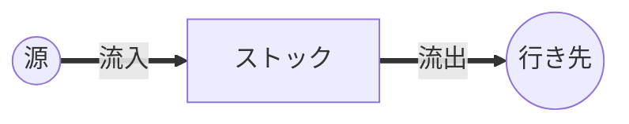
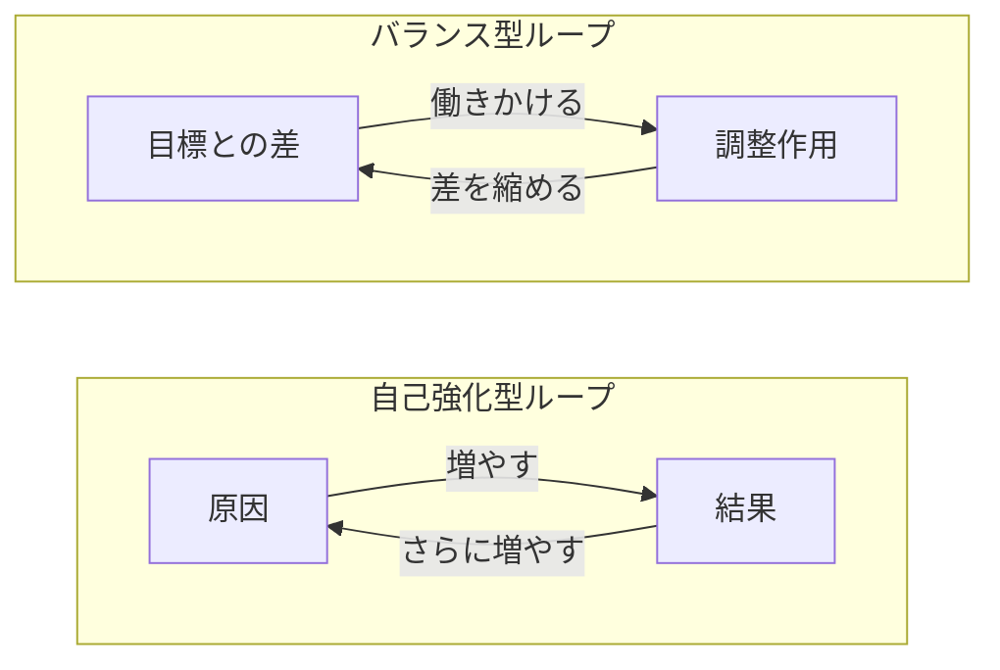
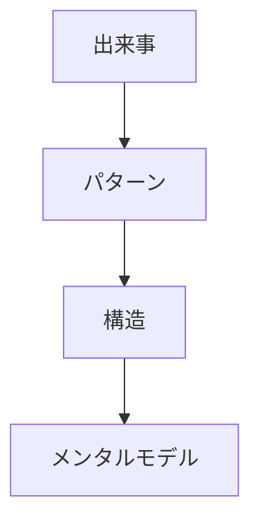
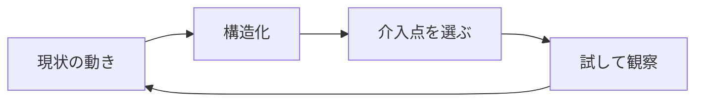

世の中の問題は、なかなか思いどおりに解けない。良かれと思った対策が裏目に出たり、原因を取り除いても症状がぶり返したりする。こうした「手ごわい問題」を扱うための見方がシステム思考である。

ここではドネラ・メドウズの『世界はシステムで動く』を土台に、システム思考の中心となる考え方を整理する。専門知識は前提にしない。物事を「点」ではなく「つながり」で見るための入り口として読んでほしい。

## 直線で考えない ―非システム思考との違い

私たちは原因と結果を直線で結びがちである。AがBを生み、BがCを生む。だから「悪いのはA」と決めつける。これが直線思考である。

しかし現実は循環している。Cの結果がAに戻り、状況をさらに動かす。直線で切り取ると、自分の打ち手がやがて自分に返ってくる構造を見落とす。

部分最適も似た罠である。担当範囲だけ良くしようとすると、しわ寄せが他に出て全体では悪化する。短期視点で動けば、長期の副作用も見えない。

システム思考は、直線を循環に、部分を全体に、短期を長期に置き換える視点である。視点を変えるだけで、見える問題が変わる。

## システムとは何か

システムとは、要素・つながり・目的の三つがそろったまとまりである。要素が集まっただけでは、システムにはならない。要素どうしが関係し、何かを生み出すふるまいを持つとき、それをシステムと呼ぶ。

たとえば学校は、生徒・教師・教室という要素だけでできているわけではない。学ぶという目的と、教える・学ぶという関係があってはじめて学校になる。要素を入れ替えてもシステムは続くが、つながりや目的を変えると、まるで別物に変わる。

だから「誰が悪いか」を探しても問題は解けないことが多い。ふるまいを生んでいるのは個人ではなく、つながりと目的のほうだからである。

## ストックとフロー

システムを見るときの最初の道具がストックとフローである。ストックは溜まっている量、フローはその出入りである。浴槽の水がストックなら、蛇口からの流入と排水口への流出がフローにあたる。

貯金、信頼、在庫、疲労。世の中の多くはストックで捉えられる。大事なのは、ストックは急には変わらないという点である。流入を増やしても流出が多ければ減る。水位が変わるには時間がかかる。

この「溜まりは一気に動かない」という感覚があるだけで、焦って蛇口だけをひねる失敗は減る。

## フィードバックループ

ストックの量がフローを左右し、それがまたストックを変える。この循環がフィードバックループである。世界はこのループの組み合わせで動いている。

ループには二種類ある。バランス型は、目標に近づけて安定させる。室温を一定に保つエアコンが典型である。自己強化型は、差を増幅して加速させる。お金がお金を生む、噂が噂を呼ぶといった動きである。

問題が雪だるま式に広がるなら自己強化型、なかなか変わらないならバランス型が働いている。どちらが効いているかを見分けるだけで、打ち手の見当がつく。

## 遅延

フィードバックには時間差がつきものである。手を打ってから効果が出るまでの遅れ、これが遅延である。遅延を見落とすと、人は待てずに重ねて手を打ち、行きすぎてしまう。

シャワーの温度調整が分かりやすい。お湯がなかなか来ないから蛇口を回しすぎて、熱くなって慌てて戻し、また冷たくなる。需要と供給、景気、人の採用など、振れ幅の大きい現象の裏にはたいてい遅延がある。

効果が出るまで待つ。遅延を知るだけで、過剰反応という失敗を避けられる。

## レジリエンス・自己組織化・階層

うまく続くシステムには共通の性質がある。メドウズはレジリエンス・自己組織化・階層の三つを挙げる。

レジリエンスは、揺さぶられても元に戻る復元力である。効率を求めて余白を削るとここが失われ、もろくなる。自己組織化は、自らを作り替えて学ぶ力である。生態系や市場が変化に対応できるのはこの力による。階層は、全体が小さなまとまりの入れ子でできていることを指す。

効率だけを追わず、しなやかさと多様性を残す。それが壊れにくいシステムの条件である。

## 氷山モデルで深さを見る

見えている出来事は氷山の一角にすぎない。出来事の下にはくり返すパターンがあり、その下にパターンを生む構造があり、いちばん底に人々の前提や信念がある。これが氷山モデルである。

出来事だけを叩くと対症療法で終わる。パターンに気づき、それを生む構造へ降り、最後に前提を疑う。深く降りるほど直しにくいが、効果は大きい。問題が再発するときは、たいてい底の前提が変わっていない。

## 実践の三段階 ―出来事・パターン・構造

メドウズ『世界はシステムで動く』巻末の解説(枝廣淳子氏)では、システム思考の使い方を**初級・中級・上級**の三段階に整理している。氷山モデルの上三層と対応し、見ている対象の深さの違いと言える。

**初級: 出来事を見る**

目の前で起きた出来事に反応する段階である。クレームが一件入る。サーバが一時的に落ちる。特定の商品で在庫が切れる。会議が時間内に終わらない。こうした表面の問題を一件ずつ片づける。必要な対応ではあるが、構造そのものには触れていない。

**中級: パターンを見る**

出来事の裏で繰り返される動きに注目する段階である。同じ種類のクレームが季節ごとに戻ってくる。月末になると決まって障害が増える。特定カテゴリの商品で何度も在庫切れが起きる。同じ会議体が毎週時間を超過する。こうした傾向を捉える。「個別案件ではなく、繰り返し起きる問題だ」と捉え直せると、打ち手の幅が広がる。KPI・時系列・問い合わせ分類・障害傾向の分析は、この中級にあたる。

**上級: 構造を見る**

パターンを生んでいる構造そのものに目を向ける段階である。なぜ同じクレームが生まれ続ける製品設計や説明資料のままなのか。なぜ月末に負荷が集中する業務サイクルのままなのか。なぜその商品の需要予測だけ外れ続けるのか。なぜその会議体は毎週時間が足りなくなる設計のままなのか。こうした問いを立てる。対象になるのは、製品設計・業務プロセス・意思決定ルール・インセンティブ・組織構造・情報の流れ・メンタルモデルなどである。

レバレッジポイントを見つけて構造ごと動かしたいなら、上級まで降りる必要がある。出来事ばかり追っていても、似た問題は形を変えて戻ってくる。

## 因果ループ図を描く

頭の中の構造を見えるようにする道具が因果ループ図である。要素を矢印でつなぎ、増えると増える関係と、増えると減る関係を書き分ける。一周して同じ向きなら自己強化、逆向きが混じればバランスである。

図にすると、自分の思い込みを他人と共有でき、議論の土台になる。完璧でなくてよい。一枚描くだけで、見落としていたループが浮かぶ。

## システム思考のプロセス

システム思考は思いつきではなく、段階を踏んで進める。大まかには次の流れになる。

1. 現状の動きを時間で描く ―何がどう変わってきたかを線で見る
2. 構造に下りる ―その動きを生むループと遅延を図にする
3. 介入点を選ぶ ―どこを変えれば構造ごと動くかを探す
4. 試して観察する ―結果を見て、図を描き直す

最初から完璧を目指さない。図を描いては直すこと自体が、システム思考の練習になる。

## システムによくある原型

別々の現場で同じ失敗が繰り返される。それは、背後の構造が似ているからである。メドウズはこうした共通の型を**システム・トラップ(罠)**と呼び、ピーター・センゲは『学習する組織』で十の原型として整理し直した。代表的なものをいくつか見ていく。

### 成長の限界

自己強化で順調に伸びていたものが、ある時点で頭打ちになる。容量・人員・市場といった制約に当たって、ループの勢いが消える。打ち手は、伸びている側をさらに強めることではない。制約のほうを緩めるのが効く。

### 応急処置の失敗

痛みだけ押さえる薬や、症状を隠すだけの回避策に頼り続けると、根本の力が痩せていく。短期は楽になっても、長期では依存と悪化を生む。

### 問題のすり替わり

症状にだけ効く対策を繰り返していると、対症療法そのものが新しい構造になってしまう。応急処置の失敗と近いが、こちらは「依存の固定化」に重さを置く。

### 目標のなし崩し

達成できない目標が目の前にあると、人は基準のほうを下げる。一度下げると、次もまた下がる。じわじわ後退するこの動きは気づきにくい。

### エスカレーション

相手の動きに合わせて自分の動きを強める二者がいると、両者の行動はどんどん強くなっていく。値引き合戦、軍拡競争、口論などがこれにあたる。誰かが先に止めない限り、上限まで突き進む。

### 共有地の悲劇

みなが共有資源から自分の分を取り続けると、やがて全体は枯渇する。個人にとって最適な行動が、合計すると破滅を生む。マナー、職場の共有予算、漁業、地下水、地球環境まで、規模を問わず同じ型が現れる。

### 型に名前を付けて、罠から抜ける

メドウズは原型をシステム・トラップと呼んだ。型を覚える目的は二つある。罠に名前を付けて診断できるようにすること。そして、そもそも罠に入らない設計を選べるようにすることだ。「これは成長の限界では」「エスカレーションが起きていないか」と問えるだけで、見立ては早くなる。

打ち手は型ごとに違う。ただ、共通する姿勢はある。症状を見たら、一段下の構造に降りて確かめること。短期に効く対症策で長期の能力が痩せていないかを点検すること。共有資源のまわりにはフィードバックの仕組み(利用ルール・コスト負担・モニタリング)を入れること。いずれも、レバレッジポイントを探す姿勢そのものでもある。

## レバレッジポイントで急所を選ぶ

メドウズの説明をかみくだけば、レバレッジポイントとは**わずかな変化で全体の挙動を大きく動かせる場所**である。同じ努力でも、当てる場所で効きは桁違いに変わる。

彼女が示した介入点は以下の四つの層に分けて読める。上の層へ行くほど効きは大きくなるが、その分見えにくく抵抗も強くなる。

### 物理レベル(効きが弱い)

- **数字・パラメータ** ―税率、補助金、定数
- **バッファ** ―変動を吸収するストックの大きさ
- **ストックとフローの構造** ―物理的な配置や結節点
- **遅延** ―システムの進む速さに対する時間差

### フィードバックループ

- **バランス型ループ** ―調整の効きの強さ
- **自己強化型ループ** ―増幅の強さ

### 情報とルール

- **情報の流れ** ―誰が何を見えるかの構造
- **ルール** ―インセンティブ、罰、制約

### 構造を変える力(効きが強い)

- **自己組織化** ―構造を生み進化させる力
- **目標** ―システムの目的
- **パラダイム** ―目的や構造やルールを生み出す考え方
- **パラダイムを超越する** ―どんなパラダイムも絶対視しない態度

### なぜ弱い場所に手が伸びるのか

ジェイ・フォレスター(システム・ダイナミクスの創始者)はこう指摘した。人は直感的にレバレッジポイントの所在をつかんでいることが多い。ところが多くの場合、変化を間違った方向に押してしまう。数字のように動かしやすい場所へは大量の資源を投じる。一方で、構造そのものを動かす場所には触れない。

これは構造ほど見えにくく、合意も得にくいからである。価格や予算の議論は前に進めやすい。一方で、目的や前提を問い直す議論は、関係者の足元が揺らぐため止まりやすい。

### 効く急所を探す姿勢

数字をいじる介入は安全に見える。だが、構造そのものは変わらない。情報の流れを開けば、人の行動が変わる。目的やものの見方を変えれば、システム全体のふるまいが入れ替わる。

弱い場所に資源を集めない。効く場所を探す。たとえ抵抗があっても、効きの大きいほうへ手を伸ばしていく。これがシステム思考の実利である。

## 似た思考法との違い

システム思考は、構造的思考やデザイン思考と混同されやすい。重なる部分はあるが、見る対象は違う。

- **構造的思考**: 物事を階層と種類に整理する技法。要素どうしの動的なやり取りまでは追わない。
- **デザイン思考**: ユーザーへの共感から課題を再定義し、プロトタイプで素早く試す手法。「何を作るか」の探索に強みがある。
- **システム思考**: 要素のつながり、ループ、遅延、ストックの変化を追う。時間とともに挙動がどう生まれるかを見る。

ざっくり言えば、構造的思考は整理が得意である。デザイン思考は創出に強い。システム思考は挙動の理解に向く。

三つは相互排他ではない。組み合わせて使うのが現実的である。デザイン思考で課題を見つける。システム思考で背後の構造を読む。構造的思考で打ち手を整理して並べる。こうした流れは、現場でそのまま使える。

## まとめ

システム思考とは、症状ではなく構造を見る習慣である。要素ではなくつながりを、出来事ではなくループと遅延を見る。そうすると、責める相手ではなく変えるべき急所が見えてくる。

まずは身近な出来事を一つ、循環の図にしてみるとよい。世界がシステムで動いていることが、少しずつ腑に落ちてくるはずである。
## 参考文献

- ドネラ・H・メドウズ『世界はシステムで動く ―いま起きていることの本質をつかむ考え方』(枝廣淳子訳、英治出版、2015)
- ピーター・M・センゲ『学習する組織 ―システム思考で未来を創造する』(英治出版)
- Donella H. Meadows, "Leverage Points: Places to Intervene in a System" (The Sustainability Institute, 1999)
- チェンジ・エージェント社「システム思考」<https://www.change-agent.jp/systemsthinking/>
