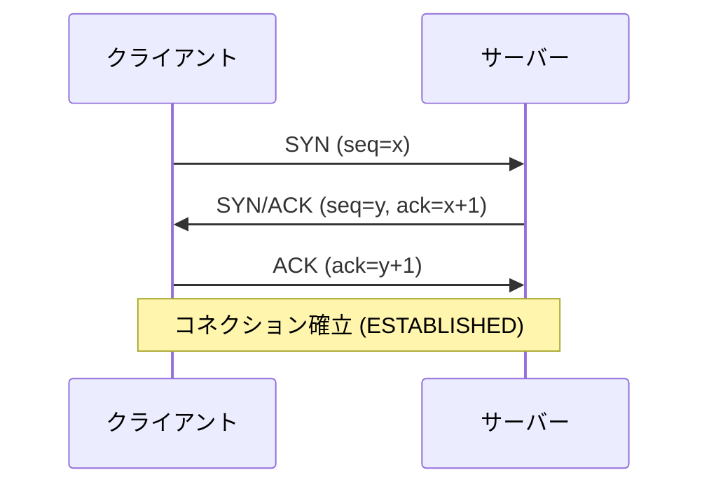

# 3ウェイハンドシェイクとは
TCPで通信を始める前に、クライアントとサーバーがコネクションを確立する手順のこと。3回のパケットのやり取り（SYN → SYN/ACK → ACK）で、お互いに送受信できる状態かを確認し合う。

# なぜ必要か
TCPは信頼性のある通信を提供するプロトコルである。データを送る前に、双方が通信できる状態であること、そして通信の起点となる初期シーケンス番号（ISN: Initial Sequence Number）を共有しておく必要がある。この準備を担うのが3ウェイハンドシェイクである。

# 手順

1. SYN: クライアントがサーバーへ接続を要求する。このとき自分の初期シーケンス番号を送る。
2. SYN/ACK: サーバーが要求を受理し、サーバー自身の初期シーケンス番号と、クライアント宛ての確認応答（ACK）を返す。
3. ACK: クライアントがサーバーへ確認応答（ACK）を返す。これでコネクションが確立する。

# 状態遷移
ハンドシェイクの過程で、クライアントとサーバーはそれぞれ状態を遷移させる。

- クライアント: CLOSED → SYN-SENT → ESTABLISHED
- サーバー: LISTEN → SYN-RECEIVED → ESTABLISHED

# なぜ2回ではなく3回なのか
2回のやり取りだけでは、サーバーはクライアントが応答を受け取れる状態かどうかを確認できない。3回目のACKによって、双方向の到達性をはじめて確認できる。あわせて、ネットワークに遅れて届いた古いSYNによる誤ったコネクション確立も防げる。

# コネクションの終了
コネクションの確立は3ウェイだが、終了は双方がFINとACKを送り合う4ウェイハンドシェイクで行う。

# まとめ
- 3ウェイハンドシェイクは、TCPがコネクションを確立する手順である。
- SYN → SYN/ACK → ACKの3ステップで、双方向の到達性を確認し、初期シーケンス番号を共有する。
- 3回必要なのは、双方向の通信可能性を保証し、古いSYNによる誤接続を防ぐためである。
