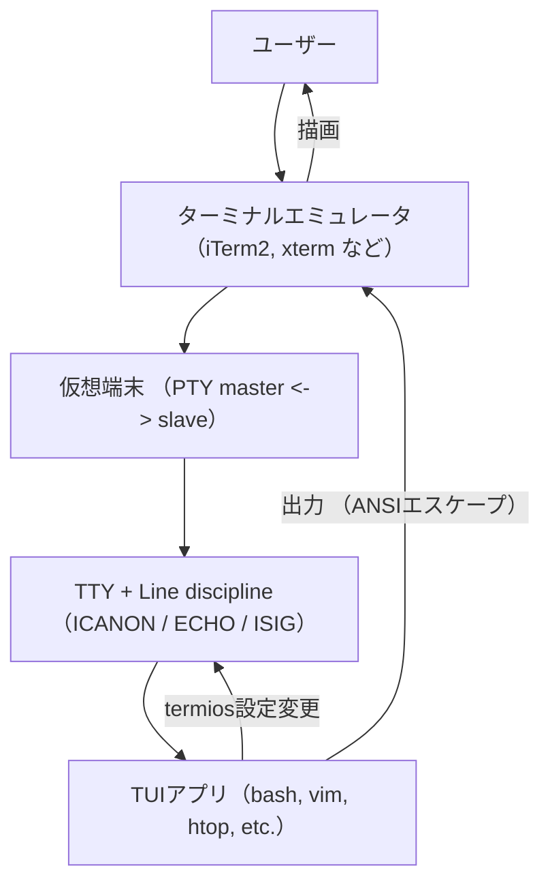
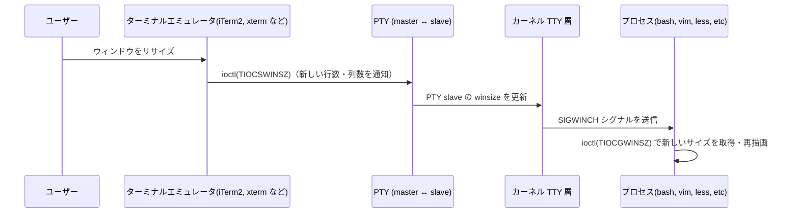

## はじめに

TUI（Terminal User Interface）アプリケーションを開発する際、`vim`や`htop`のような既存のTUIライブラリを使えば簡単に実装できる。しかし、その裏でターミナルがどのように動作しているのか、なぜRaw Modeが必要なのか、ANSIエスケープシーケンスとは何なのかを理解していないと、高レベルのAPIが何をしているのかわからず、問題が起きたときに対処しづらい。

本記事では、TUI開発に必要なターミナルの仕様と実装について、以下の観点から解説する。

- 基本概念: ターミナル、シェル、TTY、termiosなどの用語の整理
- 動作原理: Line Disciplineによる入力処理、エスケープシーケンスによる画面制御
- 実装方法: Go言語での具体的な実装例（高レイヤーAPI/低レイヤーAPI）

ターミナルの仕様を理解することで、TUIライブラリの選定や独自実装の判断ができるようになり、デバッグ時にも問題の原因を特定しやすくなる。

## 前提知識：用語の整理

TUI開発を理解するには、まずターミナルに関連する用語を理解する必要がある。

### コンソール（Console）

コンピューターの物理的な入出力デバイスを指す。元々はPC本体に直接接続されたキーボードとディスプレイを意味していた。OS的には「システムの主要な標準入出力端末」という扱いである。

### 端末（Terminal）

端末は、コンピューターへの入出力を行うデバイスまたはソフトウェアの総称である。歴史的には物理的な端末装置を指していたが、現在では主にソフトウェアで実装された仮想端末を指す。

### 端末エミュレータ（Terminal Emulator）

物理的な端末装置の機能をソフトウェアで再現したアプリケーションである。iTerm2、GNOME Terminal、Windows Terminal、xtermなどがこれにあたる。端末エミュレータは、キーボード入力をプログラムに渡し、出力を画面に描画する役割を担う。ANSIエスケープシーケンスを解釈して画面制御を行う。

主な端末エミュレータは以下の通り。

- macOS：Terminal.app、iTerm2
- Linux：GNOME Terminal、Konsole、xterm
- Windows：Windows Terminal、ConEmu

### CLI（Command Line Interface）

コマンドをテキストで入力し、出力もテキストで受け取るインターフェイス形態である。GUI（グラフィカルUI）と対比される概念である。シェル、REPL、TUIなどがCLIの一種である。

### コマンドライン（Command Line）

CLI上でユーザーが1行入力する実際の入力行を指す。`ls -l`や`git commit -m "msg"`のような行である。シェルがこの文字列を構文解析（パース）して実行する。

### シェル（Shell）

コマンドを受け取り、プログラムを実行するコマンド解釈プログラムである。bash、zsh、fish、PowerShellなどがある。ターミナル上で動作するが、ターミナルとは独立したプロセスである。

シェルの主な役割は以下の通り。

- コマンドの構文解析（トークン分割、リダイレクト処理など）
- 環境変数の管理
- プロセスの起動と制御（ジョブ制御。ジョブとはプロセスの集合のこと）
- スクリプト機能の提供

### TUI（Text User Interface）

文字ベースのインターフェースで、画面全体を使ったインタラクティブなUIを提供する。通常のCLI（シェル）が1行ずつコマンドを実行するのに対し、TUIは画面全体を制御し、カーソル移動、色、枠線、メニュー、フォームなどを使ってリッチなユーザー体験を実現する。

TUIとCLIの違いは以下の通り。

| 項目         | CLI（シェルなど）                                                 | TUI                                                               |
| ------------ | ----------------------------------------------------------------- | ----------------------------------------------------------------- |
| 入力方式     | 行単位（Enterで確定）<br>カノニカルモードで入力バッファ処理される | キー単位（押された瞬間に処理）<br>非カノニカル（raw）モードで処理 |
| 画面利用     | テキストを順に標準出力へ流す                                      | 画面全体（矩形領域）を自由に再描画・更新                          |
| カーソル制御 | 自動で次の行へ進む（基本は連続出力）                              | ANSIエスケープなどで任意の位置に移動可能                          |
| エコーバック | 有効（入力文字が自動で表示）                                      | 無効（アプリ側で必要に応じて描画）                                |
| 端末モード   | カノニカルモード（Canonical Mode）<br>＝行編集や信号処理が有効    | ローモード（Raw Mode）<br>＝入力が即アプリへ渡る                  |
| 代表例       | bash, zsh, fish, Python REPL など                                 | vim, less, htop, nmtui など                                       |

### POSIX（Portable Operating System Interface）

Unix系システムの互換性を保つための標準仕様である。IEEE（米国電気電子学会）によって策定され、システムコール、端末制御、ファイルI/O、スレッドなどのAPIを定義している。macOSやLinuxの多くのコマンドとシステムコールはPOSIX準拠である。

POSIX準拠のOSは以下の通り。

- Linux（Ubuntu、Debian、Red Hat等）
- macOS（Darwin）
- BSD系（FreeBSD、OpenBSD等）
- Solaris、AIX

最新仕様は以下の通り。

- POSIX.1-2024（IEEE Std 1003.1-2024）
- [オンライン版](https://pubs.opengroup.org/onlinepubs/9799919799/)

### POSIX端末インターフェース（POSIX Terminal Interface）

POSIXで定義された端末の入出力制御に関する標準APIである。termios構造体とその関連関数（`tcgetattr()`、`tcsetattr()`など）によって、端末のモード設定、特殊文字の定義、ボーレート（シリアル通信におけるデータ転送速度）の設定などを行う。この標準化により、POSIX準拠のOS間で同じコードが動作する。

仕様ドキュメントは以下の通り。

- [POSIX.1-2024 - General Terminal Interface](https://pubs.opengroup.org/onlinepubs/9799919799/basedefs/V1_chap11.html)

### Unix端末インターフェース

Unix系OSにおける端末制御の伝統的な仕組みである。TTYドライバがカーネル内で端末デバイスを管理し、ラインディシプリンが入出力の処理（行編集、エコーバック、特殊文字処理など）を行う。POSIXはこのUnix端末インターフェースを標準化したものである。

### TTY（TeleTYpewriter）

TTYは、Unix系OSにおける端末デバイスの総称である。元々は物理的なテレタイプライター（電動タイプライター）を接続するためのデバイスだったが、現在では仮想端末（PTY）を含む端末デバイス全般を指す。

### TTY Line Discipline

ラインディシプリンは、Unix系OSのカーネル内でTTYドライバとユーザープロセスの間に位置し、端末の入出力処理を担当するソフトウェア層である。

ラインディシプリンの役割は以下の通り。

1. 行編集機能
   - Backspaceで文字削除
   - Ctrl+Uで行全体を削除
   - Ctrl+Wで単語を削除

2. エコーバック
   - 入力した文字を自動的に端末に送り返す
   - ユーザーが入力を確認できるようにする

3. 特殊文字処理
   - Ctrl+C → SIGINTシグナルを送信
   - Ctrl+Z → SIGTSTPシグナルを送信（プロセスを一時停止）
   - Ctrl+D → EOF（入力終了）

4. 文字変換
   - 改行コード変換（CR ↔ LF）
   - 大文字・小文字変換（古いシステム）

5. 入力バッファリング
   - カノニカルモード：Enterキーまで行単位でバッファリング
   - 非カノニカルモード：文字単位で即座に渡す

### termios

POSIX標準の端末制御構造体である。以下の設定を管理する。

- 入力モード（`c_iflag`）：改行変換、フロー制御など
- 出力モード（`c_oflag`）：出力処理の設定
- 制御モード（`c_cflag`）：ボーレート、文字サイズなど
- ローカルモード（`c_lflag`）：エコー、カノニカルモード、シグナル生成など
- 特殊文字（`c_cc`）：Ctrl+C、Ctrl+Z、EOFなどの定義
- タイムアウト（`VMIN`、`VTIME`）：非カノニカルモードでの読み取り制御

TUI開発では、termiosを使ってRaw Mode（生入力モード）を実装する。

### ioctl（Input/Output Control）

`ioctl`は、Unix系OSにおける汎用的なデバイス制御用のシステムコールである。ファイルディスクリプタを通じて、通常のread/write操作では行えない特殊な操作をデバイスドライバに指示する。

主な操作は以下の通り。

- termiosの取得と設定
- ウィンドウサイズの取得

### tcgetattr / tcsetattr

POSIX標準で定義された端末制御の高レベルAPI関数である。`ioctl`システムコールを直接使うより、ポータブルで読みやすいコードを書くことができる。

POSIX準拠のシステムでは、`tcgetattr`/`tcsetattr`を使うことが推奨される。プラットフォーム間の差異（定数名の違いなど）を気にせずにコードを書くことができる。

Go言語では標準ライブラリに`tcgetattr`/`tcsetattr`のラッパーがないため、以下の選択肢がある：

1. `golang.org/x/term`を使う（高レイヤー）
```go
import "golang.org/x/term"

// 現在の設定を取得
oldState, err := term.GetState(fd)

// Raw Modeに設定
newState, err := term.MakeRaw(fd)

// 元に戻す
err := term.Restore(fd, oldState)
```

2. `golang.org/x/sys/unix`で直接`ioctl`を使う（低レイヤー）
```go
import "golang.org/x/sys/unix"

// tcgetattr 相当
termios, err := unix.IoctlGetTermios(fd, unix.TIOCGETA)

// tcsetattr 相当
err := unix.IoctlSetTermios(fd, unix.TIOCSETA, termios)
```

`golang.org/x/term`パッケージは、内部で`golang.org/x/sys/unix`の`ioctl`を使用しており、プラットフォーム間の差異を吸収している。

### PTY（Pseudo Terminal／擬似端末）

端末エミュレータが使用する仮想的な端末デバイスである。実際には2つのデバイスファイルがペアで動作する。

- master側：端末エミュレータが操作する側
- slave側：シェルやTUIアプリが接続される側

POSIX.1-2024（IEEE Std 1003.1-2024）では、master側を「manager」、slave側を「subsidiary」と呼んでいる。

シェルやTUIアプリはslave側を「本物の端末」として扱うため、物理端末と同じAPI（termios等）を使用できる。これにより、アプリケーション側は物理端末か仮想端末かを意識する必要がない。

デバイスファイルの例は以下の通り。

- Linux：`/dev/pts/0`、`/dev/pts/1`...
- macOS：`/dev/ttys000`、`/dev/ttys001`...

### ANSIエスケープシーケンス（ANSI Escape Sequence）

端末の表示制御を行う特殊な文字列命令である。ESC文字（`\x1b`または`\033`）で始まる制御コードで、カーソル移動、色変更、画面クリアなどを指示する。

主な制御シーケンスは以下の通り。

- `\x1b[31m`：赤文字に変更
- `\x1b[2J`：画面クリア
- `\x1b[H`：カーソルを左上（1,1）に移動
- `\x1b[10;20H`：カーソルを10行20列に移動

TUI開発では、これらのシーケンスを直接出力して画面の描画、部分更新、色付けを実現する。ANSI X3.64として標準化され、VT100端末で実装されたことから広く普及した。

### ターミナルの入出力の流れ



## TUI開発で制御すべきターミナルの振る舞い

TUI（Text User Interface）アプリケーションは、シェルのようにコマンドを解釈するのではなく、**端末（TTY）の入出力制御を直接扱う**。

具体的には、`termios` API を用いて **端末のモード設定（例：カノニカルモードの無効化、エコーの無効化など）** を変更し、ANSIエスケープシーケンスを利用して画面全体を描画・更新する。

通常のシェル環境では、端末はカノニカルモード (`ICANON`) に設定されており、ユーザーの入力は **行単位でバッファリングされ、Enterキーで確定後にプログラムへ渡される**。

```bash
$ stty -a | grep icanon
lflags: icanon isig iexten echo echoe echok echoke -echonl echoctl # カノニカルモードが有効
```

そのため、以下のように入力中の文字が自動的に画面にエコーされ、Enterキーでシェルに送信される。

```bash
$ ls
example.txt
```

一方、`vim` や `less` のような TUI アプリケーションは、**端末を非カノニカルモードに切り替える**。

これにより、キー入力は1文字単位で即座にアプリケーションに渡され、アプリケーション側で独自の入力処理・画面描画を行う。

```bash
$ vim

別の端末で実行:
$ ps aux | grep vim # vimの端末を確認
$ stty -a < /dev/ttys049 | grep icanon
lflags: -icanon -isig -iexten -echo -echoe echok echoke -echonl echoctl # カノニカルモードが無効
```

## TUI開発で必要な知識の全体像

TUIアプリを作るには、以下の技術要素を理解し制御する必要がある。

1. ターミナルモードの設定
2. 入力処理
3. 画面制御
4. ターミナルサイズの管理
5. バッファリング

以降のセクションでは、これらの技術要素について、仕様と実装方法を詳しく解説する。

### ターミナルモードの設定
端末（TTY）の**ラインディシプリン（line discipline）**は、カーネル内で入力や出力の扱い方を制御するソフトウェア層である。主に3つの動作モード（Canonical／Non-Canonical／Raw）があり、`termios`構造体のフラグ設定によって切り替えることができる。

これらのモードはすべてカーネル内の**TTY line discipline**によって実現されている。`termios`や`stty`コマンドは、このline disciplineの設定を変更するためのインターフェースである。

#### カノニカルモード（Canonical Mode / Cooked Mode）

通常の端末入力モードであり、**端末のデフォルト設定**である。行編集機能を持ち、入力は行単位でバッファリングされ、Enterキーで確定後にアプリケーションに渡される。

主な特徴は以下の通り。

- 行単位の入力バッファリング
- 行編集機能（Backspace、Ctrl+U、Ctrl+Wなど）
- エコーバック（入力文字の自動表示）
- 特殊文字処理（Ctrl+C、Ctrl+Z、Ctrl+Dなど）
- 改行コード変換（`\r` ↔ `\n`）

用途としては以下の通り。

- 通常のシェル操作（bash、zshなど）
- 対話型プログラム

Cooked Modeは、Canonical Modeの別名である。

#### 非カノニカルモード（Non-Canonical Mode）

`ICANON`を無効にしたモードである。

行編集機能はカーネル内の TTY line discipline によって提供されるが、非カノニカルモードではその処理が無効化され、アプリケーション側で行う必要がある。

主な特徴は以下の通り。

- 文字単位で即時入力
- 行編集機能なし（Backspaceは単なる文字）
- エコーやシグナル処理は個別設定で残すことも可能

用途としては以下の通り。

- タイムアウト付き入力
- カスタムな入力制御を行うCLIツールなど

非カノニカルモード単体ではまだエコーやシグナル処理が残る可能性があるため、完全に制御したい場合はRawモードを用いる。

#### Rawモード（生入力モード）

端末の入出力変換と制御をほぼ完全に無効化したモードである。TUIアプリケーションなどで一般的に使用される。

主な特徴は以下の通り。

- 特殊文字や改行変換を含むあらゆる処理を無効化
- 入力はバイト列としてそのままアプリケーションへ渡される
- エコーなし
- シグナル生成なし（Ctrl+Cなども文字扱い）

用途としては以下の通り。

- TUIアプリ（vim、less、htopなど）
- ゲーム、独自画面制御ツール

`stty`の`-cooked`は`raw`と同義であり、RawモードはCookedモードの対義語として扱われる。

#### モード比較表

| 項目                 | カノニカル（Cooked） | 非カノニカル | Raw         |
| -------------------- | -------------------- | ------------ | ----------- |
| 入力バッファリング   | 行単位               | 文字単位     | 文字単位    |
| 行編集機能           | 有効                 | 無効         | 無効        |
| エコーバック         | 有効                 | 設定次第*    | 無効        |
| 特殊文字（シグナル） | 有効                 | 設定次第*    | 無効        |
| 改行変換             | 有効                 | 設定次第*    | 無効        |
| 主な用途             | シェル、対話入力     | カスタムCLI  | TUI、ゲーム |

### 入力処理

入力処理では「どんなキーが押されたか」を解析する。

矢印キー、ファンクションキー、マウスイベントなど、**通常の文字以外の入力**を処理する必要がある。これらは複数バイトのエスケープシーケンスとして送られてくる。

TUIアプリでは、これらのエスケープシーケンスを解析し、適切な操作を行う必要がある。

#### 特殊キーのエスケープシーケンス

| キー      | シーケンス        | バイト列     |
| --------- | ----------------- | ------------ |
| ↑         | `ESC[A`           | `\x1b[A`     |
| ↓         | `ESC[B`           | `\x1b[B`     |
| →         | `ESC[C`           | `\x1b[C`     |
| ←         | `ESC[D`           | `\x1b[D`     |
| Home      | `ESC[H`           | `\x1b[H`     |
| End       | `ESC[F`           | `\x1b[F`     |
| Page Up   | `ESC[5~`          | `\x1b[5~`    |
| Page Down | `ESC[6~`          | `\x1b[6~`    |
| F1-F4     | `ESC[OP`-`ESC[OS` | `\x1b[OP` 等 |

#### 制御文字

| 文字      | ASCII              | 説明       |
| --------- | ------------------ | ---------- |
| Ctrl+C    | 3                  | SIGINT     |
| Ctrl+D    | 4                  | EOF        |
| Ctrl+Z    | 26                 | SIGTSTP    |
| Enter     | 13 (CR) / 10 (LF)  | 改行       |
| Tab       | 9                  | タブ       |
| Backspace | 127 (DEL) / 8 (BS) | 後退       |
| ESC       | 27                 | エスケープ |

### 画面制御（ANSI Escape Sequences）

画面制御では「どに何を表示するか」を指示する。

画面の任意の位置にカーソルを移動し、色を変更し、画面をクリアするなど、TUIの描画に必要な全ての操作を行う必要がある。

主要な制御シーケンスは以下の通り。

#### カーソル制御

| シーケンス         | 説明                            |
| ------------------ | ------------------------------- |
| `ESC[H`            | カーソルをホーム位置(1,1)に移動 |
| `ESC[{row};{col}H` | 指定位置に移動（1-indexed）     |
| `ESC[{n}A`         | n行上に移動                     |
| `ESC[{n}B`         | n行下に移動                     |
| `ESC[{n}C`         | n列右に移動                     |
| `ESC[{n}D`         | n列左に移動                     |
| `ESC[s`            | カーソル位置を保存              |
| `ESC[u`            | カーソル位置を復元              |
| `ESC[?25l`         | カーソルを非表示                |
| `ESC[?25h`         | カーソルを表示                  |

#### 画面クリア

| シーケンス | 説明                           |
| ---------- | ------------------------------ |
| `ESC[2J`   | 画面全体をクリア               |
| `ESC[H`    | カーソルをホームに移動         |
| `ESC[K`    | カーソル位置から行末までクリア |
| `ESC[1K`   | 行頭からカーソル位置までクリア |
| `ESC[2K`   | 行全体をクリア                 |

#### 色とスタイル

#### 基本スタイル

| シーケンス | 説明                 |
| ---------- | -------------------- |
| `ESC[0m`   | 全ての属性をリセット |
| `ESC[1m`   | 太字                 |
| `ESC[4m`   | 下線                 |
| `ESC[7m`   | 反転                 |

#### 前景色（テキスト色）

| シーケンス | 色       |
| ---------- | -------- |
| `ESC[30m`  | 黒       |
| `ESC[31m`  | 赤       |
| `ESC[32m`  | 緑       |
| `ESC[33m`  | 黄       |
| `ESC[34m`  | 青       |
| `ESC[35m`  | マゼンタ |
| `ESC[36m`  | シアン   |
| `ESC[37m`  | 白       |

#### 背景色

| シーケンス | 色       |
| ---------- | -------- |
| `ESC[40m`  | 黒       |
| `ESC[41m`  | 赤       |
| `ESC[42m`  | 緑       |
| `ESC[43m`  | 黄       |
| `ESC[44m`  | 青       |
| `ESC[45m`  | マゼンタ |
| `ESC[46m`  | シアン   |
| `ESC[47m`  | 白       |

#### 拡張色モード

| シーケンス              | 説明                     |
| ----------------------- | ------------------------ |
| `ESC[38;5;{n}m`         | 前景色（n: 0-255）       |
| `ESC[48;5;{n}m`         | 背景色（n: 0-255）       |
| `ESC[38;2;{r};{g};{b}m` | 前景色（RGB True Color） |
| `ESC[48;2;{r};{g};{b}m` | 背景色（RGB True Color） |

#### 代替スクリーンバッファ

| シーケンス   | 説明                                                   |
| ------------ | ------------------------------------------------------ |
| `ESC[?1049h` | 代替スクリーンバッファに切り替え（vim/lessなどが使用） |
| `ESC[?1049l` | 通常スクリーンバッファに戻る                           |

### ターミナルサイズの管理

TUIアプリはターミナルのサイズに合わせて描画する必要がある。また、ユーザーがウィンドウサイズを変更したときに再描画する必要がある。

ターミナルサイズは カーネルの TTY 構造体が保持する winsize 構造体 で管理され、ターミナルエミュレータが変更時に ioctl(TIOCSWINSZ) で通知し、カーネルが接続中のプロセスに SIGWINCH を送る。という流れになっている。



### バッファリング

多数の制御シーケンスを送る際、1つずつ送ると遅くなる。バッファリングして一度にフラッシュすることで、画面のちらつきを防ぎ、パフォーマンスを向上させることができる。

---

以上が、TUI開発で必要なターミナル制御の5つの要素である。次のセクションでは、これらを実際にGo言語で実装する方法を見ていく。

## GoでTUIの実装を学ぶ

ここでは、前セクションで説明した5つの技術要素を、Go言語で実際に実装する方法を解説する。

`golang.org/x/term`パッケージ（高レイヤーAPI）を使用した、約230行のシンプルな実装例を通じて、TUI開発の基礎を学ぶことができる。

ターミナルで必要な知識の全体像を学びやすいように、それぞれの技術要素を考慮した実装を行う。

### 実装する機能
### 1. ターミナルモードの設定
- `term.MakeRaw()`でRaw Modeに設定
- `term.GetState()`/`term.Restore()`で設定の保存と復元
- プログラム終了時に必ず元の状態に戻す

### 2. 入力処理
- 1バイトずつキー入力を読み取り
- エスケープシーケンスを解析して矢印キーを認識
- Ctrl+Cなどの制御文字を処理

### 3. 画面制御（ANSI Escape Sequences）
- カーソル移動（`\033[{row};{col}H`）
- 画面クリア（`\033[2J\033[H`）
- 色の設定（前景色）

### 4. ターミナルサイズの管理
- `unix.IoctlGetWinsize()`で現在のサイズを取得
- `SIGWINCH`シグナルでウィンドウサイズ変更を検知

### 5. バッファリング
- `bufio.Writer`で出力をバッファリング
- 複数の描画操作をバッファに蓄積
- `Flush()`で一度に画面に反映してちらつきを防止

### 実装
```go
package main

import (
	"bufio"
    "fmt"
    "os"
    "os/signal"
    "syscall"
	"time"

    "golang.org/x/term"
)

// ターミナルの状態を管理する構造体
type Terminal struct {
	fd       int
	oldState *term.State
	width    int
	height   int
	writer   *bufio.Writer
}

// 1. ターミナルモードの設定
func NewTerminal() (*Terminal, error) {
	fd := int(os.Stdin.Fd())

	// 現在の設定を保存
	oldState, err := term.GetState(fd)
	if err != nil {
		return nil, err
	}

	// Raw Modeに設定
	_, err = term.MakeRaw(fd)
	if err != nil {
		return nil, err
	}

	// 初期サイズを取得
	width, height := getTerminalSize(fd)

	return &Terminal{
		fd:       fd,
		oldState: oldState,
		width:    width,
		height:   height,
		writer:   bufio.NewWriter(os.Stdout),
	}, nil
}

// 終了時に元の状態に復元
func (t *Terminal) Restore() {
	t.writer.WriteString("\033[?25h") // カーソルを表示
	t.writer.WriteString("\033[0m")   // 色をリセット
	t.writer.Flush()
	term.Restore(t.fd, t.oldState)
}

// 4. ターミナルサイズの管理
func getTerminalSize(fd int) (width, height int) {
	width, height, err := term.GetSize(fd)
    if err != nil {
        return 80, 24 // デフォルト値
    }
    return width, height
}

func (t *Terminal) UpdateSize() {
	t.width, t.height = getTerminalSize(t.fd)
}

// 2. 入力処理
func (t *Terminal) ReadKey() (rune, string, error) {
    buf := make([]byte, 1)
    _, err := os.Stdin.Read(buf)
    if err != nil {
		return 0, "", err
	}

	// Ctrl+C
	if buf[0] == 3 {
		return 0, "CTRL_C", nil
	}

	// ESCキー（矢印キーなどのエスケープシーケンス）
	if buf[0] == 27 {
		// 少し待って次のバイトがあるかチェック
        seq := make([]byte, 2)
        os.Stdin.Read(seq)

        if seq[0] == '[' {
            switch seq[1] {
			case 'A':
				return 0, "UP", nil
			case 'B':
				return 0, "DOWN", nil
			case 'C':
				return 0, "RIGHT", nil
			case 'D':
				return 0, "LEFT", nil
			}
		}
		return 0, "ESC", nil
	}

	// 通常の文字
	return rune(buf[0]), "", nil
}

// 3. 画面制御（ANSI Escape Sequences）
func (t *Terminal) Clear() {
	t.writer.WriteString("\033[2J\033[H")
}

func (t *Terminal) MoveTo(row, col int) {
	t.writer.WriteString(fmt.Sprintf("\033[%d;%dH", row, col))
}

func (t *Terminal) SetColor(fg int) {
	t.writer.WriteString(fmt.Sprintf("\033[%dm", fg))
}

func (t *Terminal) Write(s string) {
	t.writer.WriteString(s)
}

// 5. バッファリング
func (t *Terminal) Flush() {
	t.writer.Flush()
}

func main() {
	// ターミナルチェック
	if !term.IsTerminal(int(os.Stdin.Fd())) {
		fmt.Fprintln(os.Stderr, "Error: Must be run in an interactive terminal")
		os.Exit(1)
	}

	// 初期化
	term, err := NewTerminal()
	if err != nil {
		fmt.Fprintf(os.Stderr, "Failed to initialize: %v\n", err)
		os.Exit(1)
	}
	defer term.Restore()

	// ウィンドウサイズ変更を検知
	sigCh := make(chan os.Signal, 1)
	signal.Notify(sigCh, syscall.SIGWINCH)
    go func() {
        for range sigCh {
			term.UpdateSize()
        }
    }()

	// カーソル位置
	x, y := term.width/2, term.height/2

    // メインループ
	for {
		// 画面をクリア
		term.Clear()

		// タイトル
		term.MoveTo(1, term.width/2-10)
		term.SetColor(36) // シアン
		term.Write("TUI Demo (press 'q' to quit)")

		// 情報表示
		term.MoveTo(3, 2)
		term.SetColor(33) // 黄色
		term.Write(fmt.Sprintf("Terminal Size: %dx%d", term.width, term.height))

		term.MoveTo(4, 2)
		term.Write(fmt.Sprintf("Cursor Position: (%d, %d)", x, y))

		// 枠を描画
		for row := 5; row < term.height-1; row++ {
			term.MoveTo(row, 1)
			term.SetColor(34) // 青
			term.Write("|")
			term.MoveTo(row, term.width)
			term.Write("|")
		}

		// カーソル（マーカー）を表示
		term.MoveTo(y, x)
		term.SetColor(32) // 緑
		term.Write("●")

		// 操作説明
		term.MoveTo(term.height, 2)
		term.SetColor(37) // 白
		term.Write("Arrow keys: move | q: quit")

		// バッファをフラッシュ（一度に画面に反映）
		term.Flush()

		// キー入力を待つ
		ch, key, err := term.ReadKey()
		if err != nil {
			break
		}

		// キー処理
		switch key {
		case "CTRL_C":
			return
		case "UP":
			if y > 5 {
				y--
			}
		case "DOWN":
			if y < term.height-1 {
				y++
			}
		case "LEFT":
			if x > 2 {
				x--
			}
		case "RIGHT":
			if x < term.width-1 {
				x++
			}
		}

		if ch == 'q' || ch == 'Q' {
			return
		}

		// 少し待つ（リサイズイベントを検知できるように）
		time.Sleep(50 * time.Millisecond)
	}
}
```

### 実行

```bash
go run main.go
```

操作方法は以下の通り。

- 矢印キー: カーソル（●）を移動
- q: 終了
- Ctrl+C: 終了
- ウィンドウサイズ変更: 自動的に検知（次のキー入力時に反映）

### 実装詳細
### Terminal構造体
```go
type Terminal struct {
	fd       int // ファイルディスクリプタ
	oldState *term.State // 元の端末設定
	width    int // ターミナル幅
	height   int // ターミナル高さ
	writer   *bufio.Writer // バッファ付きWriter
}
```

Terminal構造体はターミナルの状態を管理するための構造体である。

fdはファイルディスクリプタで、操作対象のファイルを指す。

Unix系OSでは、入出力（ファイル、ターミナル、ソケットなど）を整数の識別番号で管理する。

以下は標準的なファイルディスクリプタの番号と名前である。

|番号|名前|説明|
|-|-|-|
|0|stdin|標準入力（キーボード入力）
|1|stdout|標準出力（画面出力）
|2|stderr|標準エラー出力|

標準入力のファイルディスクリプタは次のように取得できる。

```go
fd := int(os.Stdin.Fd()) // stdinのファイルディスクリプタを取得
```

`fd`を使ってターミナルの設定を操作することができる。

```go
// ターミナルの現在の設定を取得
term.GetState(fd)

// Raw Modeに設定
term.MakeRaw(fd)

// ターミナルサイズを取得
term.GetSize(fd)
```

### Raw Modeの設定

Raw Modeの設定は次のように行う。

```go
oldState, _s := term.GetState(fd)
term.MakeRaw(fd)
defer term.Restore(fd, oldState)
```

Raw Modeの設定をする際は`term.Restore()`を使って元の状態に復元しておかないと、プログラム終了時に元の状態に戻らない。

### バッファリングによる最適化
```go
writer := bufio.NewWriter(os.Stdout)
writer.WriteString("...") // 複数の描画をバッファに蓄積
writer.Flush() // 一度に画面に反映してちらつきを防止
```

バッファリングをする際は`writer.Flush()`を使ってバッファをフラッシュする。

### SIGWINCHによるサイズ変更検知

SIGWINCHはウィンドウサイズが変更された時に送信されるシグナルである。

SIGWINCHを受け取ったら`term.UpdateSize()`を呼び出してウィンドサイズを更新する。

```go
sigCh := make(chan os.Signal, 1)
signal.Notify(sigCh, syscall.SIGWINCH)
go func() {
	for range sigCh {
		term.UpdateSize()
	}
}()
```

## より低レイヤーな実装：`golang.org/x/sys/unix`を使う

`golang.org/x/term`パッケージは、内部で`golang.org/x/sys/unix`を使用している。ここでは、`termios`の各フラグを直接操作する低レイヤーな実装を見てみる。

この実装では、以下を学ぶことができる：

- `termios`構造体の各フラグ（`Iflag`、`Oflag`、`Lflag`、`Cflag`、`Cc`）の直接操作
- `ioctl`システムコール（`IoctlGetTermios`/`IoctlSetTermios`）の使用
- `tcgetattr`/`tcsetattr`相当のAPI呼び出し

高レイヤー実装と比較することで、`golang.org/x/term`が内部で何をしているのかが理解できる。

```go
package main

import (
    "bufio"
    "fmt"
    "os"
    "os/signal"
    "syscall"
	"time"

	"golang.org/x/sys/unix"
)

// termiosを直接操作する低レイヤー実装
// golang.org/x/term の内部実装に近い形で学習できる

// ターミナルの状態を管理する構造体
type Terminal struct {
	fd       int
	oldState unix.Termios // termios構造体を直接保持
	width    int
	height   int
	writer   *bufio.Writer
}

// 1. ターミナルモードの設定（低レイヤー）
func NewTerminal() (*Terminal, error) {
	fd := int(os.Stdin.Fd())

	// tcgetattr 相当: 現在のtermios設定を取得
	oldState, err := unix.IoctlGetTermios(fd, unix.TIOCGETA)
    if err != nil {
		return nil, fmt.Errorf("failed to get termios: %w", err)
	}

	// Raw Modeの設定を作成
	newState := *oldState

	// Input flags (c_iflag)
	newState.Iflag &^= unix.IGNBRK | unix.BRKINT | unix.PARMRK |
		unix.ISTRIP | unix.INLCR | unix.IGNCR | unix.ICRNL | unix.IXON

	// Output flags (c_oflag)
	newState.Oflag &^= unix.OPOST

	// Local flags (c_lflag)
	newState.Lflag &^= unix.ECHO | unix.ECHONL | unix.ICANON |
		unix.ISIG | unix.IEXTEN

	// Control flags (c_cflag)
	newState.Cflag &^= unix.CSIZE | unix.PARENB
	newState.Cflag |= unix.CS8

	// Control characters (c_cc)
	newState.Cc[unix.VMIN] = 1  // 最低1バイト読む
	newState.Cc[unix.VTIME] = 0 // タイムアウトなし

	// tcsetattr 相当: 新しい設定を適用
	if err := unix.IoctlSetTermios(fd, unix.TIOCSETA, &newState); err != nil {
		return nil, fmt.Errorf("failed to set raw mode: %w", err)
	}

	// 初期サイズを取得
	width, height := getTerminalSize(fd)

	return &Terminal{
		fd:       fd,
		oldState: *oldState,
		width:    width,
		height:   height,
		writer:   bufio.NewWriter(os.Stdout),
	}, nil
}

// 終了時に元の状態に復元
func (t *Terminal) Restore() {
	t.writer.WriteString("\033[?25h") // カーソルを表示
	t.writer.WriteString("\033[0m")   // 色をリセット
	t.writer.Flush()

	// tcsetattr 相当: 元の設定に戻す
	unix.IoctlSetTermios(t.fd, unix.TIOCSETA, &t.oldState)
}

// 4. ターミナルサイズの管理（ioctl直接呼び出し）
func getTerminalSize(fd int) (width, height int) {
	// TIOCGWINSZ ioctl でウィンドウサイズを取得
	ws, err := unix.IoctlGetWinsize(fd, unix.TIOCGWINSZ)
	if err != nil {
		return 80, 24 // デフォルト値
	}
	return int(ws.Col), int(ws.Row)
}

func (t *Terminal) UpdateSize() {
	t.width, t.height = getTerminalSize(t.fd)
}

// 2. 入力処理
func (t *Terminal) ReadKey() (rune, string, error) {
	buf := make([]byte, 1)
	_, err := unix.Read(t.fd, buf) // システムコールを直接使用
	if err != nil {
		return 0, "", err
	}

	// Ctrl+C
	if buf[0] == 3 {
		return 0, "CTRL_C", nil
	}

	// ESCキー（矢印キーなどのエスケープシーケンス）
	if buf[0] == 27 {
		// 少し待って次のバイトがあるかチェック
		seq := make([]byte, 2)
		unix.Read(t.fd, seq)

		if seq[0] == '[' {
			switch seq[1] {
			case 'A':
				return 0, "UP", nil
			case 'B':
				return 0, "DOWN", nil
			case 'C':
				return 0, "RIGHT", nil
			case 'D':
				return 0, "LEFT", nil
			}
		}
		return 0, "ESC", nil
	}

	// 通常の文字
	return rune(buf[0]), "", nil
}

// 3. 画面制御（ANSI Escape Sequences）
func (t *Terminal) Clear() {
	t.writer.WriteString("\033[2J\033[H")
}

func (t *Terminal) MoveTo(row, col int) {
	t.writer.WriteString(fmt.Sprintf("\033[%d;%dH", row, col))
}

func (t *Terminal) SetColor(fg int) {
	t.writer.WriteString(fmt.Sprintf("\033[%dm", fg))
}

func (t *Terminal) Write(s string) {
	t.writer.WriteString(s)
}

// 5. バッファリング
func (t *Terminal) Flush() {
	t.writer.Flush()
}

func main() {
	// 初期化
	term, err := NewTerminal()
	if err != nil {
		fmt.Fprintf(os.Stderr, "Failed to initialize: %v\n", err)
		os.Exit(1)
	}
	defer term.Restore()

	// ウィンドウサイズ変更を検知（SIGWINCH）
	sigCh := make(chan os.Signal, 1)
	signal.Notify(sigCh, syscall.SIGWINCH)
	go func() {
		for range sigCh {
			term.UpdateSize()
		}
	}()

	// カーソル位置
	x, y := term.width/2, term.height/2

	// メインループ
	for {
		// 画面をクリア
		term.Clear()

		// タイトル
		term.MoveTo(1, term.width/2-15)
		term.SetColor(36) // シアン
		term.Write("TUI Demo (Low-level termios API)")

		// termios設定の説明
		term.MoveTo(3, 2)
		term.SetColor(33) // 黄色
		term.Write("Using unix.IoctlGetTermios/IoctlSetTermios")

		term.MoveTo(4, 2)
		term.Write(fmt.Sprintf("Terminal Size: %dx%d", term.width, term.height))

		term.MoveTo(5, 2)
		term.Write(fmt.Sprintf("Cursor Position: (%d, %d)", x, y))

		// 設定されているフラグの説明
		term.MoveTo(7, 2)
		term.SetColor(37) // 白
		term.Write("Raw Mode flags:")
		term.MoveTo(8, 4)
		term.Write("- ICANON off: 行バッファリング無効")
		term.MoveTo(9, 4)
		term.Write("- ECHO off: エコーバック無効")
		term.MoveTo(10, 4)
		term.Write("- ISIG off: シグナル生成無効")
		term.MoveTo(11, 4)
		term.Write("- VMIN=1, VTIME=0: 1バイトずつ即座に読む")

		// 枠を描画
		for row := 13; row < term.height-1; row++ {
			term.MoveTo(row, 1)
			term.SetColor(34) // 青
			term.Write("|")
			term.MoveTo(row, term.width)
			term.Write("|")
		}

		// カーソル（マーカー）を表示
		term.MoveTo(y, x)
		term.SetColor(32) // 緑
		term.Write("●")

		// 操作説明
		term.MoveTo(term.height, 2)
		term.SetColor(37) // 白
		term.Write("Arrow keys: move | q: quit")

		// バッファをフラッシュ（一度に画面に反映）
		term.Flush()

		// キー入力を待つ
		ch, key, err := term.ReadKey()
		if err != nil {
			break
		}

		// キー処理
		switch key {
		case "CTRL_C":
			return
		case "UP":
			if y > 13 {
				y--
			}
		case "DOWN":
			if y < term.height-1 {
				y++
			}
		case "LEFT":
			if x > 2 {
				x--
			}
		case "RIGHT":
			if x < term.width-1 {
				x++
			}
		}

		if ch == 'q' || ch == 'Q' {
			return
		}

		// 少し待つ（リサイズイベントを検知できるように）
		time.Sleep(50 * time.Millisecond)
	}
}
```

この低レイヤー実装により、以下が理解できる：

- `termios`の各フラグが具体的に何を制御しているか
- POSIX標準の`tcgetattr`/`tcsetattr`がGo言語でどう実装されるか
- `ioctl`システムコールの実際の使い方

高レイヤー実装（`golang.org/x/term`）と低レイヤー実装（`golang.org/x/sys/unix`）の両方を理解することで、ターミナル制御の全体像が見えてくる。

## まとめ

本記事では、TUI開発に必要なターミナル仕様について、用語の整理から実装まで解説した。

### 学んだこと

1. 用語と概念の整理
   - ターミナル、シェル、TTY、Line Discipline、termiosなどの関係性
   - POSIXとUnix端末インターフェースの位置づけ

2. TUI開発の5つの要素
   - ターミナルモードの設定（Canonical/Non-Canonical/Raw）
   - 入力処理（エスケープシーケンスの解析）
   - 画面制御（ANSIエスケープシーケンス）
   - ターミナルサイズの管理（SIGWINCH）
   - バッファリング（ちらつき防止）

3. 実装の理解
   - 高レイヤーAPI（`golang.org/x/term`）の使い方
   - 低レイヤーAPI（`golang.org/x/sys/unix`）による`termios`直接操作
   - `tcgetattr`/`tcsetattr`と`ioctl`の関係

# 宣伝

[ggc](https://github.com/bmf-san/ggc)というgitのTUI・CLIツールを開発している。ターミナルについて学ぼうと思ったきっかけは、このアプリケーションの開発だった。

良かったらスターをつけてほしい。

# 参考

## 仕様・標準
- [POSIX.1-2024 - General Terminal Interface](https://pubs.opengroup.org/onlinepubs/9799919799/basedefs/V1_chap11.html)
- [termios(3) - Linux manual page](https://linuxjm.sourceforge.io/html/LDP_man-pages/man3/termios.3.html)
- [TTY Line Discipline - Linux Kernel Documentation](https://docs.kernel.org/driver-api/tty/tty_ldisc.html)

## Wikipedia
- [Computer terminal](https://en.wikipedia.org/wiki/Computer_terminal)
- [Terminal emulator](https://en.wikipedia.org/wiki/Terminal_emulator)
- [Text-based user interface](https://en.wikipedia.org/wiki/Text-based_user_interface)
- [POSIX terminal interface](https://en.wikipedia.org/wiki/POSIX_terminal_interface)
- [Seventh Edition Unix terminal interface](https://en.wikipedia.org/wiki/Seventh_Edition_Unix_terminal_interface)
- [Pseudoterminal](https://en.wikipedia.org/wiki/Pseudoterminal)
- [ANSI escape code](https://en.wikipedia.org/wiki/ANSI_escape_code)

## チュートリアル・実装
- [Serial Programming/termios - Wikibooks](https://en.wikibooks.org/wiki/Serial_Programming/termios)
- [golang.org/x/term - Go Package Documentation](https://pkg.go.dev/golang.org/x/term)
- [ioctl(2) - Linux manual page](https://man7.org/linux/man-pages/man2/ioctl.2.html)
